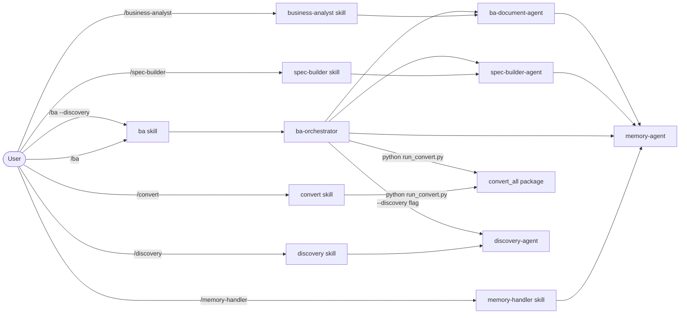

# BA Team – Agents

[Magyar változat](README.md)

This folder contains the specialized agents of the BA workflow. Agents are not directly callable by the user — they are dispatched by skills and can call each other.

---

## Relationship Between Agents and Skills

> File conversion is **not an AI agent** — the `convert_all` Python package handles it with 0 LLM tokens.

---

## `ba-orchestrator`

**File:** [ba-orchestrator.md](ba-orchestrator.md)

**Role:** The main coordinator. Assesses the current state of the workflow and delegates work to the appropriate specialist agent. It does not write specifications or generate BA documents itself.

**Steps:**
1. Runs the `convert_all` Python package if needed (0 AI tokens)
2. Loads memory (`memory-agent` targeted QUERY — relevant files only)
3. Assesses workflow state (input, FORCED decisions, spec, answers, BA docs)
4. Dispatches `spec-builder-agent` OR `ba-document-agent` OR `discovery-agent`
5. Reports back to the user

**When it's called:** Dispatched by the `/ba` skill.

**When it stops:**
- If no input files → notifies the user
- If Q-XXX questions are unanswered → lists them and stops
- If `--draft` flag is active → generates BA documents with VÁZLAT header even with open questions
- If `PARTIALLY_ANSWERED` questions exist (spec-builder extracted partial answers) → shows **non-blocking warning**, does not stop

**OB-01 — Input size estimation:**
At the start of every run, the orchestrator estimates token load from files in `workflow/01_project_info/`. Non-blocking warning at 20+ files or >100K estimated tokens. Details: `devdocs/performance.md`.

**OB-25 — FR priority preview:**
Before dispatching ba-document-agent, the orchestrator lists the FR items from SPEC_OUTPUT.md grouped by Phase 1 / Phase 2. Does not block — informs only, so priorities can be adjusted via SDEC-XXX decision.

**`04_decisions/` effect on workflow:**

If any file in `workflow/04_decisions/` has a modified time (mtime) newer than `SPEC_OUTPUT.md`,
the orchestrator **automatically re-runs spec-builder-agent** to apply the new decision.
This guarantees FORCED decisions remain applied even after spec rebuilds.

**Input priority order (for spec-builder):**

| Priority | Source | Effect |
|---|---|---|
| **1 (FORCED)** | `workflow/04_decisions/` (`forced: true`) | Overrides targeted IDs; `[FORCED]` annotation |
| 2 | `workflow/02_discovery/BC.md` | Priority base: problem, goals, scope |
| 3 | `workflow/02_discovery/Discovery_RAID.md` | Early risks and assumptions |
| 4 | `workflow/01_project_info/` | Raw input materials |
| 5 | `workflow/03_answers/` | Stakeholder answers |

---

## `spec-builder-agent`

**File:** [spec-builder-agent.md](spec-builder-agent.md)

**Role:** Specification creation specialist. Reads raw materials in `workflow/01_project_info/`, merges them into a single coherent model, and produces the structured specification with a Q-XXX question list.

**Steps:**
1. Reads `SPEC_LOG` to detect changes
2. Loads `workflow/04_decisions/` FORCED decisions (pyyaml frontmatter parse — **mandatory on every run**)
3. Computes SHA-256 fingerprints for all input files (`sha_map`)
4. Decides strategy: **Incremental** (reads only new/changed files) or **Full** rebuild
5. **OB-19:** In incremental runs, automatically cross-checks open Q-XXX questions against new source materials → sets `PARTIALLY_ANSWERED` or `ANSWERED` if relevant text is found
6. Generates or updates the specification (FR-XXX, NFR-XXX, US-XXX, Q-XXX) — every element receives a `[Forrás: filename · sha8]` source annotation
7. **OB-08:** Groups Q-XXX questions by category (`BUSINESS_LOGIC`, `DATA`, `UX_UI`, `INTEGRATION`, `PRIORITY`, `STAKEHOLDER`, `TECHNICAL`) — summary table + detailed list
8. **OB-20:** SCOPE CONFLICT detection — if an item appears as IN SCOPE and OUT OF SCOPE simultaneously, generates `SCOPE:CONFLICT` annotation and a Q-XXX question
9. **OB-21:** Classifies `[INFERRED]` items by risk level: `[INFERRED:LOW]`, `[INFERRED:MED]`, `[INFERRED:HIGH]` — HIGH items are automatically converted to RISK entries in RAID_Log
10. **OB-24:** Extraction checklist — detects estimation tables, implementation options, contract-related scope; warns if potential FR may be missing
11. Applies FORCED decisions — `[FORCED]` annotation and `DECISIONS_LOG.md` update
12. Saves: `workflow/01_project_info/_system/SPEC_OUTPUT.md` + `SPEC_DIFF.md`
13. Updates memory via batch operation (`SPEC_LOG` UPSERT + other STOREs)
14. Reports back to `ba-orchestrator`

**When it's called:** Dispatched by `ba-orchestrator` (if SPEC_OUTPUT.md is missing or a FORCED decision is newer than the spec) or directly by the `/spec-builder` skill.

**Memory stored:** PROJECT_CONTEXT · STAKEHOLDERS · RISKS

**Source traceability:** every generated element includes `[Forrás: filename · sha8]` — the original input file name and first 8 characters of its SHA-256. Makes it traceable exactly which document version each requirement originated from.

---

## `ba-document-agent`

**File:** [ba-document-agent.md](ba-document-agent.md)

**Role:** BA document generation specialist. Produces the complete, deliverable BA documentation package from the finished specification, answered questions, and memory context. Creates mandatory Mermaid diagrams for every process.

**Steps:**
1. Reads `workflow/01_project_info/_system/SPEC_OUTPUT.md`, answer files from `workflow/03_answers/`, FORCED decisions from `workflow/04_decisions/`, and memory (excluding binaries)
2. **OB-26:** Reads `SPEC_DIFF.md` — impact-based selective regeneration: only regenerates affected documents; adds `[Nincs változás]` header to unchanged ones
3. Generates all mandatory documents with Mermaid diagrams
4. **OB-21:** Auto-generates RISK entries in RAID_Log from `[INFERRED:HIGH]` assumptions
5. **OB-16:** Mermaid syntax validation after every generated diagram — WARN report (non-blocking)
6. Preserves `[Forrás: filename · sha8]` source annotations — Traceability Matrix gains a `Forrás fájl` column
7. Saves: `workflow/05_ba_docs/`
8. **OB-14:** Writes `workflow/05_ba_docs/_system/BA_DOCS_LOG.md` (generation log — timestamp, spec SHA, mode)
9. Saves learnings to memory (`memory-agent` BATCH STORE — RESOLVED_QUESTIONS `status: archived`)
10. **OB-27:** Generates `workflow/05_ba_docs/_system/BA_DOCS_DIFF.md` (change report: what was modified vs. unchanged)
11. Reports back to `ba-orchestrator`

**When it's called:** Dispatched by `ba-orchestrator` (if all Q-XXX are answered) or directly by the `/business-analyst` skill.
In `--draft` mode: also dispatched by ba-orchestrator when Q-XXX questions are still open.

**Output:**

| File | Content |
|---|---|
| `BRD.md` | Business Requirements Document (with priority warning note) |
| `User_Stories.md` | User Stories with Gherkin acceptance criteria |
| `Process_Flows.md` | Process models (mandatory Mermaid diagrams) |
| `Traceability_Matrix.md` | Traceability matrix |
| `RAID_Log.md` | Risks, Assumptions, Issues, Dependencies (INFERRED:HIGH → auto RISK) |
| `Glossary.md` | Domain glossary |
| `_system/BA_DOCS_LOG.md` | Generation log (when, from what, which mode) |
| `_system/BA_DOCS_DIFF.md` | Change report (what the last run modified) |

**Memory stored:** RESOLVED_QUESTIONS (archived) · DECISIONS · DOMAIN_GLOSSARY · RISKS

---

## `memory-agent`

**File:** [memory-agent.md](memory-agent.md)

**Role:** Memory manager. All other agents read and write to the `.claude/memory/` folder through this agent. It does not perform analysis or generate documents — it exclusively manages data.

**Operations:**

| Operation | Description |
|---|---|
| `BATCH` | Execute multiple STORE or UPSERT operations in a single call (more efficient) |
| `LOAD` | Reads all BA memory files — returns only `status: active` rows (default, token-efficient) |
| `LOAD_ALL` | Returns all rows including archived (`status: archived`) — for audit/reset only |
| `STORE` | Appends a new entry to the specified file (default: `status: active`) |
| `QUERY` | Targeted query from one or more memory files |
| `LOAD_CONVERSION_LOG` | Returns conversion log content |
| `MEMORY_UPSERT` | Updates or adds a row; use `status: archived` to archive an entry |

**Archive mechanism:**

Every memory table contains a `Status` column (`active` / `archived`).
- Default: every new row has `status: active`
- `LOAD` returns only active rows — this reduces token usage as the project grows
- `RESOLVED_QUESTIONS.md` rows are automatically set to `archived` after BA documents are generated
- `LOAD_ALL` returns all rows (active + archived) — use only for audit or project reset

**Memory Files:**

| File | Content |
|---|---|
| `PROJECT_CONTEXT.md` | Project name, client, scope, involved systems |
| `STAKEHOLDERS.md` | Stakeholder list with roles |
| `DECISIONS.md` | Decision log (DEC-XXX) |
| `RESOLVED_QUESTIONS.md` | Answered Q-XXX archive |
| `DOMAIN_GLOSSARY.md` | Domain terminology |
| `RISKS.md` | Risks and assumptions |
| `CONVERSION_LOG.md` | Converted file registry (9 columns, includes output SHA-256 verification) |
| `AGENT_DECISIONS.md` | Audit log of internal orchestrator and spec-builder decisions |

**When it's called:** Called by every other agent — `ba-orchestrator`, `spec-builder-agent`, `ba-document-agent`. Also dispatched directly by the `/memory-handler` skill.

**Important Rule:** Only `memory-agent` can write and read in the `.claude/memory/` folder (exception: the `convert_all` Python package writes `CONVERSION_LOG.md` directly).

---

## `discovery-agent`

**File:** [discovery-agent.md](discovery-agent.md)

**Role:** Discovery phase specialist. Produces a structured Discovery document set from early, incomplete, or just-assembled project materials — Sales handovers, first meeting notes, client emails. Never blocks generation due to unanswered questions.

**Steps:**
1. Loads memory (`memory-agent` QUERY — PROJECT_CONTEXT, STAKEHOLDERS, RISKS)
2. Reads files from `workflow/01_project_info/`
3. Reads answers from `workflow/03_answers/` (if any — Discovery and Analysis answers share this folder)
4. Generates `DISCOVERY_OUTPUT.md` intermediate spec → `workflow/02_discovery/_system/`
5. Generates the three Discovery documents → `workflow/02_discovery/`
6. Saves learnings to memory (PROJECT_CONTEXT, STAKEHOLDERS, RISKS)
7. Reports back to `ba-orchestrator`

**When it's called:** Dispatched by `ba-orchestrator` when the `--discovery` flag is active (sent by the `/discovery` skill).

**Built-in draft mode:** The discovery-agent **always** operates in draft mode. Q-XXX questions never block document generation — a well-structured question list is just as valuable an output as the answers themselves.

**DISCOVERY_OUTPUT.md structure:**

| Section | ID prefix | Annotation |
|---|---|---|
| Business problem | PROB-XXX | `[Forrás: filename · sha8]` + `[EXPLICIT/INFERRED]` |
| Root causes | RC-XXX | `[Forrás: filename · sha8]` |
| Business goals | GOAL-XXX | `[Forrás: filename · sha8]` |
| Scope boundaries | – | In scope / Out of scope list |
| MVP items | MVP-XXX | `[Forrás: filename · sha8]` |
| Assumptions | A-XXX | `[Forrás: filename · sha8]` |
| Risks | RISK-XXX | `[Forrás: filename · sha8]` |
| Stakeholders | ST-XXX | `[Forrás: filename · sha8]` |
| Open questions | Q-XXX | `[Forrás: filename · sha8]` + category |

**Q-XXX categories in Discovery mode:**

| Category | When assigned |
|---|---|
| `[SCOPE]` | Boundary unclear — what's in and what's out |
| `[MVP]` | MVP definition incomplete, must-have list undetermined |
| `[FEASIBILITY]` | Feasibility questionable — possible technical or business obstacle |
| `[STAKEHOLDER]` | Decision-maker unknown, approver not identified |
| `[TECHNICAL]` | Technical requirement unknown — system, integration, API |

**Output:**

| File | Content |
|---|---|
| `workflow/02_discovery/_system/DISCOVERY_OUTPUT.md` | Structured intermediate spec |
| `workflow/02_discovery/BC.md` | Business Concept — main Discovery deliverable (VÁZLAT header if open questions) |
| `workflow/02_discovery/Discovery_RAID.md` | Early RAID — risks, assumptions, open issues |
| `workflow/02_discovery/Discovery_Questions.md` | Meeting-ready question checklist by category |

**Discovery → Analysis transition (DS-10):**

When `ba-orchestrator` generates Analysis BA documents after Discovery (Check D) and `workflow/02_discovery/BC.md` exists, `ba-document-agent` produces **Discovery-depth documents**:
- BRD: scope and goal focus, fewer FR details
- User Stories: epic-level user journeys, 2–3 acceptance criteria
- UAT: 5–8 general scenarios (instead of detailed TC-XXX)

**Memory stored:** PROJECT_CONTEXT · STAKEHOLDERS · RISKS

---

## Summary of Responsibilities

| Component | Type | Reads | Writes | Calls |
|---|---|---|---|---|
| `ba-orchestrator` | AI agent | workflow folder states | – | `memory-agent`, `spec-builder-agent`, `ba-document-agent`, `discovery-agent` |
| `convert_all` | Python package | raw workflow files | `*_converted.md`, `CONVERSION_LOG.md` | – |
| `spec-builder-agent` | AI agent | `01_project_info/`, `02_discovery/`, `04_decisions/` | `_system/SPEC_OUTPUT.md`, `04_decisions/_system/DECISIONS_LOG.md` | `memory-agent` |
| `ba-document-agent` | AI agent | `_system/SPEC_OUTPUT.md`, `03_answers/`, `04_decisions/` | `05_ba_docs/` | `memory-agent` |
| `discovery-agent` | AI agent | `01_project_info/`, `03_answers/`, `02_discovery/` (prior) | `02_discovery/` | `memory-agent` |
| `memory-agent` | AI agent | `.claude/memory/` | `.claude/memory/` | – |
