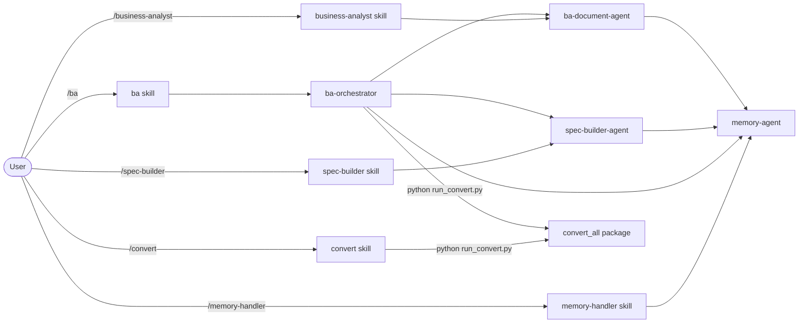

# BA Team – Agents

[Magyar változat](README.md)

This folder contains the specialized agents of the BA workflow. Agents are not directly callable by the user — they are dispatched by skills and can call each other.

---

## Relationship Between Agents and Skills

> File conversion is **not an AI agent** — the `convert_all` Python package handles it with 0 LLM tokens.

---

## `ba-orchestrator`

**File:** [ba-orchestrator.md](ba-orchestrator.md)

**Role:** The main coordinator. Assesses the current state of the workflow and delegates work to the appropriate specialist agent. It does not write specifications or generate BA documents itself.

**Steps:**
1. Runs the `convert_all` Python package if needed (0 AI tokens)
2. Loads memory (`memory-agent` targeted QUERY — relevant files only)
3. Assesses workflow state
4. Dispatches `spec-builder-agent` OR `ba-document-agent`
5. Reports back to the user

**When it's called:** Dispatched by the `/ba` skill.

**When it stops:**
- If no input files → notifies the user
- If Q-XXX questions are unanswered → lists them and stops

---

## `spec-builder-agent`

**File:** [spec-builder-agent.md](spec-builder-agent.md)

**Role:** Specification creation specialist. Reads raw materials in `workflow/01_project_info/`, merges them into a single coherent model, and produces the structured specification with a Q-XXX question list.

**Steps:**
1. Reads `SPEC_LOG` to detect changes
2. Computes SHA-256 fingerprints for all input files (`sha_map`)
3. Decides strategy: **Incremental** (reads only new/changed files) or **Full** rebuild
4. Generates or updates the specification (FR-XXX, NFR-XXX, US-XXX, Q-XXX) — every element receives a `[Forrás: filename · sha8]` source annotation
5. Saves: `workflow/01_project_info/SPEC_OUTPUT.md`
6. Updates memory via batch operation (`SPEC_LOG` UPSERT + other STOREs)
7. Reports back to `ba-orchestrator`

**When it's called:** Dispatched by `ba-orchestrator` (if SPEC_OUTPUT.md is missing or needs update) or directly by the `/spec-builder` skill.

**Memory stored:** PROJECT_CONTEXT · STAKEHOLDERS · RISKS

**Source traceability:** every generated element includes `[Forrás: filename · sha8]` — the original input file name and first 8 characters of its SHA-256. Makes it traceable exactly which document version each requirement originated from.

---

## `ba-document-agent`

**File:** [ba-document-agent.md](ba-document-agent.md)

**Role:** BA document generation specialist. Produces the complete, deliverable BA documentation package from the finished specification, answered questions, and memory context. Creates mandatory Mermaid diagrams for every process.

**Steps:**
1. Reads SPEC_OUTPUT.md, answer files, and memory (excluding binaries)
2. Generates all mandatory documents with Mermaid diagrams
3. Preserves `[Forrás: filename · sha8]` source annotations — Traceability Matrix gains a `Forrás fájl` column
4. Saves: `workflow/03_ba_docs/`
5. Saves learnings to memory (`memory-agent` BATCH STORE)
6. Reports back to `ba-orchestrator`

**When it's called:** Dispatched by `ba-orchestrator` (if all Q-XXX are answered) or directly by the `/business-analyst` skill.

**Output:**

| File | Content |
|---|---|
| `BRD.md` | Business Requirements Document |
| `User_Stories.md` | User Stories with Gherkin acceptance criteria |
| `Process_Flows.md` | Process models (mandatory Mermaid diagrams) |
| `Traceability_Matrix.md` | Traceability matrix |
| `RAID_Log.md` | Risks, Assumptions, Issues, Dependencies |
| `Glossary.md` | Domain glossary |

**Memory stored:** RESOLVED_QUESTIONS · DECISIONS · DOMAIN_GLOSSARY · RISKS

---

## `memory-agent`

**File:** [memory-agent.md](memory-agent.md)

**Role:** Memory manager. All other agents read and write to the `.claude/memory/` folder through this agent. It does not perform analysis or generate documents — it exclusively manages data.

**Operations:**

| Operation | Description |
|---|---|
| `BATCH` | Execute multiple STORE or UPSERT operations in a single call (more efficient) |
| `LOAD` | Reads all BA memory files, creates missing ones from templates |
| `STORE` | Appends a new entry to the specified file (never deletes old ones) |
| `QUERY` | Targeted query from one or more memory files |
| `LOAD_CONVERSION_LOG` | Returns conversion log content |
| `MEMORY_UPSERT` | Updates or adds a row in the conversion log |

**Memory Files:**

| File | Content |
|---|---|
| `PROJECT_CONTEXT.md` | Project name, client, scope, involved systems |
| `STAKEHOLDERS.md` | Stakeholder list with roles |
| `DECISIONS.md` | Decision log (DEC-XXX) |
| `RESOLVED_QUESTIONS.md` | Answered Q-XXX archive |
| `DOMAIN_GLOSSARY.md` | Domain terminology |
| `RISKS.md` | Risks and assumptions |
| `CONVERSION_LOG.md` | Converted file registry (9 columns, includes output SHA-256 verification) |

**When it's called:** Called by every other agent — `ba-orchestrator`, `spec-builder-agent`, `ba-document-agent`. Also dispatched directly by the `/memory-handler` skill.

**Important Rule:** Only `memory-agent` can write and read in the `.claude/memory/` folder (exception: the `convert_all` Python package writes `CONVERSION_LOG.md` directly).

---

## Summary of Responsibilities

| Component | Type | Reads | Writes | Calls |
|---|---|---|---|---|
| `ba-orchestrator` | AI agent | workflow folder states | – | `memory-agent`, `spec-builder-agent`, `ba-document-agent` |
| `convert_all` | Python package | raw workflow files | `*_converted.md`, `CONVERSION_LOG.md` | – |
| `spec-builder-agent` | AI agent | `01_project_info/` raw files | `SPEC_OUTPUT.md` | `memory-agent` |
| `ba-document-agent` | AI agent | `SPEC_OUTPUT.md`, `02_answers/` | `03_ba_docs/` | `memory-agent` |
| `memory-agent` | AI agent | `.claude/memory/` | `.claude/memory/` | – |
