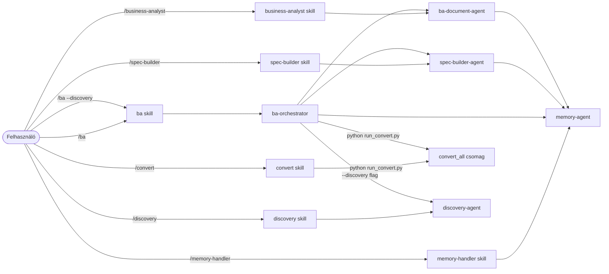

# BA Team – Agentek

[English version](README.en.md)

Ez a mappa tartalmazza a BA workflow specializált ügynökeit. Az agentek nem közvetlenül a felhasználó által hívhatók — a skillek dispatchilik őket, és egymást is hívhatják.

---

## Az agentek és a skillek viszonya

> A fájlkonverzió **nem AI agent** — a `convert_all` Python csomag végzi, 0 LLM token felhasználással.

---

## `ba-orchestrator`

**Fájl:** [ba-orchestrator.md](ba-orchestrator.md)

**Szerepe:** A fő koordinátor. Felméri a workflow aktuális állapotát és delegálja a munkát a megfelelő specialist agentnek. Maga nem ír specifikációt és nem generál BA dokumentumokat.

**Lépései:**
1. Szükség esetén futtatja a `convert_all` Python csomagot (0 AI token)
2. Betölti a memóriát (`memory-agent` targeted QUERY — csak a releváns fájlok)
3. Megvizsgálja a workflow állapotát (input, FORCED döntések, spec, válaszok, BA docs)
4. Dispatchilja a `spec-builder-agent`-et VAGY a `ba-document-agent`-et VAGY a `discovery-agent`-et
5. Visszajelent a felhasználónak

**Mikor hívódik:** A `/ba` skill dispatchilja.

**Mikor áll meg:**
- Ha nincs bemeneti fájl → jelzi a felhasználónak
- Ha Q-XXX kérdések megválaszolatlanok → listázza és megáll
- Ha `--draft` flag aktív → vázlatként generálja a BA dokumentumokat (megválaszolatlan kérdésekkel is)
- Ha `PARTIALLY_ANSWERED` kérdések vannak (spec-builder részleges választ kinyert) → **nem blokkolja**, de figyelmezteti a felhasználót

**OB-01 — Input méretbecslés:**
Az orchestrator minden futás elején megbecsüli az input token-terhelést a `workflow/01_project_info/` fájlok alapján. Ha 20+ fájl vagy >100K token várható, nem-blokkoló figyelmeztetést ír. Részletek: `devdocs/performance.md`.

**OB-25 — FR prioritás előnézet:**
BA dokumentum-generálás előtt az orchestrator listázza a SPEC_OUTPUT.md FR-eit Fázis 1 / Fázis 2 csoportokban. Nem blokkol — csak tájékoztat, hogy a felhasználó módosíthassa a prioritásokat SDEC-XXX döntéssel.

**`04_decisions/` hatása a workflow-ra:**

Ha bármely `workflow/04_decisions/` fájl módosítási ideje (mtime) újabb mint a `SPEC_OUTPUT.md` mtime,
az orchestrator **automatikusan újrafuttatja a spec-builder-agent**-et a döntés alkalmazásához.
Ez garantálja, hogy egy FORCED döntés mindig érvényes marad spec rebuild után is.

**Input-prioritási sorrend (spec-builder számára):**

| Prioritás | Forrás | Hatás |
|---|---|---|
| **1 (FORCED)** | `workflow/04_decisions/` (`forced: true`) | Targetált ID-kat felülírja; `[FORCED]` annotáció |
| 2 | `workflow/02_discovery/BC.md` | Prioritásos alap: probléma, célok, scope |
| 3 | `workflow/02_discovery/Discovery_RAID.md` | Korai kockázatok, feltételezések |
| 4 | `workflow/01_project_info/` | Nyers anyagok |
| 5 | `workflow/03_answers/` | Stakeholder válaszok |

---

## `spec-builder-agent`

**Fájl:** [spec-builder-agent.md](spec-builder-agent.md)

**Szerepe:** A specifikáció-készítő specialist. Beolvassa a `workflow/01_project_info/` nyers anyagait, egyetlen koherens modellbe olvasztja őket, és előállítja a strukturált specifikációt Q-XXX kérdéslistával.

**Lépései:**
1. Beolvassa a `SPEC_LOG`-ot a változások detektálásához
2. Betölti a `workflow/04_decisions/` FORCED döntéseket (pyyaml frontmatter parse — **minden futásnál kötelező**)
3. Kiszámolja az összes bemeneti fájl SHA-256 ujjlenyomatát (`sha_map`)
4. Eldönti a stratégiát: **Inkrementális** (csak az újakat olvassa) vagy **Teljes** újragenerálás
5. **OB-19:** Inkrementális futásban automatikusan keresztbe ellenőrzi a nyitott Q-XXX kérdéseket az új forrásanyagokkal → `PARTIALLY_ANSWERED` vagy `ANSWERED` státuszra állítja, ha releváns szöveget talál
6. Generálja vagy frissíti a specifikációt (FR-XXX, NFR-XXX, US-XXX, Q-XXX) — minden elemhez `[Forrás: filename · sha8]` forrásjelzéssel
7. **OB-08:** Q-XXX kérdéseket kategóriák szerint csoportosítja (`BUSINESS_LOGIC`, `DATA`, `UX_UI`, `INTEGRATION`, `PRIORITY`, `STAKEHOLDER`, `TECHNICAL`) — összefoglaló tábla + részletes lista
8. **OB-20:** SCOPE CONFLICT detekció — ha egy scope-elem IN SCOPE és OUT OF SCOPE is egyszerre, explicit `SCOPE:CONFLICT` jelzést és Q-XXX kérdést generál
9. **OB-21:** `[INFERRED]` elemeket kockázati szint szerint jelöli: `[INFERRED:LOW]`, `[INFERRED:MED]`, `[INFERRED:HIGH]` — a HIGH elemek automatikus RISK tételként kerülnek a RAID_Log-ba
10. **OB-24:** Extraction checklist — becslési tábla, megvalósítási opciók, szerződéses folyamat detektálása; figyelmeztetés ha hiányzó FR gyanítható
11. Alkalmazza a FORCED döntéseket — `[FORCED]` annotáció és `decisions_log.md` frissítés
12. Menti: `workflow/01_project_info/_system/SPEC_OUTPUT.md` + `SPEC_DIFF.md`
13. Frissíti a memóriát batch művelettel (`SPEC_LOG` UPSERT + többi STORE)
14. Visszajelent a `ba-orchestrator`-nak

**Mikor hívódik:** `ba-orchestrator` dispatchilja (ha nincs még SPEC_OUTPUT.md, vagy FORCED döntés újabb a spec-nél), vagy közvetlenül a `/spec-builder` skill.

**Memóriába ment:** PROJECT_CONTEXT · STAKEHOLDERS · RISKS

**Forrás-traceability:** minden generált elem tartalmaz `[Forrás: filename · sha8]` jelzést — az eredeti bemeneti fájl neve és SHA-256-jának első 8 karaktere. Visszakereshetővé teszi, melyik dokumentum-verzióból született egy adott követelmény.

---

## `ba-document-agent`

**Fájl:** [ba-document-agent.md](ba-document-agent.md)

**Szerepe:** A BA dokumentum-generáló specialist. A kész specifikációból, a megválaszolt kérdésekből és a memória kontextusából előállítja a teljes, átadható BA dokumentációs csomagot. Minden folyamathoz kötelező Mermaid diagramot készít.

**Lépései:**
1. Beolvassa a `workflow/01_project_info/_system/SPEC_OUTPUT.md` fájlt, a `workflow/03_answers/` válasz fájlokat, a `workflow/04_decisions/` FORCED döntéseket és a memóriát (binárisokat kihagyva)
2. **OB-26:** Beolvassa a `SPEC_DIFF.md`-t — impact-alapú szelektív regenerálás: csak az érintett dokumentumokat írja újra; a változatlanokhoz `[Nincs változás]` fejlécet fűz
3. Generálja az összes kötelező dokumentumot Mermaid diagramokkal
4. **OB-21:** `[INFERRED:HIGH]` feltételezésekből automatikus RISK bejegyzések a RAID_Log-ba
5. **OB-16:** Mermaid szintaxis validáció minden generált diagram után — WARN riport (nem blokkoló)
6. Megőrzi a `[Forrás: filename · sha8]` forrásjelzéseket — a Traceability Matrix kap egy `Forrás fájl` oszlopot
7. Menti: `workflow/05_ba_docs/`
8. **OB-14:** Írja a `workflow/05_ba_docs/_system/BA_DOCS_LOG.md`-t (generálási napló — időpont, spec SHA, mód)
9. Elmenti a tanultakat a memóriába (`memory-agent` BATCH STORE — RESOLVED_QUESTIONS `status: archived`)
10. **OB-27:** Generálja a `workflow/05_ba_docs/_system/BA_DOCS_DIFF.md`-t (változásjelentés: mi módosult/változatlan)
11. Visszajelent a `ba-orchestrator`-nak

**Mikor hívódik:** `ba-orchestrator` dispatchilja (ha minden Q-XXX megválaszolt), vagy közvetlenül a `/business-analyst` skill.
`--draft` módban: ba-orchestrator is dispatchilja, ha Q-XXX kérdések még nyitottak.

**Kimenet:**

| Fájl | Tartalom |
|---|---|
| `BRD.md` | Business Requirements Document (prioritás fejléccel) |
| `User_Stories.md` | User Story-k Gherkin elfogadási kritériumokkal |
| `Process_Flows.md` | Folyamatmodellek (kötelező Mermaid diagramok) |
| `Traceability_Matrix.md` | Követhetőségi mátrix |
| `RAID_Log.md` | Kockázatok, feltételezések, függőségek (INFERRED:HIGH → auto RISK) |
| `Glossary.md` | Domain szószedet |
| `_system/BA_DOCS_LOG.md` | Generálási napló (mikor, miből, milyen módban) |
| `_system/BA_DOCS_DIFF.md` | Változásjelentés (mit módosított az utolsó futás) |

**Memóriába ment:** RESOLVED_QUESTIONS (archived) · DECISIONS · DOMAIN_GLOSSARY · RISKS

---

## `memory-agent`

**Fájl:** [memory-agent.md](memory-agent.md)

**Szerepe:** A memória kezelő. Minden más agent ezen keresztül ír és olvas a `.claude/memory/` mappába. Nem végez elemzést, nem generál dokumentumot — kizárólag adatkezelést végez.

**Műveletek:**

| Művelet | Leírás |
|---|---|
| `BATCH` | Több STORE vagy UPSERT művelet végrehajtása egyetlen hívással (hatékonyabb) |
| `LOAD` | Beolvassa az összes BA memóriafájlt — csak `status: active` sorokat ad vissza (alapértelmezett, token-hatékony) |
| `LOAD_ALL` | Beolvassa az összes sort, beleértve az archivált (`status: archived`) bejegyzéseket is — csak audit/reset esetén |
| `STORE` | Új bejegyzést fűz hozzá a megadott fájlhoz (alapértelmezés: `status: active`) |
| `QUERY` | Célzott lekérdezés egy vagy több memóriafájlból |
| `LOAD_CONVERSION_LOG` | Visszaadja a konverziós napló tartalmát |
| `MEMORY_UPSERT` | Frissít vagy hozzáad egy sort; `status: archived` értékkel archiválható egy bejegyzés |

**Archívum mechanizmus:**

Minden memória tábla tartalmaz egy `Status` oszlopot (`active` / `archived`).
- Alapértelmezés: minden új sor `status: active`
- A `LOAD` protokoll csak `active` sorokat ad vissza — ez csökkenti a token-felhasználást hosszú projektek esetén
- A `RESOLVED_QUESTIONS.md` sorai automatikusan `archived`-re váltanak, miután a BA dokumentumok legenerálódtak
- A `LOAD_ALL` protokoll az összes sort visszaadja (aktív + archivált) — kizárólag audit vagy projekt reset esetén használandó

**Memória fájlok:**

| Fájl | Tartalom |
|---|---|
| `PROJECT_CONTEXT.md` | Projekt neve, ügyfél, scope, érintett rendszerek |
| `STAKEHOLDERS.md` | Stakeholder lista szerepekkel |
| `DECISIONS.md` | Döntések naplója (DEC-XXX) |
| `RESOLVED_QUESTIONS.md` | Megválaszolt Q-XXX archívum |
| `DOMAIN_GLOSSARY.md` | Domain szakkifejezések |
| `RISKS.md` | Kockázatok és feltételezések |
| `CONVERSION_LOG.md` | Konvertált fájlok nyilvántartása (9 oszlop, output SHA-256 ellenőrzéssel) |
| `AGENT_DECISIONS.md` | Orchestrator és spec-builder belső döntéseinek audit-logja |

**Mikor hívódik:** Minden más agent hívja — `ba-orchestrator`, `spec-builder-agent`, `ba-document-agent`. Közvetlenül a `/memory-handler` skill is dispatchilja.

**Fontos szabály:** Kizárólag a `memory-agent` írhat és olvashat a `.claude/memory/` mappában (kivétel: a `convert_all` Python csomag írja a `CONVERSION_LOG.md`-t közvetlenül).

---

## `discovery-agent`

**Fájl:** [discovery-agent.md](discovery-agent.md)

**Szerepe:** A Discovery fázis specialistája. Korai, hiányos vagy éppen csak összeálló projektanyagokból — Sales handover, első meeting jegyzetek, ügyfél emailek — előállítja a strukturált Discovery dokumentumcsomagot. Soha nem blokkolja a generálást megválaszolatlan kérdések miatt.

**Lépései:**
1. Betölti a memóriát (`memory-agent` QUERY — PROJECT_CONTEXT, STAKEHOLDERS, RISKS)
2. Beolvassa a `workflow/01_project_info/` fájljait
3. Beolvassa a `workflow/03_answers/` válaszokat (ha vannak — Discovery és Analysis válaszok ugyanitt)
4. Generálja a `DISCOVERY_OUTPUT.md` közbenső specet → `workflow/02_discovery/_system/`
5. Generálja a három Discovery dokumentumot → `workflow/02_discovery/`
6. Elmenti a tanultakat a memóriába (PROJECT_CONTEXT, STAKEHOLDERS, RISKS)
7. Visszajelent a `ba-orchestrator`-nak

**Mikor hívódik:** `ba-orchestrator` dispatchilja a `--discovery` flag hatására (a `/discovery` skill által küldött).

**Beépített draft mód:** A discovery-agent **mindig** draft módban működik. Q-XXX kérdések soha nem blokkolják a dokumentumgenerálást — a jól strukturált kérdéslista épp annyira értékes output, mint a válaszok.

**DISCOVERY_OUTPUT.md struktúra:**

| Szekció | ID prefix | Annotáció |
|---|---|---|
| Üzleti probléma | PROB-XXX | `[Forrás: filename · sha8]` + `[EXPLICIT/INFERRED]` |
| Gyökérok | RC-XXX | `[Forrás: filename · sha8]` |
| Üzleti célok | GOAL-XXX | `[Forrás: filename · sha8]` |
| Scope határok | – | In scope / Out of scope lista |
| MVP elemek | MVP-XXX | `[Forrás: filename · sha8]` |
| Feltételezések | A-XXX | `[Forrás: filename · sha8]` |
| Kockázatok | RISK-XXX | `[Forrás: filename · sha8]` |
| Érintettek | ST-XXX | `[Forrás: filename · sha8]` |
| Nyitott kérdések | Q-XXX | `[Forrás: filename · sha8]` + kategória |

**Q-XXX kategóriák Discovery módban:**

| Kategória | Mikor kap ilyen jelzést |
|---|---|
| `[SCOPE]` | Határ nem tiszta — mi van benne, mi nincs |
| `[MVP]` | MVP definíció hiányos, must-have lista nincs meghatározva |
| `[FEASIBILITY]` | Megvalósíthatóság kérdéses — technikai vagy üzleti akadály lehetséges |
| `[STAKEHOLDER]` | Döntéshozó ismeretlen, jóváhagyó személy nincs azonosítva |
| `[TECHNICAL]` | Technikai feltétel ismeretlen — rendszer, integráció, API |

**Kimenet:**

| Fájl | Tartalom |
|---|---|
| `workflow/02_discovery/_system/DISCOVERY_OUTPUT.md` | Strukturált közbenső spec |
| `workflow/02_discovery/BC.md` | Business Concept — fő Discovery deliverable (VÁZLAT fejléccel, ha nyitott kérdések vannak) |
| `workflow/02_discovery/Discovery_RAID.md` | Korai RAID — kockázatok, feltételezések, nyitott problémák |
| `workflow/02_discovery/Discovery_Questions.md` | Meeting-ready kérdéslista kategóriák szerint |

**Discovery → Analysis átmenet (DS-10):**

Ha a `ba-orchestrator` a Discovery után Analysis BA dokumentumokat generál (Check D), és `workflow/02_discovery/BC.md` létezik, a `ba-document-agent` **Discovery mélységű dokumentumokat** állít elő:
- BRD: scope és cél fókusz, kevesebb FR részlet
- User Stories: epikus szintű user journey-k, 2–3 acceptance criteria
- UAT: 5–8 általános forgatókönyv (részletes TC-XXX helyett)

**Memóriába ment:** PROJECT_CONTEXT · STAKEHOLDERS · RISKS

---

## Felelősségek összefoglalója

| Komponens | Típus | Olvas | Ír | Hívja |
|---|---|---|---|---|
| `ba-orchestrator` | AI agent | workflow mappák állapota | – | `memory-agent`, `spec-builder-agent`, `ba-document-agent`, `discovery-agent` |
| `convert_all` | Python csomag | workflow nyers fájlok | `*_converted.md`, `CONVERSION_LOG.md` | – |
| `spec-builder-agent` | AI agent | `01_project_info/`, `02_discovery/`, `04_decisions/` | `_system/SPEC_OUTPUT.md`, `04_decisions/_system/DECISIONS_LOG.md` | `memory-agent` |
| `ba-document-agent` | AI agent | `_system/SPEC_OUTPUT.md`, `_system/SPEC_DIFF.md`, `03_answers/`, `04_decisions/` | `05_ba_docs/`, `05_ba_docs/_system/BA_DOCS_LOG.md`, `05_ba_docs/_system/BA_DOCS_DIFF.md` | `memory-agent` |
| `discovery-agent` | AI agent | `01_project_info/`, `03_answers/`, `02_discovery/` (prior) | `02_discovery/` | `memory-agent` |
| `memory-agent` | AI agent | `.claude/memory/` | `.claude/memory/` | – |
