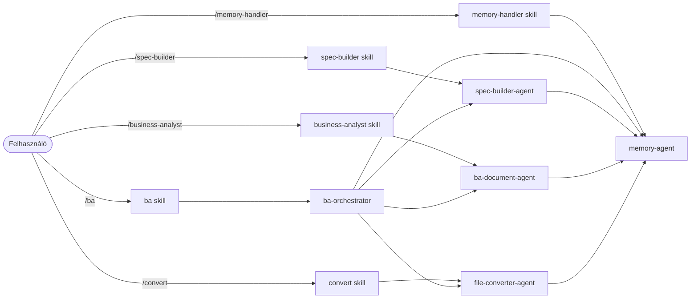

# BA Team – Agentek

[English version](README.en.md)

Ez a mappa tartalmazza a BA workflow specializált ügynökeit. Az agentek nem közvetlenül a felhasználó által hívhatók — a skillek dispatchilik őket, és egymást is hívhatják.

---

## Az agentek és a skillek viszonya

---

## `ba-orchestrator`

**Fájl:** [ba-orchestrator.md](ba-orchestrator.md)

**Szerepe:** A fő koordinátor. Felméri a workflow aktuális állapotát és delegálja a munkát a megfelelő specialist agentnek. Maga nem ír specifikációt és nem generál BA dokumentumokat.

**Lépései:**
1. Betölti a memóriát (`memory-agent` targeted QUERY - csak a releváns fájlok)
2. Megvizsgálja a workflow állapotát (Glob-előszűréssel ellenőrzi, kell-e konverzió)
3. Dispatchilja a `spec-builder-agent`-et VAGY a `ba-document-agent`-et
4. Visszajelent a felhasználónak

**Mikor hívódik:** A `/ba` skill dispatchilja.

**Mikor áll meg:**
- Ha nincs bemeneti fájl → jelzi a felhasználónak
- Ha Q-XXX kérdések megválaszolatlanok → listázza és megáll

---

## `spec-builder-agent`

**Fájl:** [spec-builder-agent.md](spec-builder-agent.md)

**Szerepe:** A specifikáció-készítő specialist. Beolvassa a `workflow/01_project_info/` nyers anyagait, egyetlen koherens modellbe olvasztja őket, és előállítja a strukturált specifikációt Q-XXX kérdéslistával.

**Lépései:**
1. Beolvassa a `SPEC_LOG`-ot a változások detektálásához
2. Eldönti a stratégiát: **Inkrementális** (csak az újakat olvassa) vagy **Teljes** újragenerálás
3. Generálja vagy frissíti a specifikációt (FR-XXX, NFR-XXX, US-XXX, Q-XXX)
4. Menti: `workflow/01_project_info/SPEC_OUTPUT.md`
5. Frissíti a memóriát batch művelettel (`SPEC_LOG` UPSERT + többi STORE)
5. Visszajelent a `ba-orchestrator`-nak

**Mikor hívódik:** `ba-orchestrator` dispatchilja (ha nincs még SPEC_OUTPUT.md), vagy közvetlenül a `/spec-builder` skill.

**Memóriába ment:** PROJECT_CONTEXT · STAKEHOLDERS · RISKS

---

## `ba-document-agent`

**Fájl:** [ba-document-agent.md](ba-document-agent.md)

**Szerepe:** A BA dokumentum-generáló specialist. A kész specifikációból, a megválaszolt kérdésekből és a memória kontextusából előállítja a teljes, átadható BA dokumentációs csomagot. Minden folyamathoz kötelező Mermaid diagramot készít.

**Lépései:**
1. Beolvassa a SPEC_OUTPUT.md-t, a válasz fájlokat és a memóriát (binárisokat kihagyva)
2. Generálja az összes kötelező dokumentumot Mermaid diagramokkal
3. Menti: `workflow/03_ba_docs/`
4. Elmenti a tanultakat a memóriába (`memory-agent` BATCH STORE)
5. Visszajelent a `ba-orchestrator`-nak

**Mikor hívódik:** `ba-orchestrator` dispatchilja (ha minden Q-XXX megválaszolt), vagy közvetlenül a `/business-analyst` skill.

**Kimenet:**

| Fájl | Tartalom |
|---|---|
| `BRD.md` | Business Requirements Document |
| `User_Stories.md` | User Story-k Gherkin elfogadási kritériumokkal |
| `Process_Flows.md` | Folyamatmodellek (kötelező Mermaid diagramok) |
| `Traceability_Matrix.md` | Követhetőségi mátrix |
| `RAID_Log.md` | Kockázatok, feltételezések, függőségek |
| `Glossary.md` | Domain szószedet |

**Memóriába ment:** RESOLVED_QUESTIONS · DECISIONS · DOMAIN_GLOSSARY · RISKS

---

## `file-converter-agent`

**Fájl:** [file-converter-agent.md](file-converter-agent.md)

**Szerepe:** Fájl konverter. A `workflow/01_project_info/` és `workflow/02_answers/` mappában lévő nem-markdown fájlokat Markdown formátumba alakítja. SHA-256 fingerprint alapján csak a megváltozott fájlokat konvertálja.

**Lépései:**
1. Lekéri a konverziós naplót a `memory-agent`-től (`LOAD_CONVERSION_LOG`)
2. Megvizsgálja a mappákat és azonosítja a konvertálandó fájlokat
3. Ultra-gyors ellenőrzés (Size/Modified stat alapján kihagyja az egyezőket)
4. Fast ellenőrzés fingerprintek alapján — csak az eltérőket konvertálja
5. Ellenőrzi az eszközök elérhetőségét (Python, markitdown, openpyxl, extract-msg)
6. Konvertálja a fájlokat (`[fájlnév]_converted.md`)
7. Frissíti a konverziós naplót batch művelettel (`MEMORY_BATCH UPSERT`)
7. Visszajelent: mi sikerült, mi lett kihagyva, mi igényel manuális beavatkozást

**Mikor hívódik:**

| Hívó | Scope (melyik mappa) |
|---|---|
| `/convert` skill | `01_project_info/` + `02_answers/` |
| `ba-orchestrator` | `01_project_info/` + `02_answers/` |
| `/spec-builder` skill | csak `01_project_info/` |
| `/business-analyst` skill | csak `02_answers/` |

**Eszközök:**

| Fájltípus | Eszköz |
|---|---|
| `.docx` / `.doc` | Python + markitdown[docx] |
| `.xlsx` / `.xls` | Python + openpyxl |
| `.msg` | Python + extract-msg |
| `.eml` | Python stdlib (külső csomag nem kell) |
| `.pdf` | Natívan olvasható – nem kell konvertálni |

---

## `memory-agent`

**Fájl:** [memory-agent.md](memory-agent.md)

**Szerepe:** A memória kezelő. Minden más agent ezen keresztül ír és olvas a `.claude/memory/` mappába. Nem végez elemzést, nem generál dokumentumot — kizárólag adatkezelést végez.

**Műveletek:**

| Művelet | Leírás |
|---|---|
| `BATCH` | Több STORE vagy UPSERT művelet végrehajtása egyetlen hívással (hatékonyabb) |
| `LOAD` | Beolvassa az összes BA memóriafájlt, hiányzókat létrehozza a sablonból |
| `STORE` | Új bejegyzést fűz hozzá a megadott fájlhoz (soha nem törli a régit) |
| `QUERY` | Célzott lekérdezés egy vagy több memóriafájlból |
| `LOAD_CONVERSION_LOG` | Visszaadja a konverziós napló tartalmát (Size/Modified/SHA-256 adatokkal) |
| `MEMORY_UPSERT` | Frissít vagy hozzáad egy sort a konverziós naplóban |

**Memória fájlok:**

| Fájl | Tartalom |
|---|---|
| `PROJECT_CONTEXT.md` | Projekt neve, ügyfél, scope, érintett rendszerek |
| `STAKEHOLDERS.md` | Stakeholder lista szerepekkel |
| `DECISIONS.md` | Döntések naplója (DEC-XXX) |
| `RESOLVED_QUESTIONS.md` | Megválaszolt Q-XXX archívum |
| `DOMAIN_GLOSSARY.md` | Domain szakkifejezések |
| `RISKS.md` | Kockázatok és feltételezések |
| `conversion_log.md` | Konvertált fájlok SHA-256 fingerprintjei |

**Mikor hívódik:** Minden más agent hívja — `ba-orchestrator`, `spec-builder-agent`, `ba-document-agent`, `file-converter-agent`. Közvetlenül a `/memory-handler` skill is dispatchilja.

**Fontos szabály:** Kizárólag a `memory-agent` írhat és olvashat a `.claude/memory/` mappában. Minden más agent ezt az agentet kéri meg memóriaműveletek elvégzésére.

---

## Felelősségek összefoglalója

| Agent | Olvas | Ír | Hívja |
|---|---|---|---|
| `ba-orchestrator` | workflow mappák állapota | – | `file-converter-agent`, `memory-agent`, `spec-builder-agent`, `ba-document-agent` |
| `file-converter-agent` | workflow nyers fájlok | `*_converted.md` | `memory-agent` |
| `spec-builder-agent` | `01_project_info/` nyers fájlok | `SPEC_OUTPUT.md` | `memory-agent` |
| `ba-document-agent` | `SPEC_OUTPUT.md`, `02_answers/` | `03_ba_docs/` | `memory-agent` |
| `memory-agent` | `.claude/memory/` | `.claude/memory/` | – |
