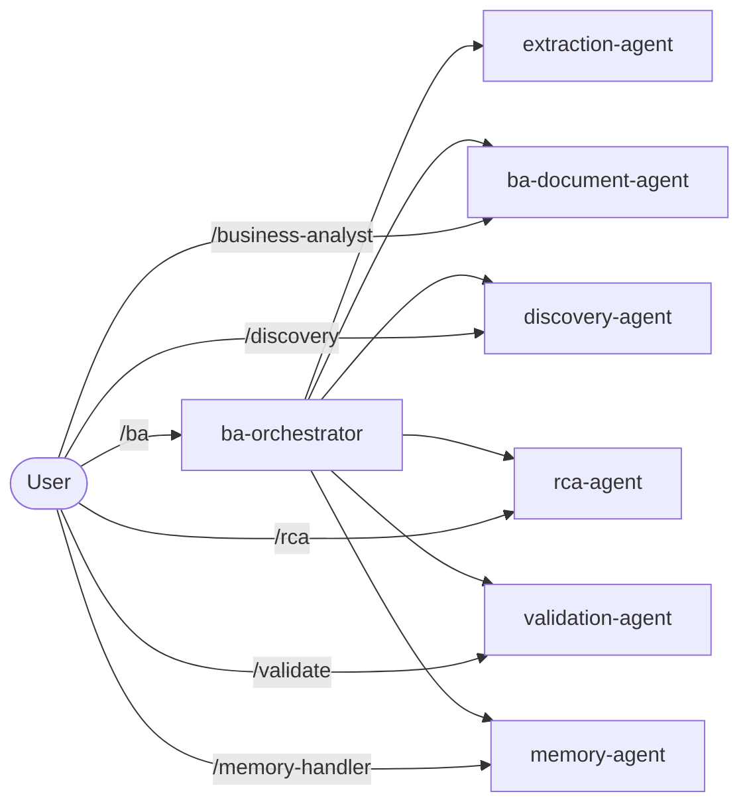

# BA Team – Agents

[Magyar változat](README.md)

This folder contains the specialized agents of the BA workflow. Agents are not directly callable by the user — they are dispatched by skills and can call each other.

---

> File conversion is **not an AI agent** — the `convert_all` Python package handles it with 0 LLM tokens.

---

## Agents

| Agent | Role | Documentation |
|---|---|---|
| `ba-orchestrator` | Main coordinator — assesses workflow state, delegates | [ba-orchestrator.en.md](ba-orchestrator.en.md) |
| `extraction-agent` | Specification extractor — produces SPEC_OUTPUT.md from raw materials | [extraction-agent.en.md](extraction-agent.en.md) |
| `ba-document-agent` | BA document generator — BRD, User Stories, RAID etc. | [ba-document-agent.en.md](ba-document-agent.en.md) |
| `discovery-agent` | Discovery phase — BC.md, Discovery RAID, question list | [discovery-agent.en.md](discovery-agent.en.md) |
| `validation-agent` | Spec quality gate — PASS/WARN/BLOCK status | [validation-agent.en.md](validation-agent.en.md) |
| `rca-agent` | Root cause analysis — causal chains, IR matrix | [rca-agent.en.md](rca-agent.en.md) |
| `memory-agent` | Memory manager — all other agents read/write through this | [memory-agent.en.md](memory-agent.en.md) |
