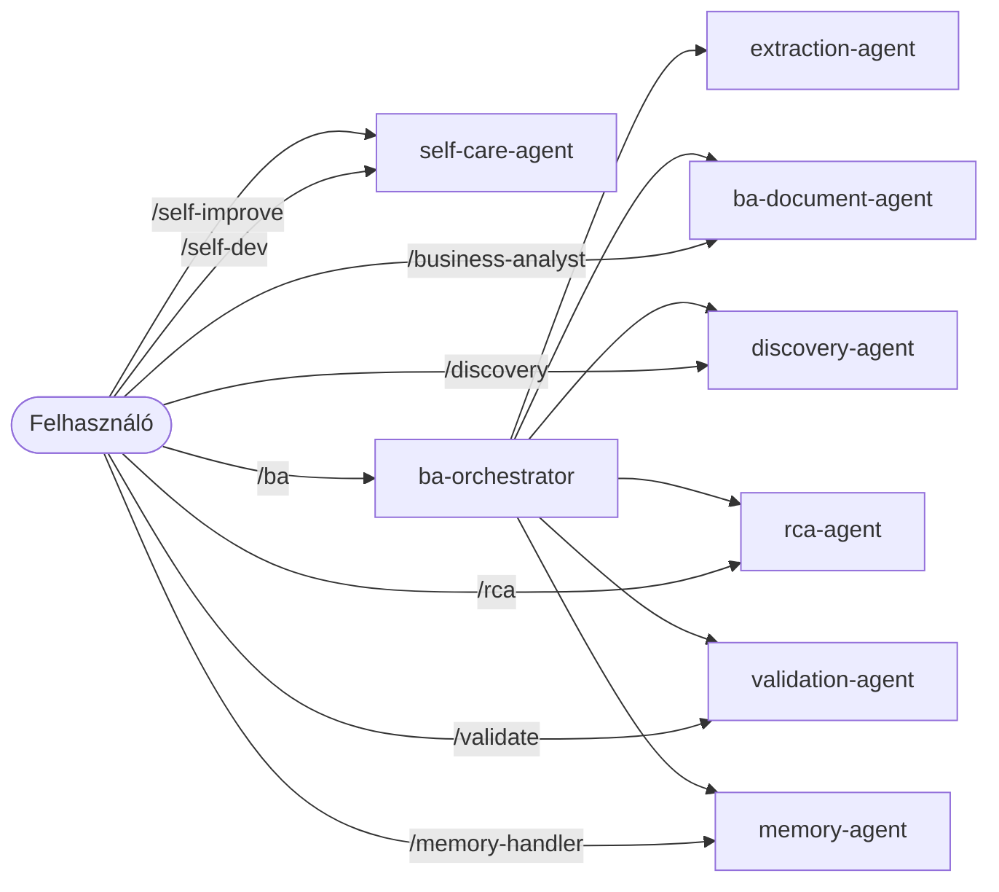

# BA Team – Agentek

[English version](README.en.md)

Ez a mappa tartalmazza a BA workflow specializált ügynökeit. Az agentek nem közvetlenül a felhasználó által hívhatók — a skillek dispatchilik őket, és egymást is hívhatják.

---

> A fájlkonverzió **nem AI agent** — a `convert_all` Python csomag végzi, 0 LLM token felhasználással.

---

## Ügynökök

| Agent | Szerepe | Dokumentáció |
|---|---|---|
| `ba-orchestrator` | Fő koordinátor — felméri a workflow állapotát, delegál | [ba-orchestrator.md](ba-orchestrator.md) |
| `extraction-agent` | Specifikáció-kinyerő — nyers anyagokból SPEC_OUTPUT.md | [extraction-agent.md](extraction-agent.md) |
| `ba-document-agent` | BA dokumentum-generáló — BRD, User Stories, RAID stb. | [ba-document-agent.md](ba-document-agent.md) |
| `discovery-agent` | Discovery fázis — BC.md, Discovery RAID, kérdéslista | [discovery-agent.md](discovery-agent.md) |
| `validation-agent` | Spec minőségőre — PASS/WARN/BLOCK státusz | [validation-agent.md](validation-agent.md) |
| `rca-agent` | Gyökérok-elemzés — oksági láncok, IR mátrix | [rca-agent.md](rca-agent.md) |
| `memory-agent` | Memória kezelő — minden más agent ezen keresztül ír/olvas | [memory-agent.md](memory-agent.md) |
| `self-care-agent` | Önfejlesztés orchestrátor — feature request elemzés és implementáció | [self-care-agent.md](self-care-agent.md) |
