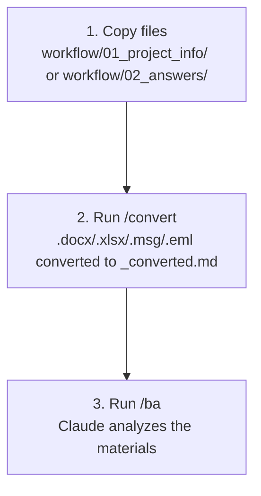

# /convert – File Converter

[Magyar változat](README.md)

## What is it for?

The `/convert` command automatically transforms Office and Outlook files in the `workflow/01_project_info/` and `workflow/02_answers/` folders into Markdown format so that AI agents can process them.

---

## When should it be used?

If you have copied files into the `workflow/01_project_info/` or `workflow/02_answers/` folder that are not in `.md` or `.txt` format:

| File Type | Conversion Needed? |
|---|---|
| `.docx` / `.doc` (Word) | Yes – Python + markitdown required |
| `.xlsx` / `.xls` (Excel) | Yes – Python + openpyxl required |
| `.msg` (Outlook email) | Yes – Python + extract-msg required |
| `.eml` (email file) | Yes – Python stdlib (no extra package needed) |
| `.pdf` | No – Claude reads natively |
| `.md` / `.txt` | No – already processable |

---

## Usage

1. Copy files to the `workflow/01_project_info/` folder
2. In the Claude panel, type: `/convert`
3. The system automatically:
   - Examines which files require conversion
   - Checks for required tools
   - Converts files into `[filename]_converted.md` format
   - Reports what succeeded and what requires manual intervention
4. Once conversion is complete: run the `/ba` command

---

## Installation Guide (if needed)

If the agent indicates that a tool is missing:

**Python** (for all conversions):
- Windows: `winget install python`
- Mac: `brew install python`
- Details: [python.org/downloads](https://www.python.org/downloads/)

**Python Libraries** (after installing Python):
```
pip install "markitdown[docx]" openpyxl extract-msg
```

---

## What does it do exactly?

- **Never modifies original files** — always creates a new `_converted.md` file
- **Converts only changes** — recognizes unchanged files based on SHA-256 fingerprint and file metadata, saving time and tokens
- **Does not convert PDF** — Claude can read it natively
- **If a tool is missing**, it provides a detailed installation guide
- After conversion, the `/ba` command processes all files

---

## Automatic Conversion – No need to always run /convert

The `/ba`, `/spec-builder`, and `/business-analyst` commands **automatically start conversion** on the appropriate folder:

| Command | Which folder does it convert? |
|---|---|
| `/ba` | `01_project_info/` and `02_answers/` |
| `/spec-builder` | `01_project_info/` only |
| `/business-analyst` | `02_answers/` only |
| `/convert` | `01_project_info/` and `02_answers/` |

`/convert` is useful independently if you just want to verify conversion or run it manually before `/ba`.

## Workflow with /convert


