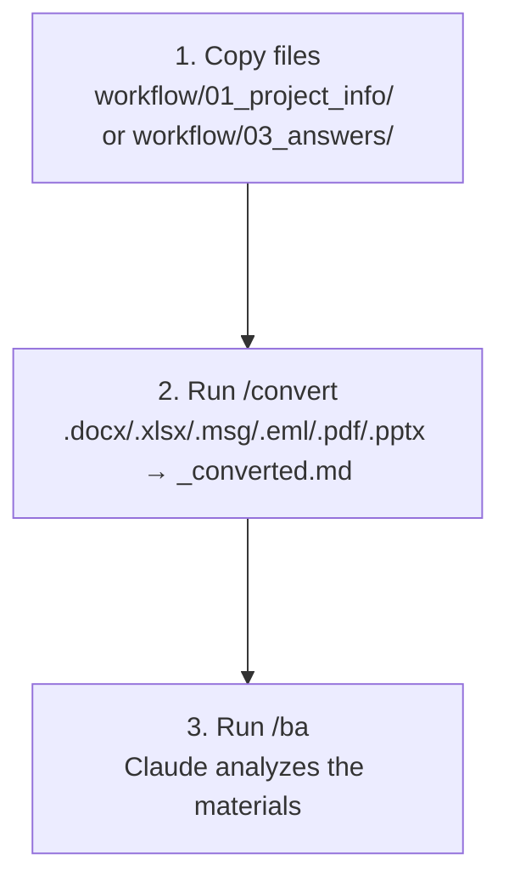

# /convert – File Converter

[Magyar változat](README.md)

## What is it for?

The `/convert` command automatically transforms Office, Outlook, and other files in the `workflow/01_project_info/` and `workflow/03_answers/` folders into Markdown format so that AI agents can process them.

Conversion is handled by a **Python package** — not an AI agent — so it uses zero LLM tokens.

---

## When should it be used?

If you have copied files into the `workflow/01_project_info/` or `workflow/03_answers/` folder that are not in `.md` or `.txt` format:

| File Type | Conversion Needed? |
|---|---|
| `.docx` / `.doc` (Word) | Yes – Python + markitdown required |
| `.xlsx` / `.xls` (Excel) | Yes – Python + openpyxl required |
| `.msg` (Outlook email) | Yes – Python + extract-msg required |
| `.eml` (email file) | Yes – Python stdlib (no extra package needed) |
| `.pdf` | Yes – Python + markitdown[pdf] required |
| `.pptx` / `.ppt` (PowerPoint) | Yes – Python + markitdown + python-pptx |
| `.csv` | Yes – markitdown (built-in, no extra package needed) |
| `.json` | Yes – Python stdlib, converted to Markdown table |
| `.xml` | Yes – Python stdlib, converted to Markdown table |
| `.html` / `.htm` | Yes – markitdown (built-in, no extra package needed) |
| `.png` / `.jpg` / `.jpeg` / `.bmp` / `.webp` (images) | Yes – AI-based processing (works without API key too) |
| `.mp3` / `.m4a` / `.wav` / `.ogg` / `.flac` / `.aac` / `.wma` / `.opus` (audio) | Yes – faster-whisper transcription (FFmpeg + faster-whisper required) |
| `.mp4` / `.mkv` / `.mov` / `.webm` / `.avi` (video) | Yes – ffmpeg audio extraction + faster-whisper transcription |
| `.md` / `.txt` | No – already processable |

---

## Usage

1. Copy files to the `workflow/01_project_info/` folder
2. In the Claude panel, type: `/convert`
3. The system automatically:
   - Examines which files require conversion (fast size + date check, then SHA-256)
   - Converts files into `[filename]_converted.md` format
   - Updates the conversion log (`.claude/memory/CONVERSION_LOG.md`)
   - Reports what succeeded, was skipped, or failed
4. Once conversion is complete: run the `/ba` command

---

## Installation Guide (if needed)

If the output contains `FAIL` lines indicating a missing tool:

**Python** (for all conversions):
- Windows: `winget install python`
- Mac: `brew install python`

**Python Libraries** (after installing Python):
```
pip install "markitdown[docx,pdf]" openpyxl extract-msg python-pptx
```

**Audio transcription (optional — only if meeting recordings are in the workflow):**

FFmpeg:
```powershell
winget install "FFmpeg (Essentials Build)"
```

faster-whisper:
```
pip install faster-whisper
```

CUDA GPU acceleration (optional — ~5–10× faster, PyTorch not required):
```
pip install nvidia-cublas-cu12 nvidia-cuda-nvrtc-cu12
```

> See detailed model comparison and recommendations: [Chapter 19 – Audio Transcription](../../HANDBOOK/ch19-audio-transcription.en.md)

---

## What does it do exactly?

- **Never modifies original files** — always creates a new `_converted.md` file
- **Converts only changes** — uses size + modified date fast-check, then SHA-256 fingerprint to skip unchanged files
- **Output SHA-256 verification** — logs the fingerprint of each converted file; if someone manually edited a `_converted.md`, it receives `MODIFIED` status (edits are preserved, log is updated)
- **Auto-reconverts deleted output** — if the source is unchanged but the `_converted.md` was deleted, it reconverts automatically
- **If a tool is missing**, reports it as a `FAIL` line with installation instructions
- After conversion, the `/ba` command processes all files

### Image Processing (PNG, JPG, JPEG, BMP, WEBP)

Images are converted using a **two-step fallback strategy**:

| Step | Condition | Method |
|---|---|---|
| 1. | markitdown available | MarkItDown OCR — extracts embedded text and structure |
| 2. | `ANTHROPIC_API_KEY` is set | Claude Vision API — detailed, structured BA description |
| 3. | No API key | `/convert` skill processes images in agent mode using the Claude Read tool |

The generated description includes:
- Visual content summary of the image
- Recognized text (if any text is visible in the image)
- Diagram / structure analysis (if applicable)
- BA-relevant observations

---

## Automatic Conversion – No need to always run /convert

The `/ba`, `/extractor`, and `/business-analyst` commands **automatically start conversion** on the appropriate folder:

| Command | Which folder does it convert? |
|---|---|
| `/ba` | `01_project_info/` and `03_answers/` |
| `/extractor` | `01_project_info/` only |
| `/business-analyst` | `03_answers/` only |
| `/convert` | `01_project_info/` and `03_answers/` |

`/convert` is useful independently if you just want to verify conversion or run it manually before `/ba`.

## Workflow with /convert


