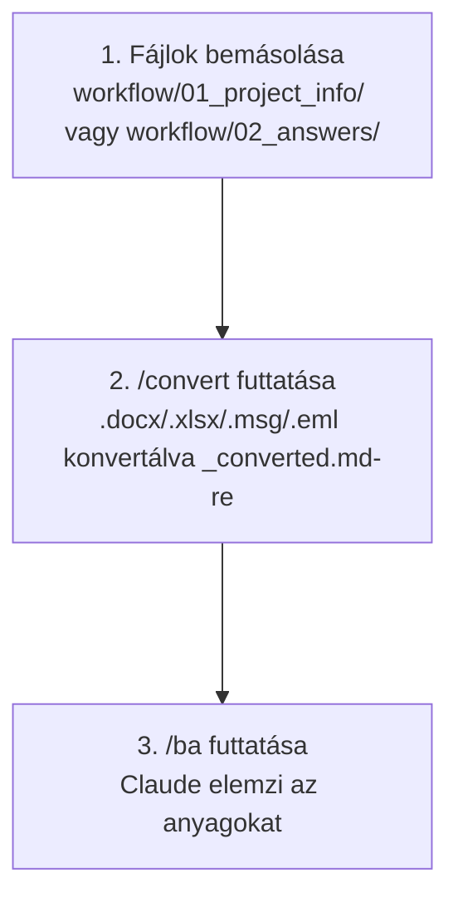

# `/convert` – Fájl konverter

[English version](README.en.md)

## Mire való?

A `/convert` parancs automatikusan átalakítja a `workflow/01_project_info/` és a `workflow/02_answers/` mappákban lévő Office és Outlook fájlokat Markdown formátumba, hogy az AI ügynökök feldolgozhassák őket.

---

## Mikor kell használni?

Ha olyan fájlokat másoltál a `workflow/01_project_info/` vagy a `workflow/02_answers/` mappába, amelyek nem `.md` vagy `.txt` formátumúak:

| Fájltípus | Konverzió szükséges? |
|---|---|
| `.docx` / `.doc` (Word) | Igen – Python + markitdown szükséges |
| `.xlsx` / `.xls` (Excel) | Igen – Python + openpyxl szükséges |
| `.msg` (Outlook e-mail) | Igen – Python + extract-msg szükséges |
| `.eml` (e-mail fájl) | Igen – Python stdlib (külön csomag nem kell) |
| `.pdf` | Nem – Claude natívan olvassa |
| `.md` / `.txt` | Nem – már feldolgozható |

---

## Használat

1. Másold be a fájlokat a `workflow/01_project_info/` mappába
2. A Claude panelen írd be: `/convert`
3. A rendszer automatikusan:
   - Megvizsgálja, mely fájlok igényelnek konverziót
   - Ellenőrzi a szükséges eszközöket
   - Konvertálja a fájlokat `[fájlnév]_converted.md` formátumba
   - Jelenti, mi sikerült és mi igényel manuális beavatkozást
4. Ha a konverzió kész: futtasd a `/ba` parancsot

---

## Telepítési útmutató (ha szükséges)

Ha az ügynök jelzi, hogy valamely eszköz hiányzik:

**Python** (minden konverzióhoz):
- Windows: `winget install python`
- Mac: `brew install python`
- Részletek: [python.org/downloads](https://www.python.org/downloads/)

**Python könyvtárak** (Python telepítése után):
```
pip install "markitdown[docx]" openpyxl extract-msg
```

---

## Mit csinál pontosan?

- **Soha nem módosítja az eredeti fájlokat** — mindig új `_converted.md` fájlt hoz létre
- **Csak a változásokat konvertálja** — SHA-256 ujjlenyomat és fájl-metaadatok alapján felismeri a változatlan fájlokat, így időt és tokeneket spórol
- **PDF-et nem konvertál** — azt Claude natívan tudja olvasni
- **Ha hiányzik egy eszköz**, részletes telepítési útmutatót ad
- A konverzió után a `/ba` parancs már feldolgozza az összes fájlt

---

## Automatikus konverzió – nem kell mindig /convert-et futtatni

A `/ba`, `/spec-builder` és `/business-analyst` parancsok **automatikusan elindítják a konverziót** a megfelelő mappán:

| Parancs | Melyik mappát konvertálja? |
|---|---|
| `/ba` | `01_project_info/` és `02_answers/` |
| `/spec-builder` | csak `01_project_info/` |
| `/business-analyst` | csak `02_answers/` |
| `/convert` | `01_project_info/` és `02_answers/` |

A `/convert` önállóan akkor hasznos, ha csak ellenőrizni szeretnéd a konverziót, vagy manuálisan szeretnéd futtatni a `/ba` előtt.

## Workflow a /convert-tel


