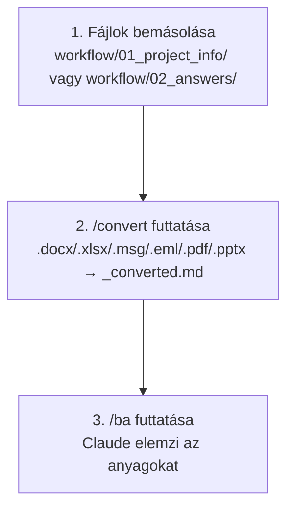

# `/convert` – Fájl konverter

[English version](README.en.md)

## Mire való?

A `/convert` parancs automatikusan átalakítja a `workflow/01_project_info/` és a `workflow/02_answers/` mappákban lévő Office, Outlook és egyéb fájlokat Markdown formátumba, hogy az AI ügynökök feldolgozhassák őket.

A konverziót egy **Python csomag** végzi — nem AI agent — így egyetlen LLM tokent sem használ el.

---

## Mikor kell használni?

Ha olyan fájlokat másoltál a `workflow/01_project_info/` vagy a `workflow/02_answers/` mappába, amelyek nem `.md` vagy `.txt` formátumúak:

| Fájltípus | Konverzió szükséges? |
|---|---|
| `.docx` / `.doc` (Word) | Igen – Python + markitdown szükséges |
| `.xlsx` / `.xls` (Excel) | Igen – Python + openpyxl szükséges |
| `.msg` (Outlook e-mail) | Igen – Python + extract-msg szükséges |
| `.eml` (e-mail fájl) | Igen – Python stdlib (külön csomag nem kell) |
| `.pdf` | Igen – Python + markitdown[pdf] szükséges |
| `.pptx` / `.ppt` (PowerPoint) | Igen – Python + markitdown + python-pptx |
| `.png` / `.jpg` / `.jpeg` / `.bmp` / `.webp` (képek) | Igen – AI alapú feldolgozás (API kulcs nélkül is működik) |
| `.md` / `.txt` | Nem – már feldolgozható |

---

## Használat

1. Másold be a fájlokat a `workflow/01_project_info/` mappába
2. A Claude panelen írd be: `/convert`
3. A rendszer automatikusan:
   - Megvizsgálja, mely fájlok igényelnek konverziót (méret + dátum gyorsellenőrzés, majd SHA-256)
   - Konvertálja a fájlokat `[fájlnév]_converted.md` formátumba
   - Frissíti a konverziós naplót (`.claude/memory/CONVERSION_LOG.md`)
   - Jelenti, mi sikerült, mi lett kihagyva és mi igényel manuális beavatkozást
4. Ha a konverzió kész: futtasd a `/ba` parancsot

---

## Telepítési útmutató (ha szükséges)

Ha a kimenet `FAIL` sorokat tartalmaz hiányzó eszközre utalva:

**Python** (minden konverzióhoz):
- Windows: `winget install python`
- Mac: `brew install python`

**Python könyvtárak** (Python telepítése után):
```
pip install "markitdown[docx,pdf]" openpyxl extract-msg python-pptx
```

---

## Mit csinál pontosan?

- **Soha nem módosítja az eredeti fájlokat** — mindig új `_converted.md` fájlt hoz létre
- **Csak a változásokat konvertálja** — méret + módosítási dátum gyorsellenőrzéssel, majd SHA-256 ujjlenyomattal ismeri fel a változatlan fájlokat
- **Output SHA-256 ellenőrzés** — a konvertált fájl ujjlenyomatát is naplózza; ha valaki kézzel belenyúlt a `_converted.md` fájlba, `MODIFIED` státuszt kap (a módosítás megmarad, a napló frissül)
- **Törölt output újragenerálása** — ha a forrás nem változott, de a `_converted.md` fájlt valaki törölte, automatikusan újra konvertálja
- **Ha hiányzik egy eszköz**, a kimenetben `FAIL` sorként jelzi a hibát és a telepítési útmutatót
- A konverzió után a `/ba` parancs már feldolgozza az összes fájlt

### Képfeldolgozás (PNG, JPG, JPEG, BMP, WEBP)

A képek konverziója **AI-alapú** — a rendszer értelmezi a kép tartalmát és Markdown leírást készít belőle:

| Feltétel | Módszer |
|---|---|
| `ANTHROPIC_API_KEY` be van állítva | Python ImageConverter a Claude API-n keresztül (gyors, automatikusan naplózott) |
| Nincs API kulcs | `/convert` skill agent-módban dolgozza fel a Claude Read eszközével |

A generált leírás tartalmaz:
- A kép vizuális tartalmának összefoglalása
- Felismert szöveg (ha van a képen)
- Diagram / struktúra elemzése (ha releváns)
- BA-szempontból releváns megfigyelések

---

## Automatikus konverzió – nem kell mindig /convert-et futtatni

A `/ba`, `/spec-builder` és `/business-analyst` parancsok **automatikusan elindítják a konverziót** a megfelelő mappán:

| Parancs | Melyik mappát konvertálja? |
|---|---|
| `/ba` | `01_project_info/` és `02_answers/` |
| `/spec-builder` | csak `01_project_info/` |
| `/business-analyst` | csak `02_answers/` |
| `/convert` | `01_project_info/` és `02_answers/` |

A `/convert` önállóan akkor hasznos, ha csak ellenőrizni szeretnéd a konverziót, vagy manuálisan szeretnéd futtatni a `/ba` előtt.

## Workflow a /convert-tel


