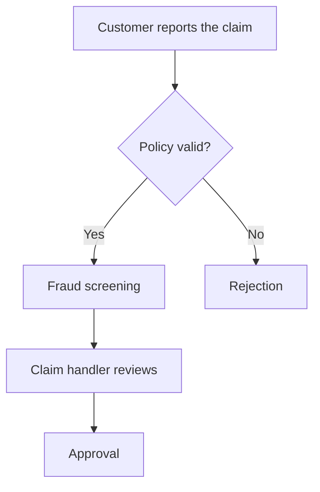
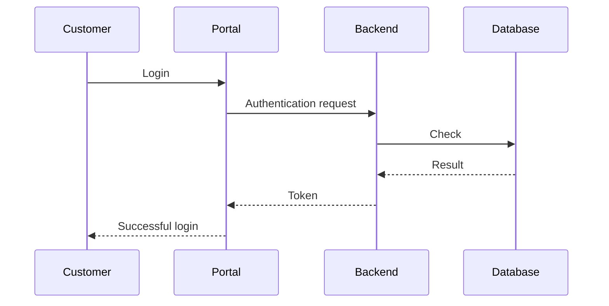
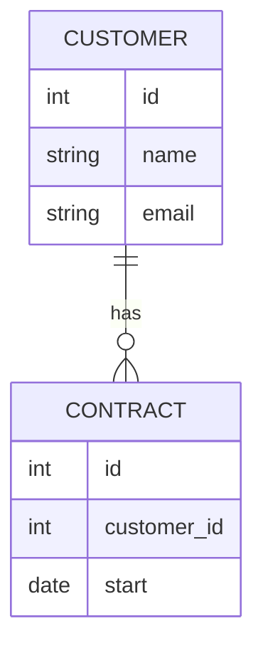
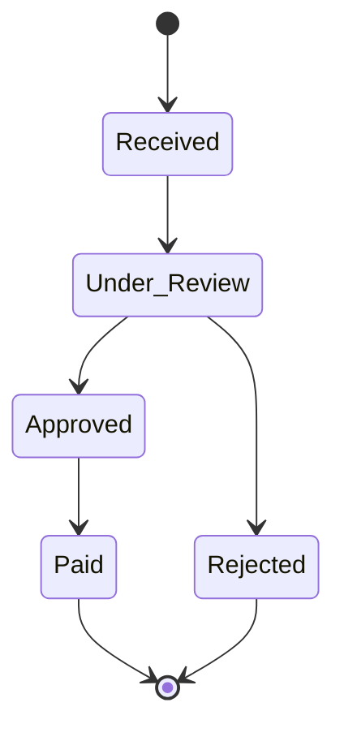

# `/mermaid-diagrams` – Diagram Generator

[Magyar változat](README.md)

## What is it for?

The `/mermaid-diagrams` skill creates **visual diagrams** in Mermaid format: flowcharts, system relationship diagrams, data models, state machines, and more. Diagrams can be viewed directly in VS Code Markdown preview, on GitHub, and in the Mermaid Live Editor.

In BA documents, process descriptions are always paired with a diagram — this skill is also used by `/business-analyst`. But it can also be called independently if a custom diagram is needed.

---

## How to use it?

Simply describe what you want to depict:

```
/mermaid-diagrams please draw the claim settlement process
```

```
/mermaid-diagrams show the relationship between systems
```

```
/mermaid-diagrams create an ER diagram for customer and contract entities
```

---

## What types of diagrams can it create?

### Flowchart (`flowchart`)
For depicting business processes, decision trees, and workflows.



### Sequence Diagram (`sequenceDiagram`)
For chronological depiction of communication between systems or people.



### ER Diagram (`erDiagram`)
For modeling data entities and their relationships.



### State Diagram (`stateDiagram-v2`)
For depicting status transitions and workflow states.



### Git graph (`gitGraph`)
For depicting development branches and release processes.

### Gantt diagram (`gantt`)
For displaying project schedules and milestones.

---

## When should you request which diagram type?

| Situation | Requested Diagram |
|---|---|
| Business process steps | Flowchart |
| Which system sends data to which | Sequence Diagram |
| What data exists and how it connects | ER Diagram |
| Application / case statuses | State Diagram |
| Project schedule | Gantt Diagram |

---

## How to display a diagram?

1. Claude writes the diagram into a Markdown code block.
2. Open the relevant `.md` file in VS Code.
3. Press `Ctrl+Shift+V` (Windows) / `Cmd+Shift+V` (Mac).
4. The diagram appears visually in the right-hand panel.

> Installation of the **Markdown Preview Mermaid Support** VS Code extension is required for display (see README installation guide).

---

## Related Skills

| Skill | Relationship |
|---|---|
| `/business-analyst` | Mandatorily uses it for every process description |
| `/ba` | Indirectly, during BA document generation |
