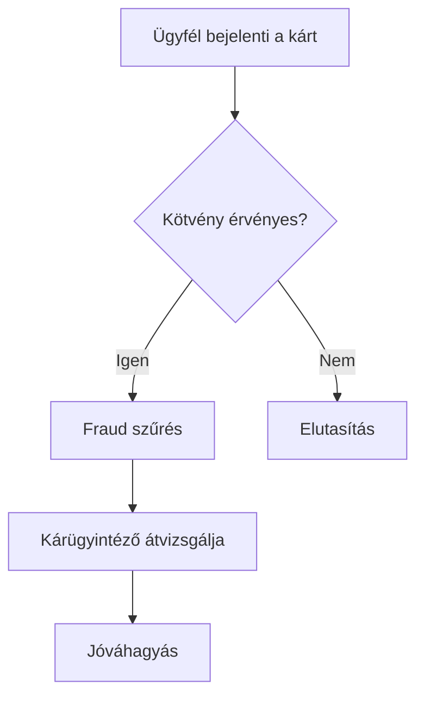
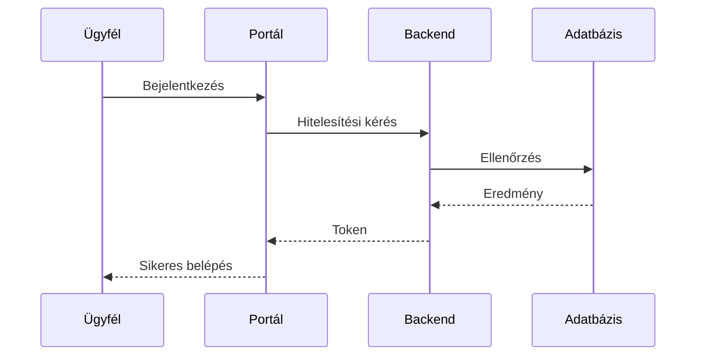
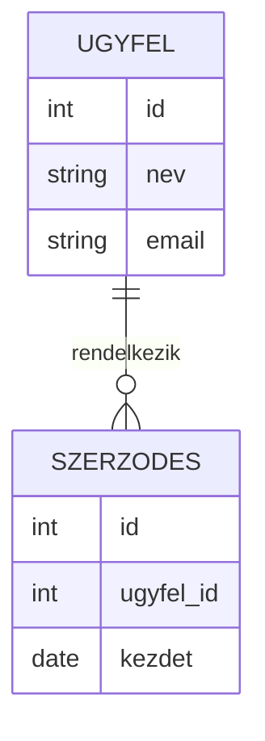
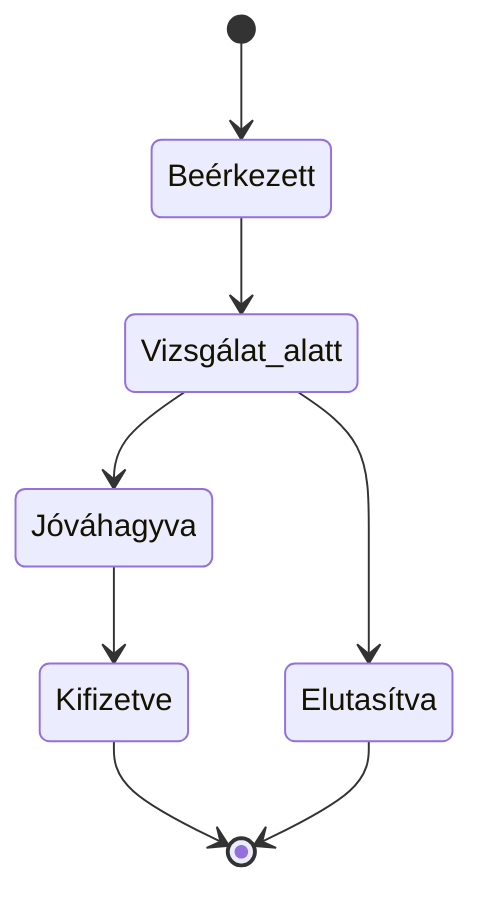

# `/mermaid-diagrams` – Diagram-generáló

[English version](README.en.md)

## Mire való?

A `/mermaid-diagrams` skill **vizuális diagramokat** készít Mermaid formátumban: folyamatábrákat, rendszerkapcsolati diagramokat, adatmodelleket, állapotgépeket és sok mást. A diagramok közvetlenül megjeleníthetők a VS Code Markdown előnézetében, GitHubon és a Mermaid Live Editorban.

A BA dokumentumokban a folyamatleírások mindig diagrammal párosulnak — ezt a skillt a `/business-analyst` is használja. De önállóan is meghívható, ha egyedi diagramra van szükség.

---

## Hogyan használd?

Egyszerűen írd le, mit szeretnél ábrázolni:

```
/mermaid-diagrams kérlek rajzold le a kárrendezési folyamatot
```

```
/mermaid-diagrams mutasd be a rendszerek közötti kapcsolatot
```

```
/mermaid-diagrams készíts ER diagramot az ügyfél és szerződés entitásokhoz
```

---

## Milyen diagramokat tud készíteni?

### Folyamatábra (`flowchart`)
Üzleti folyamatok, döntési fák, workflow-k ábrázolására.



### Szekvencia diagram (`sequenceDiagram`)
Rendszerek vagy személyek közötti kommunikáció időrendi ábrázolására.



### ER diagram (`erDiagram`)
Adatentitások és kapcsolataik modellezésére.



### Állapotdiagram (`stateDiagram-v2`)
Státuszátmenetek, munkafolyamat-állapotok ábrázolására.



### Git graph (`gitGraph`)
Fejlesztési ágak és release folyamatok ábrázolására.

### Gantt diagram (`gantt`)
Projekt ütemterv, mérföldkövek megjelenítésére.

---

## Mikor melyik diagram típust érdemes kérni?

| Helyzet | Kért diagram |
|---|---|
| Üzleti folyamat lépései | Folyamatábra |
| Melyik rendszer küld adatot melyiknek | Szekvencia diagram |
| Milyen adatok vannak és hogyan kapcsolódnak | ER diagram |
| Kérelem / ügy státuszai | Állapotdiagram |
| Projekt ütemterv | Gantt diagram |

---

## Hogyan jeleníts meg egy diagramot?

1. A Claude a diagramot egy Markdown kód blokkba írja
2. Nyisd meg az érintett `.md` fájlt VS Code-ban
3. Nyomj `Ctrl+Shift+V` (Windows) / `Cmd+Shift+V` (Mac) billentyűt
4. A jobb oldali panelen megjelenik a diagram vizuálisan

> A megjelenítéshez szükséges a **Markdown Preview Mermaid Support** VS Code bővítmény telepítése (lásd README telepítési útmutató).

---

## Kapcsolódó skillek

| Skill | Kapcsolat |
|---|---|
| `/business-analyst` | Kötelezően használja minden folyamatleíráshoz |
| `/ba` | Közvetetten, a BA dokumentumok generálásakor |
