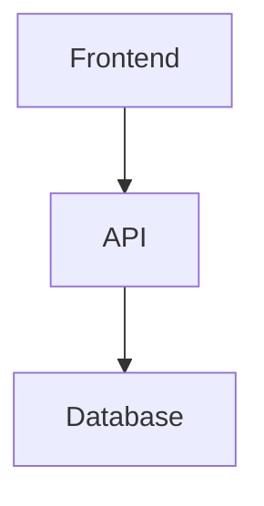

# Mermaid Diagram Generator

## Output Format Rule

Always wrap diagrams in a fenced Mermaid Markdown block:

````markdown

````

Never output raw Mermaid syntax without the code fence.

---

## Diagram Type Selection

| Use case | Diagram type |
|---|---|
| App logic, infra, pipelines, user flows | `flowchart` |
| API calls, auth, WebSocket, distributed systems | `sequenceDiagram` |
| Database schema, ORM, data modeling | `erDiagram` |
| App states, workflows, UI transitions | `stateDiagram-v2` |
| Git branching, releases, feature workflows | `gitGraph` |

---

## Direction Selection

| Scenario | Direction |
|---|---|
| Architecture, user flows | `TD` (top-down) |
| Pipelines, CI/CD, infrastructure | `LR` (left-right) |

---

## Naming Conventions

| Node type | Convention |
|---|---|
| Services | PascalCase (`UserService`) |
| Databases | `DB` suffix (`UserDB`) |
| Queues | `Queue` suffix (`EmailQueue`) |
| APIs | `API` suffix (`UserAPI`) |
| Workers | `Worker` suffix (`PaymentWorker`) |
| Events | past tense (`OrderPlaced`) |

---

## Readability Rules

- Short node labels — avoid long phrases in boxes
- Use `subgraph` to group related systems
- Label important edges: `-->|REST API|`
- Consistent left-to-right or top-to-bottom flow
- Minimize crossing arrows
- If diagram exceeds ~20 nodes, split into multiple focused diagrams

---

## Templates

Template examples are maintained in separate files:
- `.claude/skills/mermaid-diagrams/references/flowchart_template.md`
- `.claude/skills/mermaid-diagrams/references/sequence_diagram_template.md`
- `.claude/skills/mermaid-diagrams/references/er_diagram_template.md`
- `.claude/skills/mermaid-diagrams/references/state_diagram_template.md`
- `.claude/skills/mermaid-diagrams/references/git_graph_template.md`

Reference loading policy:
- Do not load all template files by default.
- First select diagram type from the request.
- Load only the single matching template file.

---

## Common Architecture Patterns

Common architecture examples are in separate files:
- `.claude/skills/mermaid-diagrams/references/microservices_template.md`
- `.claude/skills/mermaid-diagrams/references/event_driven_template.md`
- `.claude/skills/mermaid-diagrams/references/ci_cd_pipeline_template.md`

Optional reference policy:
- Treat these architecture pattern files as optional references.
- Load them only if the user explicitly asks for that pattern, or if the request is ambiguous and an example is needed.

---

## Error Prevention

- Unique node IDs throughout the diagram
- No special characters in node IDs (use labels for display text: `A[My Label]`)
- `stateDiagram-v2` not `stateDiagram`
- `erDiagram` relationships: `||--o{`, `}|--|{`, `||--||`
- `sequenceDiagram`: use `->>` for solid, `-->>` for dashed return arrows
