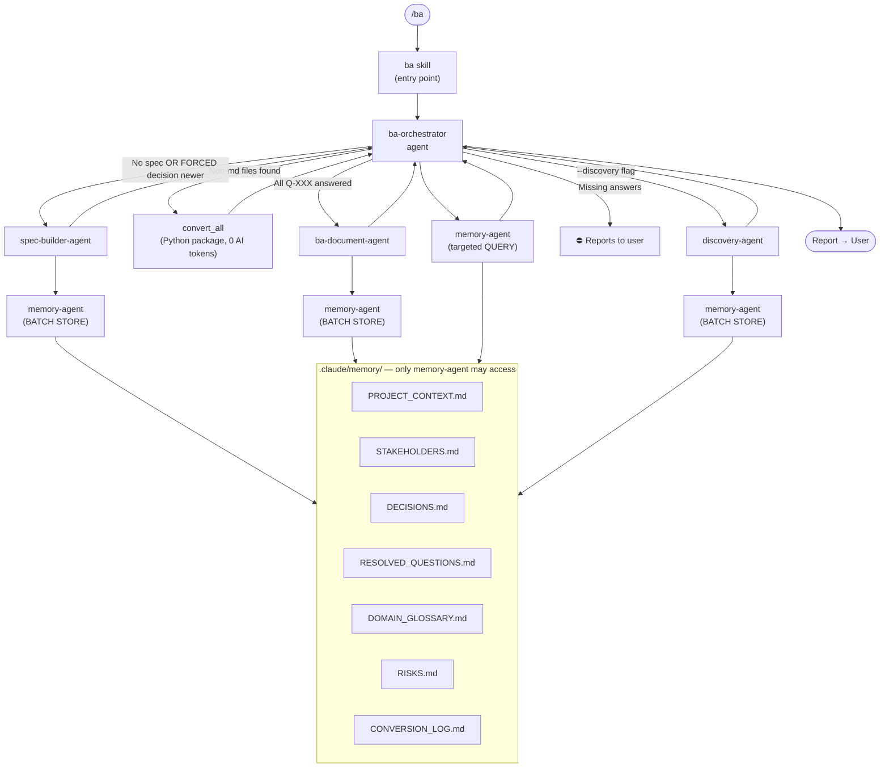
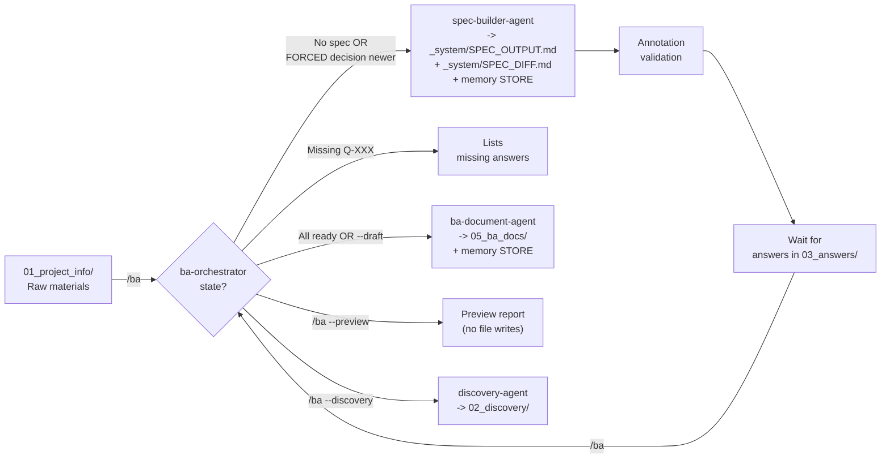

# BA Team – Agents & Skills Reference

## Architecture

Skills are user-facing entry points (slash commands).
Agents are specialist workers — they perform the actual work and are dispatched by skills or other agents.



---

## Agents

Agents live in `.claude/agents/`. They are dispatched programmatically — not invoked directly by the user.

### `ba-orchestrator`

**File:** [.claude/agents/ba-orchestrator.md](.claude/agents/ba-orchestrator.md)

The main coordinator. Detects workflow state, delegates to specialist agents, and reports to the user.
Never writes spec content or BA documents itself.

| State detected | Action |
|---|---|
| No input files | Reports: nothing to process |
| No `_system/SPEC_OUTPUT.md` | Dispatches `spec-builder-agent` |
| FORCED decision (`04_decisions/`) newer than spec | Dispatches `spec-builder-agent` to rebuild (bypassed by `--force`) |
| Open Q-XXX, no answers | Reports: waiting for answers |
| Unanswered Q-XXX | Reports: lists missing answers, stops |
| Unanswered Q-XXX + `--draft` | Dispatches `ba-document-agent` in draft mode (VÁZLAT header) |
| All Q-XXX answered | Dispatches `ba-document-agent` |
| `--discovery` flag | Dispatches `discovery-agent` |

---

### `spec-builder-agent`

**File:** [.claude/agents/extractor-agent.md](.claude/agents/extractor-agent.md)

Reads processable files in `workflow/01_project_info/`, generates or updates the structured specification.
Supports **incremental building** via `SPEC_LOG.md` fingerprints to save tokens.
Every generated element (FR-XXX, NFR-XXX, US-XXX, Q-XXX, A-XXX, contradictions) receives a
**source annotation** `[Forrás: filename · sha8]` referencing the original input file's SHA-256.

**Output:** `workflow/01_project_info/_system/SPEC_OUTPUT.md`

**Memory stored:** PROJECT_CONTEXT · STAKEHOLDERS · RISKS · SPEC_LOG

### `ba-document-agent`

**File:** [.claude/agents/ba-document-agent.md](.claude/agents/ba-document-agent.md)

Generates the full BA document set from spec, answers, and memory context.
Mermaid diagrams are mandatory for every process described. All output in Hungarian.
Preserves `[Forrás: filename · sha8]` source annotations from SPEC_OUTPUT.md throughout all documents.
`Traceability_Matrix.md` includes a `Forrás fájl` column: source file → requirement → user story.

**Output:** `workflow/05_ba_docs/` — BRD, User Stories, Process Flows, Traceability Matrix, RAID Log, Glossary

**Memory stored:** RESOLVED_QUESTIONS · DECISIONS · DOMAIN_GLOSSARY · RISKS

---

### `discovery-agent`

**File:** [.claude/agents/discovery-agent.md](.claude/agents/discovery-agent.md)

Runs the discovery phase before full spec building. Reads raw materials in `workflow/01_project_info/`
and produces structured discovery outputs in `workflow/02_discovery/`.

**Output:**
- `workflow/02_discovery/BC.md` — Business Context (problem, goals, scope, stakeholders)
- `workflow/02_discovery/Discovery_RAID.md` — early risks and assumptions
- `workflow/02_discovery/Discovery_Questions.md` — open questions for stakeholders

**Dispatched by:** `ba-orchestrator` when `--discovery` flag is active, or directly by `/discovery` skill.

**Memory stored:** PROJECT_CONTEXT · STAKEHOLDERS · RISKS

---

### `convert_all` Python package

**Entry point:** `python .claude/scripts/run_convert.py --scope [all|inputs|answers]`

Converts non-markdown files in `workflow/01_project_info/` and/or `workflow/03_answers/` to `.md` format.
Not an AI agent — runs as a deterministic Python process. Uses zero LLM tokens.
Stat-based fast-skip (Size/Modified), SHA-256 fingerprint check, writes `CONVERSION_LOG.md` directly.

| Format | Tool |
|---|---|
| `.docx` / `.doc` | Python + markitdown[docx] |
| `.xlsx` / `.xls` | Python + openpyxl |
| `.msg` | Python + extract-msg |
| `.eml` | Python stdlib (no extra packages) |
| `.pdf` | Python + markitdown[pdf] |
| `.pptx` / `.ppt` | Python + markitdown + python-pptx |

**Output:** `[source-folder]/[filename]_converted.md`

**Log:** writes `.claude/memory/CONVERSION_LOG.md` directly (9-column table, includes output SHA-256)

---

### `memory-agent`

**File:** [.claude/agents/memory-agent.md](.claude/agents/memory-agent.md)

The sole owner of `.claude/memory/`. Handles all read/write operations on memory files.
Every other agent must delegate memory operations here — no agent accesses `.claude/memory/` directly.

**Operations:**

| Operation | Purpose |
|---|---|
| `BATCH` | Execute multiple STORE/UPSERT operations in one agent call (Efficiency) |
| `LOAD` | Read all BA memory files — returns only `status: active` rows (token-efficient) |
| `LOAD_ALL` | Read all rows including archived (`status: archived`) — for audit/reset only |
| `STORE` | Append a new entry to a BA memory file (default `status: active`) |
| `QUERY` | Return targeted content from one or more memory files |
| `LOAD_CONVERSION_LOG` | Return CONVERSION_LOG.md (includes Size/Modified/SHA-256) |
| `MEMORY_UPSERT` | Update or insert a row; use `status: archived` to archive an entry |

---

## Skills

Skills live in `.claude/skills/`. They are invoked by the user via slash commands.
Each skill is a thin dispatcher — it delegates all work to an agent or a Python script.

| Skill | Dispatches | User guide |
|---|---|---|
| `/ba` | `ba-orchestrator` | [README](.claude/skills/ba/README.md) |
| `/ba --discovery` | `ba-orchestrator` → `discovery-agent` | [README](.claude/skills/ba/README.md) |
| `/convert` | `convert_all` Python package | [README](.claude/skills/convert/README.md) |
| `/extractor` | `spec-builder-agent` | [README](.claude/skills/extractor/README.md) |
| `/business-analyst` | `ba-document-agent` | [README](.claude/skills/business-analyst/README.md) |
| `/memory-handler` | `memory-agent` | [README](.claude/skills/memory-handler/README.md) |
| `/session-loader` | `session_loader.py` Python script | [README](.claude/skills/session-loader/README.md) |
| `/mermaid-diagrams` | *(inline, no agent)* | [README](.claude/skills/mermaid-diagrams/README.md) |
| `/self-dev` | Python script → Formspree | [README](.claude/skills/self-dev/README.md) |
| `/check-state` | *(inline state check)* | [README](.claude/skills/check-state/README.md) |
| `/help` | *(inline state check + doc search)* | [README](.claude/skills/help/README.md) |

> **Note:** `/ba` is the single recommended entry point for the full workflow.
> See [CLAUDE.md](CLAUDE.md) for the authoritative workflow description and usage instructions.

---

## Workflow State Machine

> **Source of truth for user-facing workflow states:** [CLAUDE.md §`/ba` Skill States](CLAUDE.md).
> This diagram shows the internal orchestrator routing; CLAUDE.md is the authoritative description
> of what the user experiences.



---

## Memory Access Rule

**Only `memory-agent` may read from or write to `.claude/memory/`.**
All other agents dispatch memory operations via the protocol above.
No agent may use file tools directly on `.claude/memory/` files.
Full protocol reference: [`.claude/rules/memory-access.md`](.claude/rules/memory-access.md)

---

## Answer file format (`workflow/03_answers/answers.md`)

```markdown
Q-001: A rendszer minden sikertelen belépési kísérletet naplóz; 5 próba után fiókzárolás.
Q-002: Az adatmegőrzési időszak GDPR alapján 7 év.
Q-003: A fizetéseket a Stripe API kezeli, számlázást az ERP-be kell integrálni.
```

> Note: Answer content is written in Hungarian, as Q-XXX answers are user-provided BA content.

---

## Related documentation

- [CLAUDE.md](CLAUDE.md) — authoritative workflow instructions and language rules (single source of truth)
- [HANDBOOK.md](HANDBOOK.md) — user-facing guide in Hungarian
- [devdocs/troubleshooting.md](devdocs/troubleshooting.md) — debugging decision tree
- [devdocs/improvements.md](devdocs/improvements.md) — known gaps and roadmap
