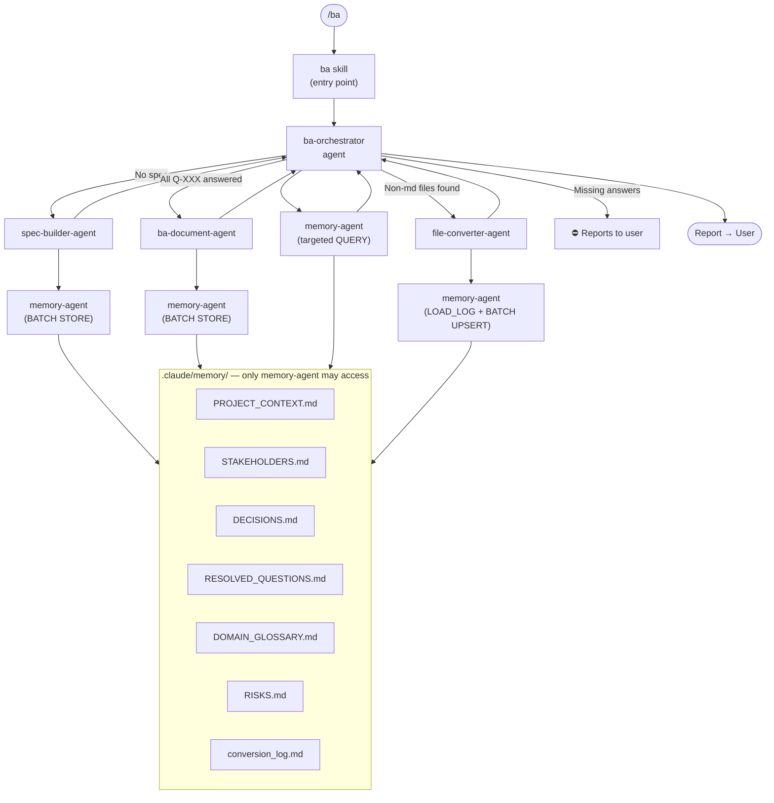
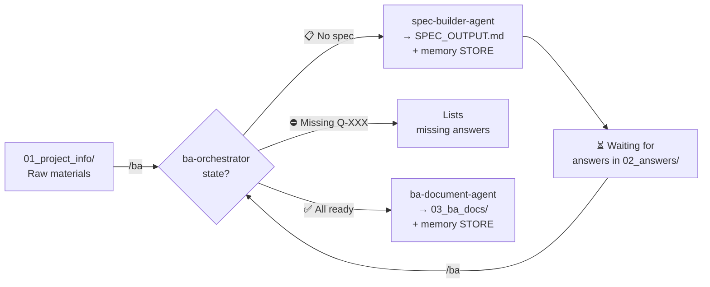

# BA Team – Agents & Skills Reference

## Architecture

Skills are user-facing entry points (slash commands).
Agents are specialist workers — they perform the actual work and are dispatched by skills or other agents.



---

## Agents

Agents live in `.claude/agents/`. They are dispatched programmatically — not invoked directly by the user.

### `ba-orchestrator`

**File:** [.claude/agents/ba-orchestrator.md](.claude/agents/ba-orchestrator.md)

The main coordinator. Detects workflow state, delegates to specialist agents, and reports to the user.
Never writes spec content or BA documents itself.

| State detected | Action |
|---|---|
| No input files | Reports: nothing to process |
| No SPEC_OUTPUT.md | Dispatches `spec-builder-agent` |
| Open Q-XXX, no answers | Reports: waiting for answers |
| Unanswered Q-XXX | Reports: lists missing answers, stops |
| All Q-XXX answered | Dispatches `ba-document-agent` |

---

### `spec-builder-agent`

**File:** [.claude/agents/spec-builder-agent.md](.claude/agents/spec-builder-agent.md)

Reads processable files in `workflow/01_project_info/`, generates or updates the structured specification.
Supports **incremental building** via `SPEC_LOG.md` fingerprints to save tokens.

**Output:** `workflow/01_project_info/SPEC_OUTPUT.md`

**Memory stored:** PROJECT_CONTEXT · STAKEHOLDERS · RISKS · SPEC_LOG

### `ba-document-agent`

**File:** [.claude/agents/ba-document-agent.md](.claude/agents/ba-document-agent.md)

Generates the full BA document set from spec, answers, and memory context.
Mermaid diagrams are mandatory for every process described. All output in Hungarian.

**Output:** `workflow/03_ba_docs/` — BRD, User Stories, Process Flows, Traceability Matrix, RAID Log, Glossary

**Memory stored:** RESOLVED_QUESTIONS · DECISIONS · DOMAIN_GLOSSARY · RISKS

---

### `file-converter-agent`

**File:** [.claude/agents/file-converter-agent.md](.claude/agents/file-converter-agent.md)

Converts non-markdown files in `workflow/01_project_info/` and `workflow/02_answers/` to `.md` format.
Uses stat-based fast-skip (Size/Modified) and SHA-256 fingerprinting via `memory-agent` to skip files that have not changed.
After conversion, updates the log via `memory-agent` (MEMORY_BATCH UPSERT).
Provides installation instructions if a required tool is missing.

| Format | Tool |
|---|---|
| `.docx` / `.doc` | Python + markitdown[docx] |
| `.xlsx` / `.xls` | Python + openpyxl |
| `.msg` | Python + extract-msg |
| `.eml` | Python stdlib (no extra packages) |
| `.pdf` | Natively readable — no conversion |

**Output:** `[source-folder]/[filename]_converted.md`

**Memory:** reads and writes `conversion_log.md` exclusively via `memory-agent`

---

### `memory-agent`

**File:** [.claude/agents/memory-agent.md](.claude/agents/memory-agent.md)

The sole owner of `.claude/memory/`. Handles all read/write operations on memory files.
Every other agent must delegate memory operations here — no agent accesses `.claude/memory/` directly.

**Operations:**

| Operation | Purpose |
|---|---|
| `BATCH` | Execute multiple STORE/UPSERT operations in one agent call (Efficiency) |
| `LOAD` | Read all BA memory files; create missing ones from templates |
| `STORE` | Append a new entry to a BA memory file |
| `QUERY` | Return targeted content from one or more memory files |
| `LOAD_CONVERSION_LOG` | Return conversion_log.md (includes Size/Modified/SHA-256) |
| `MEMORY_UPSERT` | Update or insert a row in conversion_log.md |

---

## Skills

Skills live in `.claude/skills/`. They are invoked by the user via slash commands.
Each skill is now a thin dispatcher — it delegates all work to an agent.

| Skill | Dispatches | User guide |
|---|---|---|
| `/ba` | `ba-orchestrator` | [README](.claude/skills/ba/README.md) |
| `/convert` | `file-converter-agent` | [README](.claude/skills/convert/README.md) |
| `/spec-builder` | `spec-builder-agent` | [README](.claude/skills/spec-builder/README.md) |
| `/business-analyst` | `ba-document-agent` | [README](.claude/skills/business-analyst/README.md) |
| `/memory-handler` | `memory-agent` | [README](.claude/skills/memory-handler/README.md) |
| `/session-loader` | *(runs script, no agent)* | [README](.claude/skills/session-loader/README.md) |
| `/mermaid-diagrams` | *(inline, no agent)* | [README](.claude/skills/mermaid-diagrams/README.md) |

---

## Workflow Summary



---

## Memory Access Rule

**Only `memory-agent` may read from or write to `.claude/memory/`.**
All other agents dispatch memory operations via the protocol above.
No agent may use file tools directly on `.claude/memory/` files.
Full protocol reference: [`.claude/rules/memory-access.md`](.claude/rules/memory-access.md)

---

## Answer file format (`workflow/02_answers/answers.md`)

```markdown
Q-001: A rendszer minden sikertelen belépési kísérletet naplóz; 5 próba után fiókzárolás.
Q-002: Az adatmegőrzési időszak GDPR alapján 7 év.
Q-003: A fizetéseket a Stripe API kezeli, számlázást az ERP-be kell integrálni.
```

> Note: Answer content is written in Hungarian, as Q-XXX answers are user-provided BA content.
