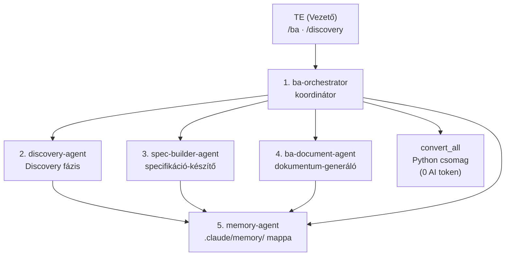
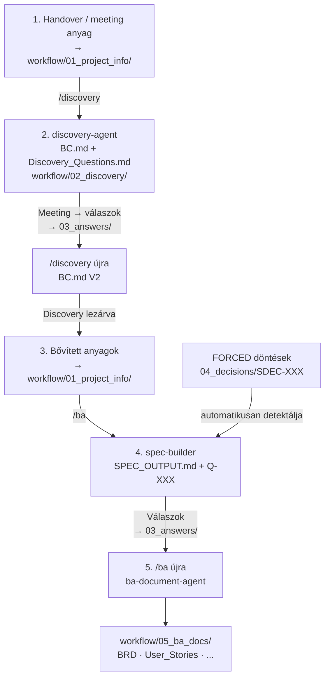
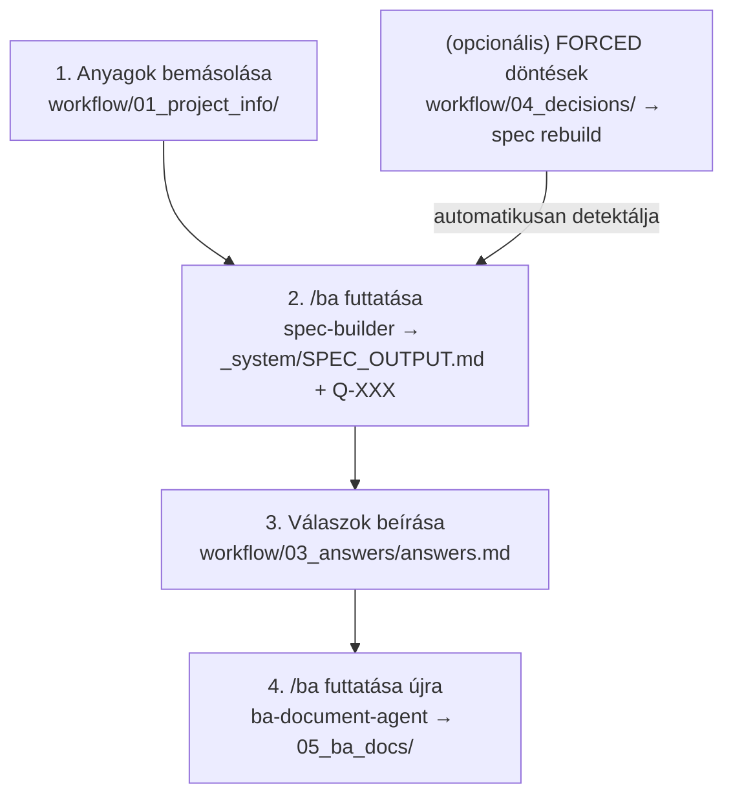

# BA Team – Felhasználói Kézikönyv

**Verzió:** 1.0
**Dátum:** 2026. május
**Termék:** BA Team – AI-alapú Business Analyst Munkafolyamat

---

## Tartalomjegyzék

- [BA Team – Felhasználói Kézikönyv](#ba-team--felhasználói-kézikönyv)
  - [Tartalomjegyzék](#tartalomjegyzék)
  - [1. A termékről](#1-a-termékről)
    - [Mit csinál a BA Team?](#mit-csinál-a-ba-team)
    - [Miért más, mint egy egyszerű chatbot?](#miért-más-mint-egy-egyszerű-chatbot)
    - [A rendszer alapelvei](#a-rendszer-alapelvei)
  - [2. Az AI csapat bemutatása](#2-az-ai-csapat-bemutatása)
  - [3. Telepítési útmutató](#3-telepítési-útmutató)
    - [3.1 Automatikus telepítés](#31-automatikus-telepítés)
    - [3.2 Manuális telepítés lépésről lépésre](#32-manuális-telepítés-lépésről-lépésre)
      - [Szükséges eszközök](#szükséges-eszközök)
      - [1. lépés – GitHub fiók létrehozása](#1-lépés--github-fiók-létrehozása)
      - [2. lépés – Saját projekt létrehozása a sablonból](#2-lépés--saját-projekt-létrehozása-a-sablonból)
      - [3. lépés – Visual Studio Code telepítése](#3-lépés--visual-studio-code-telepítése)
      - [4. lépés – Claude Code bővítmény telepítése](#4-lépés--claude-code-bővítmény-telepítése)
      - [5. lépés – Markdown bővítmények telepítése](#5-lépés--markdown-bővítmények-telepítése)
      - [6. lépés – A projekt letöltése VS Code-ba](#6-lépés--a-projekt-letöltése-vs-code-ba)
    - [3.3 Python és fájlkonverziós könyvtárak (opcionális)](#33-python-és-fájlkonverziós-könyvtárak-opcionális)
    - [3.4 Első indítás ellenőrzése](#34-első-indítás-ellenőrzése)
  - [4. Mappa- és fájlstruktúra](#4-mappa--és-fájlstruktúra)
    - [Az öt fő munkamappa](#az-öt-fő-munkamappa)
    - [A memória mappa](#a-memória-mappa)
  - [5. Parancsok és skillek](#5-parancsok-és-skillek)
  - [6. A teljes munkafolyamat](#6-a-teljes-munkafolyamat)
    - [A munkafolyamat áttekintése](#a-munkafolyamat-áttekintése)
    - [6.0 Discovery fázis (/discovery)](#60-discovery-fázis-discovery)
    - [6.1 Új projekt indítása](#61-új-projekt-indítása)
    - [6.2 Specifikáció készítése (/spec-builder)](#62-specifikáció-készítése-spec-builder)
    - [6.3 Kérdések megválaszolása](#63-kérdések-megválaszolása)
    - [6.4 BA dokumentumok generálása](#64-ba-dokumentumok-generálása)
    - [6.5 Munkamenet kezelése (/session-loader)](#65-munkamenet-kezelése-session-loader)
  - [7. A generált dokumentumok](#7-a-generált-dokumentumok)
    - [Kötelező dokumentumok](#kötelező-dokumentumok)
    - [Opcionális dokumentumok (adatmennyiségtől függően)](#opcionális-dokumentumok-adatmennyiségtől-függően)
    - [User Story formátum](#user-story-formátum)
  - [8. Típusjelzők és azonosítók rendszere](#8-típusjelzők-és-azonosítók-rendszere)
    - [Követelmény- és dokumentum azonosítók](#követelmény--és-dokumentum-azonosítók)
    - [Forrás- és státuszjelzők](#forrás--és-státuszjelzők)
    - [Kérdés kategóriák](#kérdés-kategóriák)
  - [9. A hosszú távú memória](#9-a-hosszú-távú-memória)
    - [Mi kerül a memóriába?](#mi-kerül-a-memóriába)
    - [Mikor frissül automatikusan?](#mikor-frissül-automatikusan)
    - [Fontos szabály: csak bővítés, soha törlés](#fontos-szabály-csak-bővítés-soha-törlés)
  - [10. Fájlkonverzió (/convert)](#10-fájlkonverzió-convert)
    - [Mikor szükséges?](#mikor-szükséges)
    - [Hogyan működik?](#hogyan-működik)
    - [Képfeldolgozás (PNG, JPG, JPEG, BMP, WEBP)](#képfeldolgozás-png-jpg-jpeg-bmp-webp)
    - [Tartalom-veszteség figyelmeztetések (WARN státusz)](#tartalom-veszteség-figyelmeztetések-warn-státusz)
    - [Automatikus konverzió](#automatikus-konverzió)
  - [11. Speciális esetek kezelése](#11-speciális-esetek-kezelése)
    - [Politikai és diplomáciai döntések](#politikai-és-diplomáciai-döntések)
    - [Projekt irányváltás](#projekt-irányváltás)
    - [Ha nincs válaszod egy kérdésre](#ha-nincs-válaszod-egy-kérdésre)
  - [12. Diagramkészítés (/mermaid-diagrams)](#12-diagramkészítés-mermaid-diagrams)
    - [Diagramtípusok](#diagramtípusok)
    - [Diagram megtekintése](#diagram-megtekintése)
  - [13. Automatikus értesítések](#13-automatikus-értesítések)
    - [Az automatikus értesítés aktiválása (Stop hook)](#az-automatikus-értesítés-aktiválása-stop-hook)
  - [14. Háttérben futó ügynökök](#14-háttérben-futó-ügynökök)
    - [ba-orchestrator](#ba-orchestrator)
    - [discovery-agent](#discovery-agent)
    - [spec-builder-agent](#spec-builder-agent)
    - [ba-document-agent](#ba-document-agent)
    - [convert\_all Python csomag](#convert_all-python-csomag)
    - [memory-agent](#memory-agent)
  - [15. Szabályozói megfelelőség](#15-szabályozói-megfelelőség)
  - [16. Gyakori kérdések (GYIK)](#16-gyakori-kérdések-gyik)

---

## 1. A termékről

A **BA Team** egy Claude AI-alapú, specializált munkafolyamat-rendszer, amelyet IT projektek üzleti elemzési fázisának hatékonyabbá tételére terveztek. A rendszer mesterséges intelligencia ügynökökből álló „virtuális csapatot" biztosít, amelynek Te vagy a vezetője.

### Mit csinál a BA Team?

A BA Team a nyers projektanyagokból – e-mailek, meetingjegyzetek, Word dokumentumok, Excel táblák, Outlook levelek – automatikusan állít elő **audit-kész, professzionális Business Analyst dokumentációt**.

### Miért más, mint egy egyszerű chatbot?

| Chatbot | BA Team |
|---|---|
| Minden munkamenet elölről kezdődik | Hosszú távú memória őrzi a döntéseket és kontextust |
| Manuálisan kell megadni minden hátteret | Automatikusan beolvassa az előző munkamenetek eredményeit |
| Nincs minőségbiztosítás | Nem enged dokumentumot generálni hiányos adatokkal |
| Nincsenek szabványos azonosítók | FR-XXX, NFR-XXX, US-XXX, Q-XXX – minden elem visszakövethető |
| Nem kezel Office fájlokat | Automatikusan konvertálja a .docx, .xlsx, .msg, .eml fájlokat |

### A rendszer alapelvei

- **Te vagy a főnök**: az AI elvégzi a technikai munkát, de a stratégiai döntések a tiéd maradnak
- **Audit-kész dokumentáció**: minden kimenet fejlesztői átadásra és hatósági auditra alkalmas
- **Soha nem találja ki**: amit az ügyfél nem mondott, azt az AI nem teszi bele a dokumentumba
- **Soha nem oldja fel csendben az ellentmondásokat**: a konfliktusokat jelzi és te döntöd el
- **Teljes magyar nyelvű támogatás**: minden dokumentum és visszajelzés magyarul készül

---

## 2. Az AI csapat bemutatása

A BA Team öt specializált AI ügynökből és egy Python konverziós csomagból áll. Az ügynököket nem közvetlenül te hívod – automatikusan aktiválódnak a megfelelő pillanatban.



| # | Komponens | Típus | Szerepe |
|---|---|---|---|
| 1 | **ba-orchestrator** | AI ügynök | Koordinátor: felméri az állapotot, eldönti mi a következő lépés |
| 2 | **discovery-agent** | AI ügynök | Discovery specialista: korai anyagokból BC.md + kérdéslista, soha nem blokkolja a generálást |
| 3 | **spec-builder-agent** | AI ügynök | Specifikáció-készítő: nyers anyagokból strukturált spec-et farag |
| 4 | **ba-document-agent** | AI ügynök | Dokumentum-generáló: BRD, User Story-k, folyamatábrák |
| – | **convert_all** | Python csomag | Fájlkonverzió: Office/Outlook fájlok → Markdown (0 AI token) |
| 5 | **memory-agent** | AI ügynök | Memóriakezelő: döntések, stakeholderek, szakkifejezések tárolása |

---

## 3. Telepítési útmutató

> Ez az útmutató nem igényel programozói ismereteket.

### 3.1 Automatikus telepítés

A legegyszerűbb módszer: futtasd a telepítő szkriptet, amely mindent automatikusan beállít.

**Windows – PowerShell:**
```powershell
.\install.ps1
```

**Mac – Terminal:**
```bash
bash install.sh
```

A szkript idempotens – újrafuttatható, csak azt telepíti, ami még hiányzik.

**Mit telepít a szkript:**

| Eszköz | Mire való |
|---|---|
| Git | Verziókezelés, projekt letöltése |
| Visual Studio Code | Szövegszerkesztő, Claude beépülő |
| Python | Fájlkonverziókhoz szükséges |
| markitdown[docx] | Word (.docx) → Markdown |
| openpyxl | Excel (.xlsx) → Markdown |
| extract-msg | Outlook (.msg) → Markdown |
| Claude Code (VS Code ext.) | Az AI beépülő modul |
| Markdown Preview Mermaid Support | Folyamatábrák megjelenítéséhez |
| Markdown All in One | Markdown szerkesztéshez |

---

### 3.2 Manuális telepítés lépésről lépésre

Ha a szkript helyett kézzel szeretnéd elvégezni a telepítést:

#### Szükséges eszközök

| Eszköz | Mire való | Ár |
|---|---|---|
| GitHub fiók | A projekt tárolása és letöltése | Ingyenes |
| Visual Studio Code | Szövegszerkesztő | Ingyenes |
| TypeDown App | Markdown szerkesztés és megjelenítés | Ingyenes |
| Claude fiók | Az AI motor | Ingyenes / Pro |

---

#### 1. lépés – GitHub fiók létrehozása

1. Nyisd meg a [github.com](https://github.com) oldalt
2. Kattints a **Sign up** gombra jobb felül
3. Add meg az e-mail címedet, jelszavadat és felhasználónevedet
4. Erősítsd meg az e-mail-es megerősítést
5. Bejelentkezés után kész vagy

---

#### 2. lépés – Saját projekt létrehozása a sablonból

> A BA Team **sablon (template) repository** – egyetlen kattintással létrehozol belőle egy saját, független másolatot.

1. Menj a sablon repository oldalára GitHubon (a csapatvezetőd elküldi a linket)
2. Kattints a zöld **Use this template** gombra (jobb felső sarok)
3. Válaszd a **Create a new repository** lehetőséget
4. Töltsd ki az adatokat:
   - **Repository name**: pl. `projekt-biztosito-rendszer`
   - **Visibility**: válaszd a **Private** lehetőséget
5. Kattints a **Create repository** gombra

> **Fontos:** Minden BA kolléga a saját projektjéhez létrehoz egy ilyen saját másolatot. Az eredeti sablont senki nem módosítja.

---

#### 3. lépés – Visual Studio Code telepítése

1. Nyisd meg a [code.visualstudio.com](https://code.visualstudio.com) oldalt
2. Kattints a nagy kék **Download** gombra
   - Windows: `.exe` telepítő
   - Mac: `.dmg` fájl
3. Futtasd a telepítőt – Windowson hagyd bejelölve az *„Add to PATH"* és *„Open with Code"* opciókat
4. Indítsd el a VS Code-ot

---

#### 4. lépés – Claude Code bővítmény telepítése

1. VS Code-ban kattints az **Extensions** ikonra (bal oldali sáv) – vagy nyomj `Ctrl+Shift+X` (`Cmd+Shift+X` Mac-en)
2. Keresd: `Claude Code`
3. Kiadó: **Anthropic** – kattints az **Install** gombra
4. A bal oldali sávban megjelenik a Claude ikon – kattints rá
5. Kattints a **Sign in** gombra és jelentkezz be a Claude fiókoddal

---

#### 5. lépés – Markdown bővítmények telepítése

A BA dokumentumok Markdown formátumban készülnek és Mermaid folyamatábrákat tartalmaznak. Két bővítményre van szükség:

**5a. Markdown Preview Mermaid Support**
- Keresd az Extensions panelen: `Markdown Preview Mermaid Support`
- Kiadó: **Matt Bierner** – telepítés

**5b. Markdown All in One**
- Keresd: `Markdown All in One`
- Kiadó: **Yu Zhang** – telepítés

> **Dokumentumok megtekintése:** Nyiss meg egy `.md` fájlt, nyomj `Ctrl+Shift+V` (Windows) / `Cmd+Shift+V` (Mac) – megnyílik a formázott előnézet a folyamatábrákkal.

---

#### 6. lépés – A projekt letöltése VS Code-ba

1. VS Code-ban nyomj `Ctrl+Shift+P` (`Cmd+Shift+P` Mac-en)
2. Írd be: `Git: Clone` → Enter
3. Kattints: **Clone from GitHub**
4. Ha először csinálod: engedélyezd a GitHub bejelentkezést a böngészőben
5. Keresd meg a saját repository nevedet (2. lépésben hoztad létre)
6. Válaszd ki a mentési helyet (pl. Dokumentumok mappa)
7. Kattints az **Open** gombra – megnyílik a projekt

---

### 3.3 Python és fájlkonverziós könyvtárak (opcionális)

> Csak akkor szükséges, ha Word, Excel vagy Outlook fájlokat is be szeretnél adni a rendszernek.

**Támogatott fájlformátumok konverzióhoz:**

| Fájltípus | Szükséges eszköz |
|---|---|
| Word (.docx) | Python + markitdown[docx] |
| Excel (.xlsx) | Python + openpyxl |
| Outlook (.msg) | Python + extract-msg |
| E-mail (.eml) | Python stdlib (külön csomag nem kell) |
| PDF (.pdf) | Python + markitdown[pdf] |
| PowerPoint (.pptx) | Python + markitdown + python-pptx |

**Python telepítése:**

*Windows:*
1. Töltsd le: [python.org/downloads](https://www.python.org/downloads/)
2. **Fontos:** jelöld be az **„Add Python to PATH"** jelölőnégyzetet!

*Mac:*
```bash
brew install python
```

**Python könyvtárak telepítése:**
```
pip install "markitdown[docx,pdf]" openpyxl extract-msg python-pptx
```

**Ellenőrzés:**
```
pip show markitdown openpyxl extract-msg python-pptx
```

---

### 3.4 Első indítás ellenőrzése

1. VS Code-ban nyisd meg a Claude panelt (bal oldali sáv, Claude ikon)
2. Írd be: `/session-loader`
3. Nyomj Entert

Ha a rendszer megfelelően települt, az alábbi üzenetet látod:

```
============================================================
  BA WORKFLOW – SESSION LOADER
============================================================
  PROJEKT
  Név:    –
  ...
  JAVASOLT KÖVETKEZŐ LÉPÉS
  ⚠️  Nincs bemeneti anyag.
     → Másolj fájlokat a workflow/01_project_info/ mappába
============================================================
```

> **Python ellenőrzése:** Írd be `/convert` – ha a rendszer jelzi, hogy nincs konvertálandó fájl, a Python is működik.

---

## 4. Mappa- és fájlstruktúra

```
projekt-neve/
├── workflow/
│   ├── 01_project_info/     ← IDE másold be az ügyfél anyagait
│   ├── 02_discovery/        ← Discovery-agent kimenetei (BC.md, RAID)
│   ├── 03_answers/          ← IDE kerülnek a kérdésekre adott válaszok
│   ├── 04_decisions/        ← FORCED döntések (SDEC-XXX fájlok)
│   └── 05_ba_docs/          ← IDE kerülnek a kész BA dokumentumok
├── .claude/
│   ├── agents/              ← Specializált ügynökök (nem kell szerkeszteni)
│   ├── skills/              ← Parancsok (slash commands)
│   ├── memory/              ← Projekt memória (automatikusan kezelt)
│   ├── rules/               ← Viselkedési szabályok
│   └── scripts/             ← Session loader szkriptek
├── CLAUDE.md                ← Belső instrukciók (nem kell szerkeszteni)
├── AGENTS.md                ← Technikai referencia (nem kell szerkeszteni)
└── README.md                ← Leírás
```

### Az öt fő munkamappa

**`workflow/01_project_info/`** – Ide kerül minden ügyfél-anyag:
- Meetingjegyzetek (.md, .txt, .docx)
- E-mail-levelezések (.eml, .msg)
- Excel táblázatok (.xlsx)
- Word dokumentumok (.docx)
- PDF fájlok (natívan olvasható, nem kell konverzió)

**`workflow/02_discovery/`** – Discovery-agent kimenetei:
- `BC.md` – Business Concept (probléma, célok, scope, MVP)
- `Discovery_RAID.md` – korai kockázatok és feltételezések
- `Discovery_Questions.md` – meeting-ready kérdéslista (discovery fázisból)
- `_system/DISCOVERY_OUTPUT.md` – strukturált közbenső spec

**`workflow/03_answers/`** – Ide írod a válaszokat a rendszer kérdéseire:
- `answers.md` fájl (ajánlott)
- Bármilyen más szöveges fájl
- Office fájlok (automatikusan konvertálódnak)

**`workflow/04_decisions/`** – FORCED döntések helye:
- `SDEC-XXX_nev.md` fájlok (YAML frontmatter)
- Stakeholderek és PM itt írhatnak felül bármely specifikációs elemet
- A sablont lásd: `.claude/references/decision_template.md`

**`workflow/05_ba_docs/`** – A kész dokumentumok helye:
- Ide generálja a rendszer az összes BA dokumentumot
- Soha ne szerkeszd kézzel – a `/ba` újragenerálja

### A memória mappa

**`.claude/memory/`** – A hosszú távú projekt-memória:

| Fájl | Tartalom |
|---|---|
| `PROJECT_CONTEXT.md` | Projekt neve, ügyfél, scope, rendszerek, fázis |
| `STAKEHOLDERS.md` | Érintett személyek és szerepköreik |
| `DECISIONS.md` | Naplózott döntések (DEC-XXX azonosítóval) |
| `RESOLVED_QUESTIONS.md` | Megválaszolt kérdések archívuma |
| `DOMAIN_GLOSSARY.md` | Projektspecifikus szakkifejezések |
| `RISKS.md` | Kockázatok és feltételezések |
| `CONVERSION_LOG.md` | Konvertált fájlok nyilvántartása |

---

## 5. Parancsok és skillek

| Parancs | Mire való |
|---|---|
| `/ba` | **Fő parancs** – automatikus következő lépés végrehajtása |
| `/discovery` | Discovery fázis indítása – korai anyagokból BC + kérdéslista generálása |
| `/session-loader` | Munkamenet betöltése, projekt állapot mutatása |
| `/spec-builder` | Csak a specifikáció készítése (haladó használat) |
| `/business-analyst` | Csak a BA dokumentumok generálása (haladó használat) |
| `/convert` | Office/Outlook fájlok kézi konvertálása |
| `/mermaid-diagrams` | Önálló diagram készítése |
| `/memory-handler` | Projekt memória megtekintése |

> **A legtöbb esetben csak a `/ba` vagy `/discovery` parancsra van szükséged.** A többi parancs haladó felhasználóknak és speciális esetekre való.

**`/ba` vs. `/discovery` — mikor melyiket?**

| | `/discovery` | `/ba` |
|---|---|---|
| Fázis | Discovery — korai, hiányos anyag | Analysis — részletes, strukturált anyag |
| Blokkolás Q-XXX-en? | **Nem** — mindig generál | **Igen** — megáll, ha Q-XXX nyitott |
| Kimenet mélysége | Magas szintű: probléma, célok, scope, MVP | Részletes: FR/NFR/US követelmények |
| Dokumentumok | BC.md, Discovery_RAID.md, Discovery_Questions.md | BRD, User_Stories, Process_Flows, RAID_Log, Glossary, Traceability_Matrix |

---

## 6. A teljes munkafolyamat

### A munkafolyamat áttekintése

A BA Team két fő útvonalat támogat: a **Discovery fázist** (`/discovery`) és az **Analysis fázist** (`/ba`). A legtöbb projekt a Discovery fázissal indul.

**Teljes tipikus munkafolyamat:**



**Ha nincs Discovery fázis (már strukturált anyag van):**



---

### 6.0 Discovery fázis (`/discovery`)

A Discovery fázis a projekt legelején indul — amikor még nincs részletes specifikáció, csak sales handover, meeting jegyzetek vagy ügyfél emailek állnak rendelkezésre.

**Mire való?**
- Üzleti probléma, célok, scope, MVP összegyűjtése korai anyagokból
- Strukturált kérdéslista a következő ügyfél meetingre
- Business Concept (BC.md) draft dokumentum

**Hogyan indul?**

1. Másold be az anyagokat a `workflow/01_project_info/` mappába
2. Futtasd: `/discovery`
3. A `discovery-agent` legenerálja a Discovery csomagot a `workflow/02_discovery/` mappába

**Ajánlott input sablonok:**

| Sablon | Helye | Mire való |
|---|---|---|
| Sales → PM/BA Handover | `.claude/references/templates/handover_template.md` | Strukturált Sales átadás |
| Discovery Meeting Notes | `.claude/references/templates/discovery_meeting_template.md` | Meeting lejegyzés |

Másold ki a sablont, töltsd ki, majd tedd a `workflow/01_project_info/` mappába.

**Discovery dokumentumkészlet (`workflow/02_discovery/`):**

| Fájl | Tartalom |
|---|---|
| `BC.md` | Business Concept — fő Discovery deliverable (VÁZLAT fejléccel ha nyitott kérdések vannak) |
| `Discovery_RAID.md` | Korai RAID — kockázatok, feltételezések, nyitott problémák |
| `Discovery_Questions.md` | Meeting-ready kérdéslista tárgyalási sorrenddel |
| `_system/DISCOVERY_OUTPUT.md` | Strukturált közbenső spec |

**BC.md struktúra:**

```
1. Üzleti probléma és gyökérok     [Mermaid diagram kötelező]
2. Üzleti célok                    [Mérhető eredménnyel]
3. Megoldási scope                 [In scope / Out of scope, Mermaid diagram]
4. MVP definíció                   [Must-have elemek]
5. Feltételezések és kockázatok    [Korai RAID összefoglaló]
6. Nyitott kérdések                [Q-XXX lista kategória szerint]
7. Következő lépések
```

**Iteratív Discovery:**

```
1. /discovery → BC.md V1 + Discovery_Questions.md
2. Meeting az ügyféllel → válaszok rögzítése → workflow/03_answers/
3. /discovery újra → BC.md V2 (frissített, kevesebb nyitott kérdés)
4. Discovery lezárva → /ba → teljes Analysis dokumentáció
```

**Discovery_Questions.md — meeting-ready kérdéslista:**

A kérdések kategória szerint rendezve, javasolt tárgyalási sorrendben:

| Kategória | Mikor kap ilyen jelzést |
|---|---|
| `[STAKEHOLDER]` | Döntéshozó ismeretlen, jóváhagyó személy nincs azonosítva |
| `[SCOPE]` | Határ nem tiszta — mi van benne, mi nincs |
| `[MVP]` | MVP definíció hiányos, must-have lista nem meghatározott |
| `[FEASIBILITY]` | Megvalósíthatóság kérdéses — technikai vagy üzleti akadály lehetséges |
| `[TECHNICAL]` | Technikai feltétel ismeretlen — rendszer, integráció, API |

---

### 6.1 Új projekt indítása

**1. Forrásanyagok előkészítése**

Másold be az összes ügyfélanyagot a `workflow/01_project_info/` mappába:
- Meeting-feljegyzések
- E-mail-levelezések
- Workshopok összefoglalói
- Ügyfél visszajelzések
- Félkész vagy kész dokumentumok

Bármilyen formátumban elfogadja a rendszer – Office fájlokat automatikusan konvertál.

**2. Első `/ba` futtatás**

A Claude panelen írd be:
```
/ba
```

A rendszer:
- Automatikusan konvertálja az Office fájlokat
- Beolvassa a projekt memóriáját
- Létrehozza a `workflow/01_project_info/_system/SPEC_OUTPUT.md` specifikációt
- Listázza a megválaszolatlan kérdéseket (Q-XXX)

---

### 6.2 Specifikáció készítése (/spec-builder)

A `spec-builder-agent` a nyers anyagokból strukturált specifikációt készít. A következőket tartalmazza:

- **Funkcionális követelmények (FR-XXX)**: Mit kell tudnia a rendszernek
- **Nem-funkcionális követelmények (NFR-XXX)**: Teljesítmény, biztonság, skálázhatóság
- **User Story-k (US-XXX)**: Felhasználói igények agile formátumban
- **Feltételezések (A-XXX)**: Amire a spec épít, de nincs kimondva
- **Nyitott kérdések (Q-XXX)**: Amit még az ügyféltől kell megtudni

**Forrás-traceability**

Minden generált elem tartalmaz egy forrásjelzést, amely megmutatja, melyik bemeneti fájlból és annak melyik verziójából született:

```
| FR-001 | A rendszer naplóz minden belépési kísérletet | `meeting.docx · e3b0c442` |

Q-003 [DATA] Milyen formátumban tárolódnak az ügyféladatok?
`[Forrás: requirements.xlsx · fa3b1c9a]`
```

Az `e3b0c442` az eredeti fájl SHA-256 ujjlenyomatának első 8 karaktere. Ha a forrás fájl megváltozik és újra futtatod a spec-buildert, a megváltozott elemek új SHA-t kapnak — így látható, mikor frissültek. A teljes SHA-256 a `SPEC_LOG`-ban van eltárolva.

**Inkrementális frissítés**

Ha új fájlt adsz a projekthez, a rendszer csak a változásokat dolgozza fel újra – nem kell mindent elölről kezdeni. A korábban kiosztott azonosítók (FR-XXX, Q-XXX) nem változnak meg.

> **Fontos:** Ha fájlokat törölsz, a rendszer biztonsági okokból teljes újragenerálást végez, hogy ne maradjanak érvénytelen követelmények.

---

### 6.3 Kérdések megválaszolása

A `/ba` addig nem generál BA dokumentumokat, amíg akár egyetlen Q-XXX kérdés megválaszolatlan marad. Ha hiányos válaszokat talál, ezt jelzi:

```
⛔ Munkafolyamat megállva – hiányzó válaszok

| ID    | Kategória   | Kérdés összefoglalója               |
|-------|-------------|-------------------------------------|
| Q-002 | DATA        | Milyen adatmegőrzési idő szükséges? |
| Q-005 | INTEGRATION | Melyik külső rendszer kezeli a fizetést? |

Egészítsd ki a workflow/03_answers/ fájlokat, majd futtasd újra: /ba
```

**A válaszok formátuma**

Hozz létre egy `answers.md` fájlt a `workflow/03_answers/` mappában:

```
Q-001: A rendszer minden sikertelen belépési kísérletet naplóz;
       5 próba után zárolja a fiókot.

Q-002: Az adatmegőrzési időszak GDPR alapján 7 év.

Q-003: A fizetéseket a Stripe API kezeli, a számlázást
       a meglévő ERP-be kell integrálni.
```

**Amit NE írj válaszként:**
- ❌ `TBD` (later to be determined)
- ❌ `N/A` (nem értelmezhető)

Ezeket a rendszer gépileg ellenőrzi és nem fogadja el érdemi válasznak.

**Ha még nincs válaszod egy kérdésre:**

Írd meg a legjobb tudásod szerinti feltételezést:
```
Q-004: [ASSUMPTION] Valószínűleg 2 faktoros hitelesítést kell
       bevezetni, mivel a rendszer pénzügyi adatokat kezel.
       Ez egyeztetést igényel az ügyféllel.
```

---

### 6.4 BA dokumentumok generálása

Ha minden kérdés megválaszolt, futtasd újra:
```
/ba
```

A rendszer legenerálja a teljes dokumentációs csomagot a `workflow/05_ba_docs/` mappába.

---

### 6.4b FORCED döntések (`04_decisions/`)

Ha egy stakeholder vagy a PM felül szeretne írni egy spec-builder által levezetett követelményt — például jogszabályi változás, üzleti prioritás-váltás, vagy már megszületett stratégiai döntés miatt — ezt a `workflow/04_decisions/` mappában lévő `SDEC-XXX_nev.md` fájlokkal teheti meg.

**Hogyan működik:**

1. Hozz létre egy `SDEC-001_nev.md` fájlt a `workflow/04_decisions/` mappában (sablont lásd: `.claude/references/decision_template.md`)
2. Töltsd ki a YAML frontmatter-t:

```yaml
---
id: SDEC-001
type: OVERRIDE          # OVERRIDE | ADDENDUM
targets: [FR-012]       # melyik követelményt érinti
forced: true
decided_by: Product Owner
date: 2024-03-15
rationale: Jogszabályi változás miatt kötelező
---

Az új, felülírt követelmény szövege itt szerepel.
```

3. Futtasd: `/ba`

A rendszer automatikusan észleli, hogy az SDEC fájl újabb, mint a spec — és újragenerálja a specifikációt a döntés beépítésével. Az érintett elem `[FORCED]` annotációt kap.

| Döntés típus | Hatás |
|---|---|
| `OVERRIDE` | Felülírja a targetált ID(k) tartalmát |
| `ADDENDUM` | Kiegészíti a targetált ID(k)-t, nem törli az eredetit |

> **SDEC-XXX vs. DEC-XXX:** Az `SDEC-XXX` fájlok a `workflow/04_decisions/` mappában élnek és stakeholder döntéseket rögzítenek. A `DEC-XXX` azonosítók a `.claude/memory/DECISIONS.md`-ben élnek és az AI által belső munkamenet-döntéseket naplózzák.

---

### 6.5 Munkamenet kezelése (/session-loader)

**Minden munkanap elején** indítsd el a session loadert:
```
/session-loader
```

Megmutatja:
- A projekt aktuális fázisát
- Hány döntés van naplózva, hány kérdés megválaszolva
- Mi van az egyes mappákban
- A pontos következő teendőt

**Példa kimenet:**
```
============================================================
  BA WORKFLOW – SESSION LOADER
  2026-05-12 09:15
============================================================

  PROJEKT
  Név:    Biztosítási Portál Fejlesztés
  Ügyfél: XY Biztosító Zrt.
  Fázis:  Requirements

  MEMÓRIA ÖSSZEFOGLALÓ
  Döntések:                5
  Megválaszolt kérdések:  12
  Stakeholderek:           4
  Domain szakkifejezés:    8

  WORKFLOW ÁLLAPOT
  [01] Bemeneti anyagok:  3 fájl
  [01] _system/SPEC_OUTPUT.md:    ✅ Elkészült
       Megválaszolatlan kérdések: 2 db
         ❓ Q-003
         ❓ Q-007
  [02] Discovery:         ✅ BC.md, Discovery_RAID.md
  [03] Válaszok:          1 fájl
  [04] FORCED döntések:   ÜRES
  [05] BA dokumentumok:   ÜRES

  JAVASOLT KÖVETKEZŐ LÉPÉS
  ⛔ 2 kérdés még megválaszolatlan.
     → Egészítsd ki a workflow/03_answers/ fájlokat
     → Majd futtasd: /ba
============================================================
```

---

## 7. A generált dokumentumok

### Discovery dokumentumok (`workflow/02_discovery/`)

A `/discovery` parancs ezeket állítja elő:

| Fájl | Megnevezés | Tartalom |
|---|---|---|
| `BC.md` | Business Concept | Üzleti probléma, célok, scope, MVP — VÁZLAT fejléccel ha nyitott kérdések vannak |
| `Discovery_RAID.md` | Korai RAID | Kockázatok, feltételezések, nyitott issues (Discovery fázis) |
| `Discovery_Questions.md` | Kérdéslista | Meeting-ready checklist STAKEHOLDER → SCOPE → MVP → FEASIBILITY sorrendben |
| `_system/DISCOVERY_OUTPUT.md` | Közbenső spec | Strukturált PROB/GOAL/MVP/RISK/Q elemek forrásjelzéssel |

> **Megjegyzés:** A `Discovery_RAID.md` és a `RAID_Log.md` különböző dokumentumok — előbbi a korai Discovery fázis durva RAID-je, utóbbi az Analysis fázis részletes végleges RAID logja.

---

### Analysis dokumentumok (`workflow/05_ba_docs/`)

A `/ba` parancs ezeket állítja elő (ha minden Q-XXX megválaszolt):

#### Kötelező dokumentumok

| Fájl | Megnevezés | Tartalom |
|---|---|---|
| `BRD.md` | Business Requirements Document | Üzleti követelmények BR-XXX, FR-XXX, NFR-XXX azonosítókkal |
| `User_Stories.md` | User Story lista | Agile formátumú felhasználói igények Gherkin elfogadási kritériumokkal |
| `Process_Flows.md` | Üzleti folyamatok | Szöveges leírások + kötelező Mermaid folyamatábrák |
| `Traceability_Matrix.md` | Követhetőségi mátrix | Forrásanyag → követelmény kapcsolatrendszer |
| `RAID_Log.md` | RAID Log | Kockázatok, feltételezések, problémák, függőségek |
| `Glossary.md` | Szójegyzék | Domain-specifikus szakkifejezések |

#### Opcionális dokumentumok (adatmennyiségtől függően)

| Fájl | Tartalom |
|---|---|
| `Data_Dictionary.md` | Adatentitások, mezők, típusok – ER diagrammal |
| `UAT_Test_Cases.md` | Felhasználói elfogadási tesztesetek |
| `Stakeholder_Map.md` | Érintetti térkép Mermaid diagrammal |
| `Regulatory_Checklist.md` | GDPR, AML/KYC, PCI-DSS hatáselemzés |

#### Rendszer fájlok (`workflow/05_ba_docs/_system/`)

Minden BA dokumentum-generálás után automatikusan létrejönnek — nem kézzel szerkesztendők.

| Fájl | Tartalom |
|---|---|
| `_system/BA_DOCS_LOG.md` | Generálási napló: timestamp, spec SHA, üzemmód (Analysis/Discovery/Draft) |
| `_system/BA_DOCS_DIFF.md` | Változásnapló: mit módosított az utolsó futás, mely dokumentumok maradtak változatlanok |

### User Story formátum

```
US-001: Felhasználói bejelentkezés

As a regisztrált felhasználó
I want to be able to log in with my email and password
So that I can access my personal dashboard

Acceptance Criteria:
  Given a registered user with valid credentials
  When they enter their email and password on the login page
  Then they should be redirected to the dashboard within 3 seconds

  Given a user who enters an incorrect password
  When they submit the login form
  Then they should see an error message without revealing which field is wrong
```

---

## 8. Típusjelzők és azonosítók rendszere

### Követelmény- és dokumentum azonosítók

**Discovery fázis azonosítók** (a `discovery-agent` használja, `workflow/02_discovery/`-ban):

| Azonosító | Típus | Leírás |
|---|---|---|
| `PROB-XXX` | Üzleti probléma | Azonosított probléma vagy fájdalompont |
| `RC-XXX` | Gyökérok | A probléma mögötti ok (5 Miért módszer) |
| `GOAL-XXX` | Üzleti cél | Mérhető üzleti eredmény |
| `MVP-XXX` | MVP elem | Must-have elem az első kiadáshoz |
| `ST-XXX` | Stakeholder | Érintett személy vagy szerepkör |
| `RISK-XXX` | Kockázat | Korai kockázat vagy bizonytalanság |
| `A-XXX` | Feltételezés | Amire a Discovery épít, de nincs megerősítve |
| `Q-XXX` | Nyitott kérdés | Következő meetingre viendő kérdés |

**Analysis fázis azonosítók** (a `spec-builder-agent` és `ba-document-agent` használja, `workflow/05_ba_docs/`-ban):

| Azonosító | Típus | Leírás |
|---|---|---|
| `FR-XXX` | Funkcionális követelmény | Mit kell tudnia a rendszernek |
| `NFR-XXX` | Nem-funkcionális követelmény | Teljesítmény, biztonság, skálázhatóság |
| `US-XXX` | User Story | Agile formátumú felhasználói igény |
| `BR-XXX` | Üzleti követelmény | Magas szintű üzleti célok (BRD-ben) |
| `A-XXX` | Feltételezés | Amire a spec épít, de nincs kimondva |
| `Q-XXX` | Kérdés | Hiányzó, tisztázandó információ |
| `DEC-XXX` | Döntés | Naplózott AI-munkamenet döntés (`.claude/memory/`) |
| `SDEC-XXX` | Stakeholder döntés | FORCED felülírás (`workflow/04_decisions/`) |

### Forrás- és státuszjelzők

| Jelző | Jelentés |
|---|---|
| `[EXPLICIT]` | Az ügyfél szó szerint kimondta a forrásanyagban |
| `[INFERRED]` | Az AI logikusan következtette ki, de nem hangzott el szó szerint |
| `[INFERRED:LOW]` | Könnyen következtethető; hasonló projekteknél általános feltételezés |
| `[INFERRED:MED]` | Erre a domainre tipikus feltételezés; bizonyos fokú bizonytalanság |
| `[INFERRED:HIGH]` | Egyetlen forrásból sem következtethető egyértelműen — automatikus RISK tétel a RAID_Log-ban |
| `UNANSWERED` | A Q-XXX kérdés még megválaszolatlan |
| `PARTIALLY_ANSWERED` | A spec-builder részleges választ kinyert a forrásanyagból — stakeholder megerősítés ajánlott |
| `RESOLVED` | A Q-XXX kérdés megválaszolt és archivált |
| `[SCOPE:CONFLICT]` | Ugyanaz az elem IN SCOPE és OUT OF SCOPE is egyszerre — döntés szükséges |

### Kérdés kategóriák

**Analysis fázis (a `/ba` spec-buildere használja):**

| Kategória | Mikor kap ilyen jelzést |
|---|---|
| `BUSINESS_LOGIC` | Az üzleti logika hiányos vagy ellentmondásos |
| `DATA` | Adatok, mezők vagy formátumok meghatározása hiányzik |
| `UX_UI` | A felhasználói felület nincs specifikálva |
| `INTEGRATION` | Külső rendszer kapcsolat tisztázatlan |
| `PRIORITY` | Követelmények prioritása nem egyértelmű |
| `STAKEHOLDER` | Döntéshozó ismeretlen, jóváhagyó személy nincs azonosítva |
| `TECHNICAL` | Technikai feltétel ismeretlen — rendszer, integráció, API |

**Discovery fázis (a `/discovery` discovery-agentje használja):**

| Kategória | Mikor kap ilyen jelzést |
|---|---|
| `[SCOPE]` | Határ nem tiszta — mi van benne, mi nincs |
| `[MVP]` | MVP definíció hiányos, must-have lista nincs meghatározva |
| `[FEASIBILITY]` | Megvalósíthatóság kérdéses — technikai vagy üzleti akadály lehetséges |
| `[STAKEHOLDER]` | Döntéshozó ismeretlen, jóváhagyó személy nincs azonosítva |
| `[TECHNICAL]` | Technikai feltétel ismeretlen — rendszer, integráció, API |

---

## 9. A hosszú távú memória

A BA Team egyik legfontosabb képessége az intelligens memóriakezelés. A `.claude/memory/` mappában tárolt fájlok biztosítják, hogy a projekt kontextusa munkamenetek között is megmaradjon.

### Mi kerül a memóriába?

**Projekt kontextus (`PROJECT_CONTEXT.md`):**
- Projekt neve és az ügyfél adatai
- Projekt hatóköre (scope)
- Érintett rendszerek listája
- Aktuális projektfázis

**Stakeholderek (`STAKEHOLDERS.md`):**
- Érintett személyek neve és szerepe
- Minden munkamenetben elérhető

**Döntések (`DECISIONS.md`):**
- Minden naplózott döntés DEC-XXX azonosítóval
- Az indoklással együtt tárolva
- Audit-kész, visszakereshető

**Megválaszolt kérdések (`RESOLVED_QUESTIONS.md`):**
- Az összes megválaszolt Q-XXX kérdés archívuma
- A válaszokkal együtt

**Szakkifejezések (`DOMAIN_GLOSSARY.md`):**
- Projektspecifikus szókincs
- Rövidítések és definíciók

**Kockázatok (`RISKS.md`):**
- Azonosított kockázatok
- Feltételezések (A-XXX)

**Ügynök döntések (`AGENT_DECISIONS.md`):**
- Belső orchestrátor és spec-builder döntések auditnapló-ja
- Automatikusan generált bejegyzések, nem kézzel szerkesztendők

### Mikor frissül automatikusan?

| Esemény | Mit ment |
|---|---|
| Spec elkészül | Projekt kontextus, stakeholderek, kockázatok |
| Q-XXX megválaszolva | Kérdés és válasz az archívumba |
| Döntés születik | Döntés és indoklás naplózva |
| BA doc elkészül | Domain szószedet, RAID Log kockázatai |

### Archívum mechanizmus

Hosszabb projektek esetén a memória fájlok sok bejegyzést halmoznak fel — ez lassítja a betöltést és felesleges token-felhasználást okoz. Az archívum mechanizmus ezt kezeli.

Minden memória tábla tartalmaz egy `Status` oszlopot:

| Érték | Jelentés |
|---|---|
| `active` | Az AI figyelembe veszi a betöltéskor |
| `archived` | Rejtett — a normál `LOAD` protokoll nem adja vissza |

**Automatikus archiválás:** A `RESOLVED_QUESTIONS.md` sorai automatikusan `archived` státuszba kerülnek, miután a BA dokumentumok sikeresen legenerálódtak. Ezzel csökken a következő munkamenetek token-fogyasztása.

**Manuális archiválás:** Ha egy döntés vagy kockázat már nem releváns, a `/memory-handler` skillen keresztül `archived`-re állítható.

**Minden adat megmarad:** Az archivált bejegyzések nem törlődnek — a `LOAD_ALL` protokollal bármikor lekérdezhetők (pl. audit esetén).

### Fontos szabály: csak bővítés, soha törlés

A memória fájlok kizárólag bővülhetnek – az AI soha nem töröl belőlük. Ez biztosítja az audit-kész dokumentációt és a döntések teljes visszakövethetőségét.

**Manuális módosítás:** A `.claude/memory/` mappában lévő fájlok egyszerű Markdown táblázatok – bármilyen szövegszerkesztővel szerkeszthetők, ha szükséges.

---

## 10. Fájlkonverzió (/convert)

### Mikor szükséges?

Ha Office, Outlook vagy egyéb fájlokat másoltál a workflow mappákba:

| Fájltípus | Szükséges konverzió? |
|---|---|
| `.docx` / `.doc` | Igen |
| `.xlsx` / `.xls` | Igen |
| `.msg` (Outlook) | Igen |
| `.eml` (e-mail) | Igen |
| `.pdf` | Igen |
| `.pptx` / `.ppt` (PowerPoint) | Igen |
| `.png` / `.jpg` / `.jpeg` / `.bmp` / `.webp` (képek) | Igen – AI alapú feldolgozás |
| `.md` / `.txt` | Nem – már feldolgozható |

### Hogyan működik?

```
/convert
```

A rendszer egy **Python csomagot** futtat — nem AI agentet — így **egyetlen LLM tokent sem használ el**:

1. Gyorsellenőrzés méret + módosítási dátum alapján (azonnali kihagyás ha nem változott)
2. SHA-256 ujjlenyomat ellenőrzés (pontos összehasonlítás csak szükség esetén)
3. **Csak az új vagy megváltozott fájlokat** konvertálja
4. Létrehozza a `[fájlnév]_converted.md` fájlt
5. Frissíti a konverziós naplót (`.claude/memory/CONVERSION_LOG.md`)

**Fontos:** Az eredeti fájlokat soha nem módosítja.

### Képfeldolgozás (PNG, JPG, JPEG, BMP, WEBP)

A képfájlok feldolgozása **AI-alapú** — a rendszer értelmezi a kép vizuális tartalmát, és Markdown leírást készít belőle. A konverzió két módban tud futni:

| Feltétel | Módszer |
|---|---|
| `ANTHROPIC_API_KEY` be van állítva | Python ImageConverter a Claude API-n keresztül (automatikusan naplózott) |
| Nincs API kulcs | `/convert` skill agent-módban, a Claude Read eszközével dolgozza fel |

A generált leírás tartalmaz:
- A kép vizuális tartalmának összefoglalása (mi látható, mi a célja)
- Felismert szöveg, ha van a képen
- Diagram / struktúra elemzése, ha releváns (pl. folyamatábra, képernyőkép)
- BA-szempontból releváns megfigyelések

> **API kulcs nélkül is működik** — a `/convert` parancs az agent-módot automatikusan aktiválja, ha nincs beállítva API kulcs.

### Tartalom-veszteség figyelmeztetések (WARN státusz)

A konverziós rendszer automatikusan figyelmeztet, ha az output gyanúsan kicsi:

| Feltétel | Lehetséges ok |
|---|---|
| Output < 200 bájt | Üres fájl, beolvasott (scanned) PDF, sérült forrás |
| Output < input 5%-a | PDF szöveges tartalom nélkül, jelszóval védett fájl, kép-alapú tartalom |

Ha `WARN` státuszt látsz a konverziós riportban:
1. Nyisd meg a `_converted.md` fájlt és ellenőrizd a tartalmát
2. Ha valóban üres vagy csonka: a forrás fájl valószínűleg **szkennelt képet** tartalmaz, nem géppel olvasható szöveget
3. PDF esetén: másolj szövegeket kézzel a markdown fájlba, vagy kérd az ügyfelet szöveges PDF-ben

> **Megjegyzés:** Scanned PDF-ek (beszkennelt iratok) szövege nem kinyerhető automatikusan — OCR (optikai karakterfelismerés) szükséges, amelyet a rendszer jelenleg nem végez.

### Automatikus konverzió

Általában nem kell kézzel futtatni – a `/ba` automatikusan elvégzi:

| Parancs | Melyik mappát konvertálja? |
|---|---|
| `/ba` | `01_project_info/` és `03_answers/` |
| `/spec-builder` | csak `01_project_info/` |
| `/business-analyst` | csak `03_answers/` |
| `/convert` | `01_project_info/` és `03_answers/` |

---

## 11. Speciális esetek kezelése

### Politikai és diplomáciai döntések

Ha egy stakeholder – például a vezérigazgató – határozott álláspontot fejez ki (akár hajnali kettőkor küldött e-mailben, nagyméretű „NEM!!!" felirattal), a rendszer ezt a következőképpen kezeli:

1. **Explicit adatként rögzíti** – az elutasítás bekerül a rendszerbe `[EXPLICIT]` jelzővel
2. **Ellentmondásként jelzi** – ha ütközik egy korábbi követelménnyel, a konfliktust a specifikácóban jelöli
3. **Q-XXX kérdést generál** – a tisztázásra váró pontot megjelöli, és megállítja a folyamatot
4. **Nem dönt helyetted** – az AI nem próbálja meg „kitalálni" a diplomáciai megoldást

A döntés megszületése után az a `DECISIONS.md` fájlba kerül DEC-XXX azonosítóval.

### Projekt irányváltás

Ha a projekt irányt vált és elavult fájlokat kell eltávolítani:

**Automatikus:** Ha fájlokat törölsz a `01_project_info/` mappából, a spec-builder teljes újragenerálást végez – eltávolítja az „árván maradt" követelményeket.

**Manuális (memória):** Mivel a memória-fájlok sosem törlődnek automatikusan:
1. Nyisd meg a `.claude/memory/` mappát
2. Szerkeszd a megfelelő `.md` fájlokat szövegszerkesztővel
3. Töröld az elavult sorokat
4. Futtasd a `/session-loader` parancsot az állapot ellenőrzéséhez

**Irányváltás dokumentálása (ajánlott):**
Rögzítsd a döntést a `DECISIONS.md` fájlban:
```
DEC-015: A projekt hatóköre megváltozott – a mobil alkalmazás
         fejlesztése kikerült, csak a web portálra fókuszálunk.
         Indok: Határidő és erőforrás-korlátok.
         Érintett: Q-008, FR-021–FR-031 érvénytelenné váltak.
```

### Ha nincs válaszod egy kérdésre

Három lehetőséged van:

1. **Feltételezés (A-XXX):** Írj logikus feltételezést, a rendszer továbblép, de jelöli a bizonytalanságot
2. **Kockázatként jelöld meg:** A RAID Log-ba kerül, hogy az információ hiányzik
3. **Soha ne írj TBD-t vagy N/A-t** – a rendszer gépileg ellenőrzi és visszautasítja

---

## 12. Diagramkészítés (/mermaid-diagrams)

A BA Team minden folyamatleíráshoz kötelezően Mermaid diagramot készít. Önállóan is kérhetsz diagramot:

```
/mermaid-diagrams kérlek rajzold le a kárrendezési folyamatot
```

### Diagramtípusok

| Helyzet | Diagram típus |
|---|---|
| Üzleti folyamat lépései | `flowchart` – folyamatábra |
| Rendszerek közötti kommunikáció | `sequenceDiagram` – szekvencia diagram |
| Állapotátmenetek | `stateDiagram-v2` – állapotdiagram |
| Adatentitások és kapcsolataik | `erDiagram` – ER diagram |
| Érintetti kapcsolatok | `graph LR` – gráf |
| Projekt ütemterv | `gantt` – Gantt diagram |

### Diagram megtekintése

1. Nyiss meg egy `.md` fájlt VS Code-ban
2. Nyomj `Ctrl+Shift+V` (Windows) / `Cmd+Shift+V` (Mac)
3. A Mermaid diagram vizuálisan jelenik meg

---

## 13. Automatikus értesítések

A rendszer minden Claude válasz után automatikusan ellenőrzi a workflow állapotát:

| Állapot | Értesítés |
|---|---|
| Feldolgozatlan bemeneti fájlok | `📋 N bemeneti fájl feldolgozásra vár. Futtasd: /ba` |
| Spec kész, válaszok hiányoznak | `❓ Spec elkészült. Válaszokat várok a 03_answers/ mappában.` |
| Válaszok megvannak, dokumentum nincs | `✅ Válaszok megtalálhatók. BA dokumentumok generálásához futtasd: /ba` |

### Az automatikus értesítés aktiválása (Stop hook)

Az értesítések egy **Stop hook** segítségével működnek, amelyet a `.claude/settings.json` fájlban kell konfigurálni.

**Ellenőrzés:** Ha a `.claude/settings.json` fájl nem létezik vagy üres, az értesítések nem működnek.

**Aktiválás:**

1. Nyisd meg a projektet VS Code-ban
2. Másold a hook konfigurációját:
   ```
   cp .claude/settings.json.example .claude/settings.json
   ```
   *Vagy Windows PowerShell-ben:*
   ```powershell
   Copy-Item .claude\settings.json.example .claude\settings.json
   ```
3. Ha a `.claude/settings.json` már létezik, ellenőrizd, hogy tartalmaz-e `"hooks"` szekciót.
4. Ha nem, nyisd meg a `.claude/settings.json.example` fájlt, és másold bele a `"hooks"` részt.

> **Megjegyzés:** A `.claude/settings.json` fájl projektenként egyedi és nincs a sablon repository-ban — minden BA kolléga maga konfigurálja.

---

## 14. Háttérben futó ügynökök

### ba-orchestrator

A fő koordinátor. Felméri a workflow állapotát és irányítja a többi ügynököt.

**Lépései:**
1. **Pre-flight:** Becsli a bemeneti fájlok token-terhelését — figyelmeztet ha >20 fájl vagy >100K becsült token (nem blokkolja a futást)
2. Betölti a memóriát (csak a szükséges fájlokat)
3. Megvizsgálja a workflow állapotát (bemenet, spec, válaszok, BA doksik)
4. **FR prioritás előnézet:** BA doc-generálás előtt listázza a Fázis 1 / Fázis 2 FR elemeket
5. Dispatchilja a megfelelő ügynököt
6. Visszajelent a felhasználónak

**Mikor áll meg:**
- Ha nincs bemeneti fájl → kéri az anyagok bemásolását
- Ha Q-XXX kérdések megválaszolatlanok → listázza és megáll
- `PARTIALLY_ANSWERED` Q-XXX kérdések esetén **nem áll meg** — figyelmeztetést jelenít meg, továbblép

### discovery-agent

A Discovery fázis specialistája. Korai anyagokból (handover, meeting jegyzetek) Business Concept dokumentumot és kérdéslistát generál.

**Lépései:**
1. Beolvassa az anyagokat a `workflow/01_project_info/` mappából
2. Beolvassa a már megérkezett válaszokat a `workflow/03_answers/` mappából (ha van)
3. Generálja a `DISCOVERY_OUTPUT.md` közbenső specet (`workflow/02_discovery/_system/`)
4. Generálja a három Discovery dokumentumot: `BC.md`, `Discovery_RAID.md`, `Discovery_Questions.md`
5. Frissíti a memóriát

**Fontos:** A discovery-agent **mindig** draft módban működik — Q-XXX kérdések soha nem blokkolják a generálást.

### spec-builder-agent

**Lépései:**
1. Beolvassa a SPEC_LOG-ot + FORCED döntéseket (`workflow/04_decisions/`)
2. Eldönti: inkrementális frissítés vagy teljes újragenerálás
3. **Inkrementális futásnál:** automatikusan ellenőrzi a nyitott Q-XXX kérdéseket az új forrásanyagokkal szemben — `PARTIALLY_ANSWERED` vagy `ANSWERED` státuszt állít be ha releváns szöveget talál
4. Generálja a specifikációt (FR-XXX, NFR-XXX, US-XXX, Q-XXX):
   - **Kérdések kategóriánként csoportosítva** (BUSINESS_LOGIC, DATA, UX_UI, INTEGRATION, PRIORITY, STAKEHOLDER, TECHNICAL) + összefoglaló táblázat Státusz oszloppal
   - **SCOPE CONFLICT detektálás:** ha egy elem egyszerre IN SCOPE és OUT OF SCOPE → `[SCOPE:CONFLICT]` jelző, Q-XXX kérdés, érintett FR megjelölése
   - **INFERRED kockázati besorolás:** `[INFERRED:LOW]`, `[INFERRED:MED]`, `[INFERRED:HIGH]` — HIGH elemek automatikusan RISK tételbe kerülnek a RAID_Log-ban
5. Menti a `workflow/01_project_info/_system/SPEC_OUTPUT.md` fájlt
6. Frissíti a memóriát

### ba-document-agent

**Lépései:**
1. Beolvassa a `SPEC_OUTPUT.md`-t, `SPEC_DIFF.md`-t, válaszfájlokat, FORCED döntéseket és a memóriát
2. **Szelektív újragenerálás** (SPEC_DIFF.md alapján): csak a megváltozott elemek által érintett dokumentumokat generálja újra; a változatlanokat `[Nincs változás]` fejléccel jelöli
3. Generálja a dokumentumokat Mermaid diagramokkal:
   - **BRD:** tartalmaz `⚠️ Fázis-beosztás automatikusan generált` megjegyzést
   - **RAID_Log:** `[INFERRED:HIGH]` feltételezésekből automatikusan RISK tételeket generál
4. Mermaid szintaxis-ellenőrzés minden diagram után (regex-alapú, nem blokkoló)
5. Menti a `workflow/05_ba_docs/` mappába
6. Írja a `_system/BA_DOCS_LOG.md` generálási naplót (timestamp, spec SHA, üzemmód)
7. Generálja a `_system/BA_DOCS_DIFF.md` változásnaplót (mi módosult, mi maradt változatlan)
8. Frissíti a memóriát

**Discovery-mélységű generálás (automatikus):**
Ha `workflow/02_discovery/BC.md` és `SPEC_OUTPUT.md` egyaránt létezik (Discovery→Analysis átmenet),
a dokumentumok Discovery-mélységűek lesznek: kevesebb FR, epikus US-ök, 5–8 általános UAT.
Minden ilyen dokumentum tetején megjelenik: `📍 Generálás módja: DISCOVERY`

### convert_all Python csomag

A fájlkonverziót **nem AI agent**, hanem a `.claude/scripts/convert_all` Python csomag végzi. Ez azt jelenti, hogy a konverzió **0 LLM tokent** használ el.

**Teljesítmény-optimalizálások:**
- Ultra-gyors előszűrés: méret és módosítási dátum alapján (SHA-256 számítás nélkül)
- SHA-256 ujjlenyomat ellenőrzés: pontos összehasonlítás csak ha a stat eltér
- Output SHA-256 ellenőrzés: a konvertált `_converted.md` fájl fingerprintjét is naplózza — ha valaki kézzel szerkesztette, `MODIFIED` státusszal jelzi (nem írja felül)
- Törölt output automatikus újragenerálása: ha a forrás nem változott, de a `_converted.md` törölték, automatikusan újra konvertálja
- Moduláris felépítés: minden formátumhoz külön konverter osztály

**Kimenet státuszok:** `SUCCESS` (konvertálva), `SKIP` (változatlan), `MODIFIED` (output kézzel szerkesztve), `FAIL` (hiányzó függőség)

**Futtatás:** `python .claude/scripts/run_convert.py --scope all`

### memory-agent

Az egyetlen ügynök, amely a `.claude/memory/` mappát kezeli. Minden más ügynök ezen keresztül ír és olvas.

**Elérhető műveletek:**

| Művelet | Leírás |
|---|---|
| `BATCH` | Több művelet egy hívással (hatékonyabb) |
| `LOAD` | Összes memóriafájl beolvasása — csak `status: active` sorok (token-hatékony) |
| `LOAD_ALL` | Összes sor, beleértve az archivált bejegyzéseket — csak audit/reset esetén |
| `STORE` | Új bejegyzés hozzáfűzése (sosem töröl) |
| `QUERY` | Célzott lekérdezés egy vagy több fájlból |
| `LOAD_CONVERSION_LOG` | Konverziós napló beolvasása |
| `MEMORY_UPSERT` | Sor frissítése vagy hozzáadása; `status: archived` archiváláshoz |

---

## 15. Szabályozói megfelelőség

A BA Team automatikusan értékeli a projekt érintettségét az alábbi szabályozói területeken, és szükség esetén `Regulatory_Checklist.md` dokumentumot generál:

| Szabályozó | Terület |
|---|---|
| **GDPR** | Általános adatvédelmi rendelet |
| **PCI-DSS** | Bankkártyás fizetési adatok biztonsága |
| **AML/KYC** | Pénzmosás elleni és ügyfél-átvilágítási folyamatok |
| **SOX** | Sarbanes-Oxley – vállalati irányítás, pénzügyi beszámolás |
| **Solvency II** | Biztosítók fizetőképessége |
| **HIPAA** | Egészségügyi adatok kezelése |
| **FCA** | Pénzügyi felügyeleti követelmények |

---

## 16. Gyakori kérdések (GYIK)

**Hol találom a kész BA dokumentumokat?**
A `workflow/05_ba_docs/` mappában, VS Code-ban a bal oldali fájlböngészőben.

**Hogyan olvasom el szépen a dokumentumokat?**
Kattints duplán a `.md` fájlra, majd nyomj `Ctrl+Shift+V` (Windows) / `Cmd+Shift+V` (Mac) billentyűt az előnézet megnyitásához.

**Mi az a Q-XXX?**
A Claude által generált, sorszámozott kérdések az ügyféltől hiányzó információkról. Minden kérdést meg kell válaszolni, mielőtt a BA dokumentumok elkészülnek.

**Elromlott valami, mit tegyek?**
Írd be: `/session-loader` – megmutatja az aktuális állapotot és a következő lépést.

**Újra lehet futtatni a `/ba`-t ha változott valami?**
Igen, bármikor futtatható. A rendszer mindig az aktuális állapotból indul ki, és csak a változásokat dolgozza fel.

**Miért nem enged a rendszer dokumentumot generálni?**
Mert valamelyik Q-XXX kérdés még megválaszolatlan. Ez szándékos – az audit-kész dokumentáció nem tartalmazhat tisztázatlan pontokat.

**Lehet törölni a memóriából?**
Nem automatikusan – a memória fájlok csak bővülnek. Manuálisan szerkesztheted a `.claude/memory/` mappában lévő Markdown fájlokat.

**Van más parancs a BA workflow futtatásához, nem csak a `/ba`?**
A `/ba` az egyetlen belépési pont a teljes munkafolyamathoz. Speciális esetekben használhatók a direktebb parancsok: `/spec-builder` (csak spec-generálás), `/business-analyst` (csak dokumentum-generálás), `/convert` (csak fájlkonverzió).

**Több projekthez is használhatom?**
Igen – minden projekthez hozz létre egy külön repository másolatot a sablonból. A memória fájlok projektenként külön tárolódnak.

---

*BA Team Felhasználói Kézikönyv – v1.0 – 2026. május*
