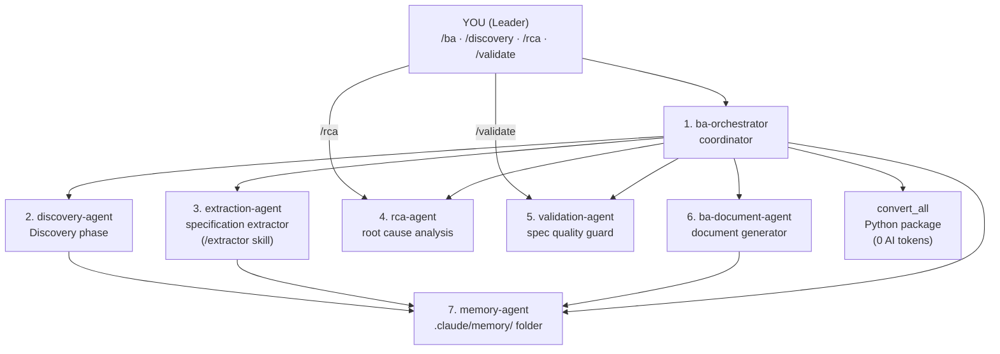

# 2. The AI Team

The BA Team consists of seven specialized AI agents and one Python conversion package. Agents are not called directly — they activate automatically at the right moment.

| # | Component | Type | Role |
|---|---|---|---|
| 1 | **ba-orchestrator** | AI agent | Coordinator: assesses state, decides next step |
| 2 | **discovery-agent** | AI agent | Discovery specialist: BC.md + question list from early materials |
| 3 | **extraction-agent** | AI agent | Specification extractor: structured spec from raw materials |
| 4 | **rca-agent** | AI agent | Root cause analysis: causal chains, loops, driver/symptom classification |
| 5 | **validation-agent** | AI agent | Spec quality guard: 8-dimension check (PASS/WARN/BLOCK) |
| 6 | **ba-document-agent** | AI agent | Document generator: BRD, User Stories, process flows |
| – | **convert_all** | Python package | File conversion: Office/Outlook → Markdown (0 AI tokens) |
| 7 | **memory-agent** | AI agent | Memory manager: decisions, stakeholders, domain terms |
