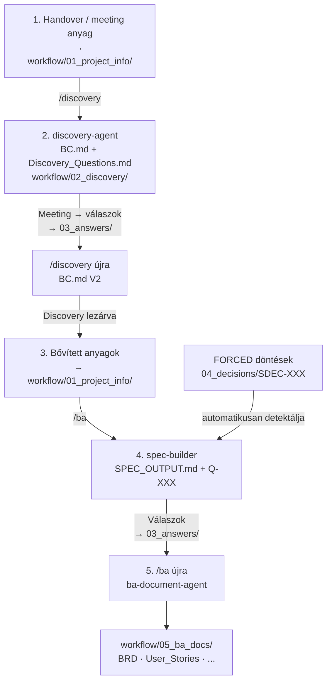
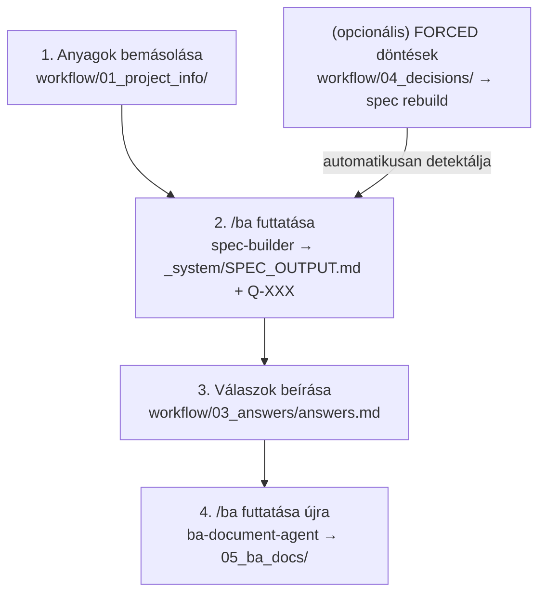

# 7. A teljes munkafolyamat

## A munkafolyamat áttekintése

A BA Team két fő útvonalat támogat: a **Discovery fázist** (`/discovery`) és az **Analysis fázist** (`/ba`). A legtöbb projekt a Discovery fázissal indul.

**Teljes tipikus munkafolyamat:**



**Ha nincs Discovery fázis (már strukturált anyag van):**



---

## 6.0 Discovery fázis (`/discovery`)

A Discovery fázis a projekt legelején indul — amikor még nincs részletes specifikáció, csak sales handover, meeting jegyzetek vagy ügyfél emailek állnak rendelkezésre.

**Mire való?**
- Üzleti probléma, célok, scope, MVP összegyűjtése korai anyagokból
- Strukturált kérdéslista a következő ügyfél meetingre
- Business Concept (BC.md) draft dokumentum

**Hogyan indul?**

1. Másold be az anyagokat a `workflow/01_project_info/` mappába
2. Futtasd: `/discovery`
3. A `discovery-agent` legenerálja a Discovery csomagot a `workflow/02_discovery/` mappába

**Discovery dokumentumkészlet (`workflow/02_discovery/`):**

| Fájl | Tartalom |
|---|---|
| `BC.md` | Business Concept — fő Discovery deliverable (VÁZLAT fejléccel ha nyitott kérdések vannak) |
| `Discovery_RAID.md` | Korai RAID — kockázatok, feltételezések, nyitott problémák |
| `Discovery_Questions.md` | Meeting-ready kérdéslista tárgyalási sorrenddel |
| `_system/DISCOVERY_OUTPUT.md` | Strukturált közbenső spec |

**BC.md struktúra:**

1. Üzleti probléma és gyökérok \[Mermaid diagram kötelező\]
2. Üzleti célok \[Mérhető eredménnyel\]
3. Megoldási scope \[In scope / Out of scope, Mermaid diagram\]
4. MVP definíció \[Must-have elemek\]
5. Feltételezések és kockázatok \[Korai RAID összefoglaló\]
6. Nyitott kérdések \[Q-XXX lista kategória szerint\]
7. Következő lépések

**Iteratív Discovery:**

1. `/discovery` → BC.md V1 + Discovery_Questions.md
2. Meeting az ügyféllel → válaszok rögzítése → `workflow/03_answers/`
3. `/discovery` újra → BC.md V2 (frissített, kevesebb nyitott kérdés)
4. Discovery lezárva → `/ba` → teljes Analysis dokumentáció

---

## 6.1 Új projekt indítása

**1. Forrásanyagok előkészítése**

Másold be az összes ügyfélanyagot a `workflow/01_project_info/` mappába:
- Meeting-feljegyzések
- E-mail-levelezések
- Workshopok összefoglalói
- Ügyfél visszajelzések
- Félkész vagy kész dokumentumok

Bármilyen formátumban elfogadja a rendszer – Office fájlokat automatikusan konvertál.

**2. Első `/ba` futtatás**

A Claude panelen írd be:
```
/ba
```

A rendszer:
- Automatikusan konvertálja az Office fájlokat
- Beolvassa a projekt memóriáját
- Létrehozza a `workflow/01_project_info/_system/SPEC_OUTPUT.md` specifikációt
- Listázza a megválaszolatlan kérdéseket (Q-XXX)

---

## 6.2 Specifikáció készítése (/extractor)

Az `extraction-agent` a nyers anyagokból strukturált specifikációt készít. A következőket tartalmazza:

- **Funkcionális követelmények (FR-XXX)**: Mit kell tudnia a rendszernek
- **Nem-funkcionális követelmények (NFR-XXX)**: Teljesítmény, biztonság, skálázhatóság
- **User Story-k (US-XXX)**: Felhasználói igények agile formátumban
- **Feltételezések (A-XXX)**: Amire a spec épít, de nincs kimondva
- **Nyitott kérdések (Q-XXX)**: Amit még az ügyféltől kell megtudni

**Forrás-traceability:** Minden generált elem tartalmaz egy forrásjelzést, amely megmutatja, melyik bemeneti fájlból és annak melyik verziójából született.

**Inkrementális frissítés:** Ha új fájlt adsz a projekthez, a rendszer csak a változásokat dolgozza fel újra – nem kell mindent elölről kezdeni. Ha fájlokat törölsz, biztonsági okokból teljes újragenerálás történik.

**`--force` flag és Discovery mód:** A `--force` flag mindig teljes (Analysis) mélységű dokumentumokat kér.

**BR KPI-kinyerés:** Minden üzleti követelményhez (BR-XXX) a rendszer aktívan keresi a mérhető kritériumot (KPI) a forrásanyagokban.

**NFR taxonómia — 5 kötelező kategória:**

| Kategória | Mit keres |
|---|---|
| Teljesítmény | Egyidejű felhasználók, válaszidő, throughput |
| Platform/Deployment | OS, böngésző, hálózati elérés |
| UI/UX | UI nyelv, eszköz-kompatibilitás, akadálymentesség |
| Adatkezelés | Megőrzési idő, backup, GDPR megfelelőség |
| Biztonság | Autentikáció, RBAC, audit log |

**GDPR automatikus trigger:** Ha a forrásban munkaidő, bér, személyes adat FR azonosítható → automatikus RISK-XXX + ISSUE-XXX generálás.

---

## 6.3 Kérdések megválaszolása

A `/ba` addig nem generál BA dokumentumokat, amíg akár egyetlen Q-XXX kérdés megválaszolatlan marad.

**A válaszok formátuma:** Hozz létre egy `answers.md` fájlt a `workflow/03_answers/` mappában.

**Amit NE írj válaszként:**
- ❌ `TBD` (later to be determined)
- ❌ `N/A` (nem értelmezhető)

**Ha még nincs válaszod egy kérdésre:** Írd meg a legjobb tudásod szerinti feltételezést `[ASSUMPTION]` jelzővel.

---

## 6.4 BA dokumentumok generálása

Ha minden kérdés megválaszolt, futtasd újra:
```
/ba
```

A rendszer legenerálja a teljes dokumentációs csomagot a `workflow/05_ba_docs/` mappába.

---

## 6.4c Vázlat generálás nyitott kérdésekkel (`/ba --draft`)

Ha nem akarsz várni az összes válaszra, de szükséged van egy előzetes dokumentumcsomagra, használd a `--draft` flaget:

```
/ba --draft
```

**Fontos különbség a normál futástól:**

| | `/ba` | `/ba --draft` |
|---|---|---|
| Szükséges válaszok | Összes Q-XXX | Nem szükséges |
| Kimeneti mappa | `workflow/05_ba_docs/` | `workflow/05_ba_docs/_draft/` |
| Dokumentum fejléc | Normál | ⚠️ **VÁZLAT** fejléc + nyitott kérdések listája |
| Memória archiválás | Igen (Q-XXX) | Nem (a végleges futásig nem archivál) |

A vázlat dokumentumok **nem számítanak befejezettnek** — a `/ba` (vázlat nélkül) figyelmen kívül hagyja a `_draft/` mappa tartalmát, és szükség esetén lefuttatja a teljes Analysis generálást.

**Tipikus vázlat workflow:**

1. `/ba --draft` → előzetes dokumentumok a `_draft/` mappában
2. Megbeszélés az ügyféllel → válaszok beírása → `workflow/03_answers/`
3. `/ba` → teljes dokumentumcsomag a `workflow/05_ba_docs/`-ban

---

## 6.4b FORCED döntések (`04_decisions/`)

FORCED döntések segítségével a stakeholderek felülírhatnak specifikációs elemeket. Hozz létre egy `SDEC-XXX_nev.md` fájlt a `workflow/04_decisions/` mappában YAML frontmatter-rel, majd futtasd: `/ba`.

---

## 6.5 Munkamenet kezelése (/session-loader)

**Minden munkanap elején** indítsd el a session loadert:
```
/session-loader
```

Megmutatja a projekt aktuális fázisát, döntések számát, kérdések állapotát, és a pontos következő teendőt.

---

## 6.6 Projekt állapotfelmérés (/check-state)

Gyors állapotellenőrzés a workflow aktuális fázisáról:
```
/check-state
```

**Output:** Fázis meghatározása, mappa-áttekintés, hiányzó lépések, javasolt következő lépés. Nem dispatchel agentet.

---

## 6.7 Súgó rendszer (/help)

A BA Tool teljes help rendszere:
```
/help              # teljes help: parancsok + állapot + következő lépés
/help <parancs>    # részletes segítség egy adott parancshoz
/help <kérdés>     # dokumentumkeresés HANDBOOK, skill-ek, agent-ek dokumentációjában
```
