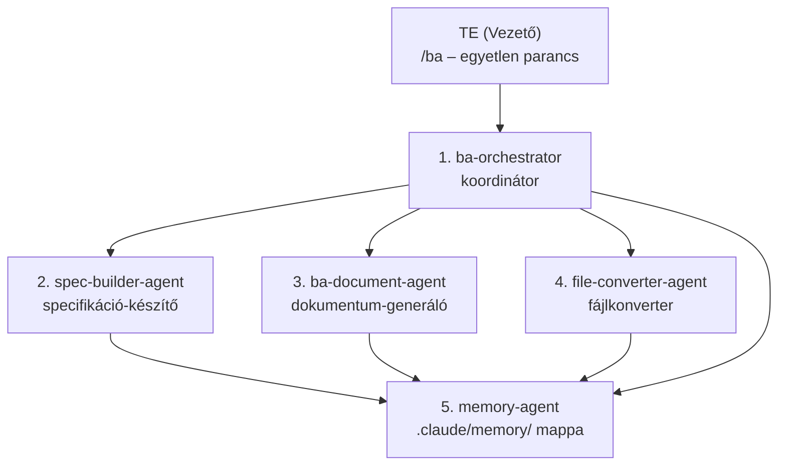
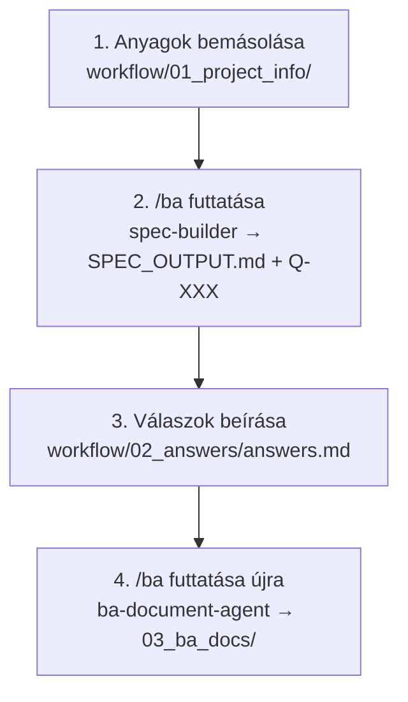

# BA Team – Felhasználói Kézikönyv

**Verzió:** 1.0
**Dátum:** 2026. május
**Termék:** BA Team – AI-alapú Business Analyst Munkafolyamat

---

## Tartalomjegyzék

1. [A termékről](#1-a-termékről)
2. [Az AI csapat bemutatása](#2-az-ai-csapat-bemutatása)
3. [Telepítési útmutató](#3-telepítési-útmutató)
   - 3.1 [Automatikus telepítés](#31-automatikus-telepítés)
   - 3.2 [Manuális telepítés lépésről lépésre](#32-manuális-telepítés-lépésről-lépésre)
   - 3.3 [Python és fájlkonverziós könyvtárak](#33-python-és-fájlkonverziós-könyvtárak-opcionális)
   - 3.4 [Első indítás ellenőrzése](#34-első-indítás-ellenőrzése)
4. [Mappa- és fájlstruktúra](#4-mappa--és-fájlstruktúra)
5. [Parancsok és skillek](#5-parancsok-és-skillek)
6. [A teljes munkafolyamat](#6-a-teljes-munkafolyamat)
   - 6.1 [Új projekt indítása](#61-új-projekt-indítása)
   - 6.2 [Specifikáció készítése (/spec-builder)](#62-specifikáció-készítése-spec-builder)
   - 6.3 [Kérdések megválaszolása](#63-kérdések-megválaszolása)
   - 6.4 [BA dokumentumok generálása](#64-ba-dokumentumok-generálása)
   - 6.5 [Munkamenet kezelése (/session-loader)](#65-munkamenet-kezelése-session-loader)
7. [A generált dokumentumok](#7-a-generált-dokumentumok)
8. [Típusjelzők és azonosítók rendszere](#8-típusjelzők-és-azonosítók-rendszere)
9. [A hosszú távú memória](#9-a-hosszú-távú-memória)
10. [Fájlkonverzió (/convert)](#10-fájlkonverzió-convert)
11. [Speciális esetek kezelése](#11-speciális-esetek-kezelése)
12. [Diagramkészítés (/mermaid-diagrams)](#12-diagramkészítés-mermaid-diagrams)
13. [Automatikus értesítések](#13-automatikus-értesítések)
14. [Háttérben futó ügynökök](#14-háttérben-futó-ügynökök)
15. [Szabályozói megfelelőség](#15-szabályozói-megfelelőség)
16. [Gyakori kérdések (GYIK)](#16-gyakori-kérdések-gyik)

---

## 1. A termékről

A **BA Team** egy Claude AI-alapú, specializált munkafolyamat-rendszer, amelyet IT projektek üzleti elemzési fázisának hatékonyabbá tételére terveztek. A rendszer mesterséges intelligencia ügynökökből álló „virtuális csapatot" biztosít, amelynek Te vagy a vezetője.

### Mit csinál a BA Team?

A BA Team a nyers projektanyagokból – e-mailek, meetingjegyzetek, Word dokumentumok, Excel táblák, Outlook levelek – automatikusan állít elő **audit-kész, professzionális Business Analyst dokumentációt**.

### Miért más, mint egy egyszerű chatbot?

| Chatbot | BA Team |
|---|---|
| Minden munkamenet elölről kezdődik | Hosszú távú memória őrzi a döntéseket és kontextust |
| Manuálisan kell megadni minden hátteret | Automatikusan beolvassa az előző munkamenetek eredményeit |
| Nincs minőségbiztosítás | Nem enged dokumentumot generálni hiányos adatokkal |
| Nincsenek szabványos azonosítók | FR-XXX, NFR-XXX, US-XXX, Q-XXX – minden elem visszakövethető |
| Nem kezel Office fájlokat | Automatikusan konvertálja a .docx, .xlsx, .msg, .eml fájlokat |

### A rendszer alapelvei

- **Te vagy a főnök**: az AI elvégzi a technikai munkát, de a stratégiai döntések a tiéd maradnak
- **Audit-kész dokumentáció**: minden kimenet fejlesztői átadásra és hatósági auditra alkalmas
- **Soha nem találja ki**: amit az ügyfél nem mondott, azt az AI nem teszi bele a dokumentumba
- **Soha nem oldja fel csendben az ellentmondásokat**: a konfliktusokat jelzi és te döntöd el
- **Teljes magyar nyelvű támogatás**: minden dokumentum és visszajelzés magyarul készül

---

## 2. Az AI csapat bemutatása

A BA Team öt specializált AI ügynökből áll. Ezeket nem közvetlenül te hívod – automatikusan aktiválódnak a megfelelő pillanatban.



| # | Ügynök neve | Szerepe |
|---|---|---|
| 1 | **ba-orchestrator** | Koordinátor: felméri az állapotot, eldönti mi a következő lépés |
| 2 | **spec-builder-agent** | Specifikáció-készítő: nyers anyagokból strukturált spec-et farag |
| 3 | **ba-document-agent** | Dokumentum-generáló: BRD, User Story-k, folyamatábrák |
| 4 | **file-converter-agent** | Fájlkonverter: Office/Outlook fájlok → Markdown |
| 5 | **memory-agent** | Memóriakezelő: döntések, stakeholderek, szakkifejezések tárolása |

---

## 3. Telepítési útmutató

> Ez az útmutató nem igényel programozói ismereteket.

### 3.1 Automatikus telepítés

A legegyszerűbb módszer: futtasd a telepítő szkriptet, amely mindent automatikusan beállít.

**Windows – PowerShell:**
```powershell
.\install.ps1
```

**Mac – Terminal:**
```bash
bash install.sh
```

A szkript idempotens – újrafuttatható, csak azt telepíti, ami még hiányzik.

**Mit telepít a szkript:**

| Eszköz | Mire való |
|---|---|
| Git | Verziókezelés, projekt letöltése |
| Visual Studio Code | Szövegszerkesztő, Claude beépülő |
| Python | Fájlkonverziókhoz szükséges |
| markitdown[docx] | Word (.docx) → Markdown |
| openpyxl | Excel (.xlsx) → Markdown |
| extract-msg | Outlook (.msg) → Markdown |
| Claude Code (VS Code ext.) | Az AI beépülő modul |
| Markdown Preview Mermaid Support | Folyamatábrák megjelenítéséhez |
| Markdown All in One | Markdown szerkesztéshez |

---

### 3.2 Manuális telepítés lépésről lépésre

Ha a szkript helyett kézzel szeretnéd elvégezni a telepítést:

#### Szükséges eszközök

| Eszköz | Mire való | Ár |
|---|---|---|
| GitHub fiók | A projekt tárolása és letöltése | Ingyenes |
| Visual Studio Code | Szövegszerkesztő | Ingyenes |
| Claude fiók | Az AI motor | Ingyenes / Pro |

---

#### 1. lépés – GitHub fiók létrehozása

1. Nyisd meg a [github.com](https://github.com) oldalt
2. Kattints a **Sign up** gombra jobb felül
3. Add meg az e-mail címedet, jelszavadat és felhasználónevedet
4. Erősítsd meg az e-mail-es megerősítést
5. Bejelentkezés után kész vagy

---

#### 2. lépés – Saját projekt létrehozása a sablonból

> A BA Team **sablon (template) repository** – egyetlen kattintással létrehozol belőle egy saját, független másolatot.

1. Menj a sablon repository oldalára GitHubon (a csapatvezetőd elküldi a linket)
2. Kattints a zöld **Use this template** gombra (jobb felső sarok)
3. Válaszd a **Create a new repository** lehetőséget
4. Töltsd ki az adatokat:
   - **Repository name**: pl. `projekt-biztosito-rendszer`
   - **Visibility**: válaszd a **Private** lehetőséget
5. Kattints a **Create repository** gombra

> **Fontos:** Minden BA kolléga a saját projektjéhez létrehoz egy ilyen saját másolatot. Az eredeti sablont senki nem módosítja.

---

#### 3. lépés – Visual Studio Code telepítése

1. Nyisd meg a [code.visualstudio.com](https://code.visualstudio.com) oldalt
2. Kattints a nagy kék **Download** gombra
   - Windows: `.exe` telepítő
   - Mac: `.dmg` fájl
3. Futtasd a telepítőt – Windowson hagyd bejelölve az *„Add to PATH"* és *„Open with Code"* opciókat
4. Indítsd el a VS Code-ot

---

#### 4. lépés – Claude Code bővítmény telepítése

1. VS Code-ban kattints az **Extensions** ikonra (bal oldali sáv) – vagy nyomj `Ctrl+Shift+X` (`Cmd+Shift+X` Mac-en)
2. Keresd: `Claude Code`
3. Kiadó: **Anthropic** – kattints az **Install** gombra
4. A bal oldali sávban megjelenik a Claude ikon – kattints rá
5. Kattints a **Sign in** gombra és jelentkezz be a Claude fiókoddal

---

#### 5. lépés – Markdown bővítmények telepítése

A BA dokumentumok Markdown formátumban készülnek és Mermaid folyamatábrákat tartalmaznak. Két bővítményre van szükség:

**5a. Markdown Preview Mermaid Support**
- Keresd az Extensions panelen: `Markdown Preview Mermaid Support`
- Kiadó: **Matt Bierner** – telepítés

**5b. Markdown All in One**
- Keresd: `Markdown All in One`
- Kiadó: **Yu Zhang** – telepítés

> **Dokumentumok megtekintése:** Nyiss meg egy `.md` fájlt, nyomj `Ctrl+Shift+V` (Windows) / `Cmd+Shift+V` (Mac) – megnyílik a formázott előnézet a folyamatábrákkal.

---

#### 6. lépés – A projekt letöltése VS Code-ba

1. VS Code-ban nyomj `Ctrl+Shift+P` (`Cmd+Shift+P` Mac-en)
2. Írd be: `Git: Clone` → Enter
3. Kattints: **Clone from GitHub**
4. Ha először csinálod: engedélyezd a GitHub bejelentkezést a böngészőben
5. Keresd meg a saját repository nevedet (2. lépésben hoztad létre)
6. Válaszd ki a mentési helyet (pl. Dokumentumok mappa)
7. Kattints az **Open** gombra – megnyílik a projekt

---

### 3.3 Python és fájlkonverziós könyvtárak (opcionális)

> Csak akkor szükséges, ha Word, Excel vagy Outlook fájlokat is be szeretnél adni a rendszernek.

**Támogatott fájlformátumok konverzióhoz:**

| Fájltípus | Szükséges eszköz |
|---|---|
| Word (.docx) | Python + markitdown[docx] |
| Excel (.xlsx) | Python + openpyxl |
| Outlook (.msg) | Python + extract-msg |
| E-mail (.eml) | Python stdlib (külön csomag nem kell) |
| PDF | Nem kell – Claude natívan olvassa |

**Python telepítése:**

*Windows:*
1. Töltsd le: [python.org/downloads](https://www.python.org/downloads/)
2. **Fontos:** jelöld be az **„Add Python to PATH"** jelölőnégyzetet!

*Mac:*
```bash
brew install python
```

**Python könyvtárak telepítése:**
```
pip install "markitdown[docx]" openpyxl extract-msg
```

**Ellenőrzés:**
```
pip show markitdown openpyxl extract-msg
```

---

### 3.4 Első indítás ellenőrzése

1. VS Code-ban nyisd meg a Claude panelt (bal oldali sáv, Claude ikon)
2. Írd be: `/session-loader`
3. Nyomj Entert

Ha a rendszer megfelelően települt, az alábbi üzenetet látod:

```
============================================================
  BA WORKFLOW – SESSION LOADER
============================================================
  PROJEKT
  Név:    –
  ...
  JAVASOLT KÖVETKEZŐ LÉPÉS
  ⚠️  Nincs bemeneti anyag.
     → Másolj fájlokat a workflow/01_project_info/ mappába
============================================================
```

> **Python ellenőrzése:** Írd be `/convert` – ha a rendszer jelzi, hogy nincs konvertálandó fájl, a Python is működik.

---

## 4. Mappa- és fájlstruktúra

```
projekt-neve/
├── workflow/
│   ├── 01_project_info/     ← IDE másold be az ügyfél anyagait
│   ├── 02_answers/          ← IDE kerülnek a kérdésekre adott válaszok
│   └── 03_ba_docs/          ← IDE kerülnek a kész BA dokumentumok
├── .claude/
│   ├── agents/              ← Specializált ügynökök (nem kell szerkeszteni)
│   ├── skills/              ← Parancsok (slash commands)
│   ├── memory/              ← Projekt memória (automatikusan kezelt)
│   ├── rules/               ← Viselkedési szabályok
│   └── scripts/             ← Session loader szkriptek
├── CLAUDE.md                ← Belső instrukciók (nem kell szerkeszteni)
├── AGENTS.md                ← Technikai referencia (nem kell szerkeszteni)
└── README.md                ← Leírás
```

### A három fő munkamappa

**`workflow/01_project_info/`** – Ide kerül minden ügyfél-anyag:
- Meetingjegyzetek (.md, .txt, .docx)
- E-mail-levelezések (.eml, .msg)
- Excel táblázatok (.xlsx)
- Word dokumentumok (.docx)
- PDF fájlok (natívan olvasható, nem kell konverzió)

**`workflow/02_answers/`** – Ide írod a válaszokat a rendszer kérdéseire:
- `answers.md` fájl (ajánlott)
- Bármilyen más szöveges fájl
- Office fájlok (automatikusan konvertálódnak)

**`workflow/03_ba_docs/`** – A kész dokumentumok helye:
- Ide generálja a rendszer az összes BA dokumentumot
- Soha ne szerkeszd kézzel – a `/ba` újragenerálja

### A memória mappa

**`.claude/memory/`** – A hosszú távú projekt-memória:

| Fájl | Tartalom |
|---|---|
| `PROJECT_CONTEXT.md` | Projekt neve, ügyfél, scope, rendszerek, fázis |
| `STAKEHOLDERS.md` | Érintett személyek és szerepköreik |
| `DECISIONS.md` | Naplózott döntések (DEC-XXX azonosítóval) |
| `RESOLVED_QUESTIONS.md` | Megválaszolt kérdések archívuma |
| `DOMAIN_GLOSSARY.md` | Projektspecifikus szakkifejezések |
| `RISKS.md` | Kockázatok és feltételezések |
| `conversion_log.md` | Konvertált fájlok nyilvántartása |

---

## 5. Parancsok és skillek

| Parancs | Mire való |
|---|---|
| `/ba` | **Fő parancs** – automatikus következő lépés végrehajtása |
| `/session-loader` | Munkamenet betöltése, projekt állapot mutatása |
| `/spec-builder` | Csak a specifikáció készítése (haladó használat) |
| `/business-analyst` | Csak a BA dokumentumok generálása (haladó használat) |
| `/convert` | Office/Outlook fájlok kézi konvertálása |
| `/mermaid-diagrams` | Önálló diagram készítése |
| `/memory-handler` | Projekt memória megtekintése |

> **A legtöbb esetben csak a `/ba` parancsra van szükséged.** A többi parancs haladó felhasználóknak és speciális esetekre való.

---

## 6. A teljes munkafolyamat

### A munkafolyamat áttekintése



---

### 6.1 Új projekt indítása

**1. Forrásanyagok előkészítése**

Másold be az összes ügyfélanyagot a `workflow/01_project_info/` mappába:
- Meeting-feljegyzések
- E-mail-levelezések
- Workshopok összefoglalói
- Ügyfél visszajelzések
- Félkész vagy kész dokumentumok

Bármilyen formátumban elfogadja a rendszer – Office fájlokat automatikusan konvertál.

**2. Első `/ba` futtatás**

A Claude panelen írd be:
```
/ba
```

A rendszer:
- Automatikusan konvertálja az Office fájlokat
- Beolvassa a projekt memóriáját
- Létrehozza a `SPEC_OUTPUT.md` specifikációt
- Listázza a megválaszolatlan kérdéseket (Q-XXX)

---

### 6.2 Specifikáció készítése (/spec-builder)

A `spec-builder-agent` a nyers anyagokból strukturált specifikációt készít. A következőket tartalmazza:

- **Funkcionális követelmények (FR-XXX)**: Mit kell tudnia a rendszernek
- **Nem-funkcionális követelmények (NFR-XXX)**: Teljesítmény, biztonság, skálázhatóság
- **User Story-k (US-XXX)**: Felhasználói igények agile formátumban
- **Feltételezések (A-XXX)**: Amire a spec épít, de nincs kimondva
- **Nyitott kérdések (Q-XXX)**: Amit még az ügyféltől kell megtudni

**Inkrementális frissítés**

Ha új fájlt adsz a projekthez, a rendszer csak a változásokat dolgozza fel újra – nem kell mindent elölről kezdeni. A korábban kiosztott azonosítók (FR-XXX, Q-XXX) nem változnak meg.

> **Fontos:** Ha fájlokat törölsz, a rendszer biztonsági okokból teljes újragenerálást végez, hogy ne maradjanak érvénytelen követelmények.

---

### 6.3 Kérdések megválaszolása

A `/ba` addig nem generál BA dokumentumokat, amíg akár egyetlen Q-XXX kérdés megválaszolatlan marad. Ha hiányos válaszokat talál, ezt jelzi:

```
⛔ Munkafolyamat megállva – hiányzó válaszok

| ID    | Kategória   | Kérdés összefoglalója               |
|-------|-------------|-------------------------------------|
| Q-002 | DATA        | Milyen adatmegőrzési idő szükséges? |
| Q-005 | INTEGRATION | Melyik külső rendszer kezeli a fizetést? |

Egészítsd ki a workflow/02_answers/ fájlokat, majd futtasd újra: /ba
```

**A válaszok formátuma**

Hozz létre egy `answers.md` fájlt a `workflow/02_answers/` mappában:

```
Q-001: A rendszer minden sikertelen belépési kísérletet naplóz;
       5 próba után zárolja a fiókot.

Q-002: Az adatmegőrzési időszak GDPR alapján 7 év.

Q-003: A fizetéseket a Stripe API kezeli, a számlázást
       a meglévő ERP-be kell integrálni.
```

**Amit NE írj válaszként:**
- ❌ `TBD` (later to be determined)
- ❌ `N/A` (nem értelmezhető)

Ezeket a rendszer gépileg ellenőrzi és nem fogadja el érdemi válasznak.

**Ha még nincs válaszod egy kérdésre:**

Írd meg a legjobb tudásod szerinti feltételezést:
```
Q-004: [ASSUMPTION] Valószínűleg 2 faktoros hitelesítést kell
       bevezetni, mivel a rendszer pénzügyi adatokat kezel.
       Ez egyeztetést igényel az ügyféllel.
```

---

### 6.4 BA dokumentumok generálása

Ha minden kérdés megválaszolt, futtasd újra:
```
/ba
```

A rendszer legenerálja a teljes dokumentációs csomagot a `workflow/03_ba_docs/` mappába.

---

### 6.5 Munkamenet kezelése (/session-loader)

**Minden munkanap elején** indítsd el a session loadert:
```
/session-loader
```

Megmutatja:
- A projekt aktuális fázisát
- Hány döntés van naplózva, hány kérdés megválaszolva
- Mi van az egyes mappákban
- A pontos következő teendőt

**Példa kimenet:**
```
============================================================
  BA WORKFLOW – SESSION LOADER
  2026-05-12 09:15
============================================================

  PROJEKT
  Név:    Biztosítási Portál Fejlesztés
  Ügyfél: XY Biztosító Zrt.
  Fázis:  Requirements

  MEMÓRIA ÖSSZEFOGLALÓ
  Döntések:                5
  Megválaszolt kérdések:  12
  Stakeholderek:           4
  Domain szakkifejezés:    8

  WORKFLOW ÁLLAPOT
  [01] Bemeneti anyagok:  3 fájl
  [01] SPEC_OUTPUT.md:    ✅ Elkészült
       Megválaszolatlan kérdések: 2 db
         ❓ Q-003
         ❓ Q-007
  [02] Válaszok:          1 fájl
  [03] BA dokumentumok:   ÜRES

  JAVASOLT KÖVETKEZŐ LÉPÉS
  ⛔ 2 kérdés még megválaszolatlan.
     → Egészítsd ki a workflow/02_answers/ fájlokat
     → Majd futtasd: /ba
============================================================
```

---

## 7. A generált dokumentumok

### Kötelező dokumentumok

| Fájl | Megnevezés | Tartalom |
|---|---|---|
| `BRD.md` | Business Requirements Document | Üzleti követelmények BR-XXX, FR-XXX, NFR-XXX azonosítókkal |
| `User_Stories.md` | User Story lista | Agile formátumú felhasználói igények Gherkin elfogadási kritériumokkal |
| `Process_Flows.md` | Üzleti folyamatok | Szöveges leírások + kötelező Mermaid folyamatábrák |
| `Traceability_Matrix.md` | Követhetőségi mátrix | Forrásanyag → követelmény kapcsolatrendszer |
| `RAID_Log.md` | RAID Log | Kockázatok, feltételezések, problémák, függőségek |
| `Glossary.md` | Szójegyzék | Domain-specifikus szakkifejezések |

### Opcionális dokumentumok (adatmennyiségtől függően)

| Fájl | Tartalom |
|---|---|
| `Data_Dictionary.md` | Adatentitások, mezők, típusok – ER diagrammal |
| `UAT_Test_Cases.md` | Felhasználói elfogadási tesztesetek |
| `Stakeholder_Map.md` | Érintetti térkép Mermaid diagrammal |
| `Regulatory_Checklist.md` | GDPR, AML/KYC, PCI-DSS hatáselemzés |

### User Story formátum

```
US-001: Felhasználói bejelentkezés

As a regisztrált felhasználó
I want to be able to log in with my email and password
So that I can access my personal dashboard

Acceptance Criteria:
  Given a registered user with valid credentials
  When they enter their email and password on the login page
  Then they should be redirected to the dashboard within 3 seconds

  Given a user who enters an incorrect password
  When they submit the login form
  Then they should see an error message without revealing which field is wrong
```

---

## 8. Típusjelzők és azonosítók rendszere

### Követelmény- és dokumentum azonosítók

| Azonosító | Típus | Leírás |
|---|---|---|
| `FR-XXX` | Funkcionális követelmény | Mit kell tudnia a rendszernek |
| `NFR-XXX` | Nem-funkcionális követelmény | Teljesítmény, biztonság, skálázhatóság |
| `US-XXX` | User Story | Agile formátumú felhasználói igény |
| `BR-XXX` | Üzleti követelmény | Magas szintű üzleti célok (BRD-ben) |
| `A-XXX` | Feltételezés | Amire a spec épít, de nincs kimondva |
| `DEC-XXX` | Döntés | Naplózott projekt-döntés |
| `Q-XXX` | Kérdés | Hiányzó, tisztázandó információ |

### Forrás- és státuszjelzők

| Jelző | Jelentés |
|---|---|
| `[EXPLICIT]` | Az ügyfél szó szerint kimondta a forrásanyagban |
| `[INFERRED]` | Az AI logikusan következtette ki, de nem hangzott el szó szerint |
| `UNANSWERED` | A Q-XXX kérdés még megválaszolatlan |
| `RESOLVED` | A Q-XXX kérdés megválaszolt és archivált |

### Kérdés kategóriák

| Kategória | Mikor kap ilyen jelzést |
|---|---|
| `BUSINESS LOGIC` | Az üzleti logika hiányos vagy ellentmondásos |
| `DATA` | Adatok, mezők vagy formátumok meghatározása hiányzik |
| `UX/UI` | A felhasználói felület nincs specifikálva |
| `INTEGRATION` | Külső rendszer kapcsolat tisztázatlan |
| `PRIORITY` | Követelmények prioritása nem egyértelmű |

---

## 9. A hosszú távú memória

A BA Team egyik legfontosabb képessége az intelligens memóriakezelés. A `.claude/memory/` mappában tárolt fájlok biztosítják, hogy a projekt kontextusa munkamenetek között is megmaradjon.

### Mi kerül a memóriába?

**Projekt kontextus (`PROJECT_CONTEXT.md`):**
- Projekt neve és az ügyfél adatai
- Projekt hatóköre (scope)
- Érintett rendszerek listája
- Aktuális projektfázis

**Stakeholderek (`STAKEHOLDERS.md`):**
- Érintett személyek neve és szerepe
- Minden munkamenetben elérhető

**Döntések (`DECISIONS.md`):**
- Minden naplózott döntés DEC-XXX azonosítóval
- Az indoklással együtt tárolva
- Audit-kész, visszakereshető

**Megválaszolt kérdések (`RESOLVED_QUESTIONS.md`):**
- Az összes megválaszolt Q-XXX kérdés archívuma
- A válaszokkal együtt

**Szakkifejezések (`DOMAIN_GLOSSARY.md`):**
- Projektspecifikus szókincs
- Rövidítések és definíciók

**Kockázatok (`RISKS.md`):**
- Azonosított kockázatok
- Feltételezések (A-XXX)

### Mikor frissül automatikusan?

| Esemény | Mit ment |
|---|---|
| Spec elkészül | Projekt kontextus, stakeholderek, kockázatok |
| Q-XXX megválaszolva | Kérdés és válasz az archívumba |
| Döntés születik | Döntés és indoklás naplózva |
| BA doc elkészül | Domain szószedet, RAID Log kockázatai |

### Fontos szabály: csak bővítés, soha törlés

A memória fájlok kizárólag bővülhetnek – az AI soha nem töröl belőlük. Ez biztosítja az audit-kész dokumentációt és a döntések teljes visszakövethetőségét.

**Manuális módosítás:** A `.claude/memory/` mappában lévő fájlok egyszerű Markdown táblázatok – bármilyen szövegszerkesztővel szerkeszthetők, ha szükséges.

---

## 10. Fájlkonverzió (/convert)

### Mikor szükséges?

Ha Office vagy Outlook fájlokat másoltál a workflow mappákba:

| Fájltípus | Szükséges konverzió? |
|---|---|
| `.docx` / `.doc` | Igen |
| `.xlsx` / `.xls` | Igen |
| `.msg` (Outlook) | Igen |
| `.eml` (e-mail) | Igen |
| `.pdf` | Nem – Claude natívan olvassa |
| `.md` / `.txt` | Nem – már feldolgozható |

### Hogyan működik?

```
/convert
```

A rendszer:
1. Beolvassa a konverziós naplót (mely fájlok változtak)
2. SHA-256 ujjlenyomattal ellenőrzi a változásokat
3. **Csak az új vagy megváltozott fájlokat** konvertálja
4. Létrehozza a `[fájlnév]_converted.md` fájlt
5. Frissíti a konverziós naplót

**Fontos:** Az eredeti fájlokat soha nem módosítja.

### Automatikus konverzió

Általában nem kell kézzel futtatni – a `/ba` automatikusan elvégzi:

| Parancs | Melyik mappát konvertálja? |
|---|---|
| `/ba` | `01_project_info/` és `02_answers/` |
| `/spec-builder` | csak `01_project_info/` |
| `/business-analyst` | csak `02_answers/` |
| `/convert` | `01_project_info/` és `02_answers/` |

---

## 11. Speciális esetek kezelése

### Politikai és diplomáciai döntések

Ha egy stakeholder – például a vezérigazgató – határozott álláspontot fejez ki (akár hajnali kettőkor küldött e-mailben, nagyméretű „NEM!!!" felirattal), a rendszer ezt a következőképpen kezeli:

1. **Explicit adatként rögzíti** – az elutasítás bekerül a rendszerbe `[EXPLICIT]` jelzővel
2. **Ellentmondásként jelzi** – ha ütközik egy korábbi követelménnyel, a konfliktust a specifikácóban jelöli
3. **Q-XXX kérdést generál** – a tisztázásra váró pontot megjelöli, és megállítja a folyamatot
4. **Nem dönt helyetted** – az AI nem próbálja meg „kitalálni" a diplomáciai megoldást

A döntés megszületése után az a `DECISIONS.md` fájlba kerül DEC-XXX azonosítóval.

### Projekt irányváltás

Ha a projekt irányt vált és elavult fájlokat kell eltávolítani:

**Automatikus:** Ha fájlokat törölsz a `01_project_info/` mappából, a spec-builder teljes újragenerálást végez – eltávolítja az „árván maradt" követelményeket.

**Manuális (memória):** Mivel a memória-fájlok sosem törlődnek automatikusan:
1. Nyisd meg a `.claude/memory/` mappát
2. Szerkeszd a megfelelő `.md` fájlokat szövegszerkesztővel
3. Töröld az elavult sorokat
4. Futtasd a `/session-loader` parancsot az állapot ellenőrzéséhez

**Irányváltás dokumentálása (ajánlott):**
Rögzítsd a döntést a `DECISIONS.md` fájlban:
```
DEC-015: A projekt hatóköre megváltozott – a mobil alkalmazás
         fejlesztése kikerült, csak a web portálra fókuszálunk.
         Indok: Határidő és erőforrás-korlátok.
         Érintett: Q-008, FR-021–FR-031 érvénytelenné váltak.
```

### Ha nincs válaszod egy kérdésre

Három lehetőséged van:

1. **Feltételezés (A-XXX):** Írj logikus feltételezést, a rendszer továbblép, de jelöli a bizonytalanságot
2. **Kockázatként jelöld meg:** A RAID Log-ba kerül, hogy az információ hiányzik
3. **Soha ne írj TBD-t vagy N/A-t** – a rendszer gépileg ellenőrzi és visszautasítja

---

## 12. Diagramkészítés (/mermaid-diagrams)

A BA Team minden folyamatleíráshoz kötelezően Mermaid diagramot készít. Önállóan is kérhetsz diagramot:

```
/mermaid-diagrams kérlek rajzold le a kárrendezési folyamatot
```

### Diagramtípusok

| Helyzet | Diagram típus |
|---|---|
| Üzleti folyamat lépései | `flowchart` – folyamatábra |
| Rendszerek közötti kommunikáció | `sequenceDiagram` – szekvencia diagram |
| Állapotátmenetek | `stateDiagram-v2` – állapotdiagram |
| Adatentitások és kapcsolataik | `erDiagram` – ER diagram |
| Érintetti kapcsolatok | `graph LR` – gráf |
| Projekt ütemterv | `gantt` – Gantt diagram |

### Diagram megtekintése

1. Nyiss meg egy `.md` fájlt VS Code-ban
2. Nyomj `Ctrl+Shift+V` (Windows) / `Cmd+Shift+V` (Mac)
3. A Mermaid diagram vizuálisan jelenik meg

---

## 13. Automatikus értesítések

A rendszer minden Claude válasz után automatikusan ellenőrzi a workflow állapotát:

| Állapot | Értesítés |
|---|---|
| Feldolgozatlan bemeneti fájlok | `📋 N bemeneti fájl feldolgozásra vár. Futtasd: /ba` |
| Spec kész, válaszok hiányoznak | `❓ Spec elkészült. Válaszokat várok a 02_answers/ mappában.` |
| Válaszok megvannak, dokumentum nincs | `✅ Válaszok megtalálhatók. BA dokumentumok generálásához futtasd: /ba` |

---

## 14. Háttérben futó ügynökök

### ba-orchestrator

A fő koordinátor. Felméri a workflow állapotát és irányítja a többi ügynököt.

**Lépései:**
1. Betölti a memóriát (csak a szükséges fájlokat)
2. Megvizsgálja a workflow állapotát
3. Dispatchilja a megfelelő ügynököt
4. Visszajelent a felhasználónak

**Mikor áll meg:**
- Ha nincs bemeneti fájl → kéri az anyagok bemásolását
- Ha Q-XXX kérdések megválaszolatlanok → listázza és megáll

### spec-builder-agent

**Lépései:**
1. Beolvassa a SPEC_LOG-ot (változásdetektálás)
2. Eldönti: inkrementális frissítés vagy teljes újragenerálás
3. Generálja a specifikációt (FR-XXX, NFR-XXX, US-XXX, Q-XXX)
4. Menti a `SPEC_OUTPUT.md` fájlt
5. Frissíti a memóriát

### ba-document-agent

**Lépései:**
1. Beolvassa a SPEC_OUTPUT.md-t, a válaszfájlokat és a memóriát
2. Generálja az összes kötelező dokumentumot Mermaid diagramokkal
3. Menti a `workflow/03_ba_docs/` mappába
4. Frissíti a memóriát

### file-converter-agent

**Teljesítmény-optimalizálások:**
- Ultra-gyors előszűrés: méret és módosítási dátum alapján
- SHA-256 ujjlenyomat ellenőrzés: csak ténylegesen megváltozott fájlok
- Batch mód: az összes változást egyetlen lépésben menti

### memory-agent

Az egyetlen ügynök, amely a `.claude/memory/` mappát kezeli. Minden más ügynök ezen keresztül ír és olvas.

**Elérhető műveletek:**

| Művelet | Leírás |
|---|---|
| `BATCH` | Több művelet egy hívással (hatékonyabb) |
| `LOAD` | Összes memóriafájl beolvasása |
| `STORE` | Új bejegyzés hozzáfűzése (sosem töröl) |
| `QUERY` | Célzott lekérdezés egy vagy több fájlból |
| `LOAD_CONVERSION_LOG` | Konverziós napló beolvasása |
| `MEMORY_UPSERT` | Sor frissítése a konverziós naplóban |

---

## 15. Szabályozói megfelelőség

A BA Team automatikusan értékeli a projekt érintettségét az alábbi szabályozói területeken, és szükség esetén `Regulatory_Checklist.md` dokumentumot generál:

| Szabályozó | Terület |
|---|---|
| **GDPR** | Általános adatvédelmi rendelet |
| **PCI-DSS** | Bankkártyás fizetési adatok biztonsága |
| **AML/KYC** | Pénzmosás elleni és ügyfél-átvilágítási folyamatok |
| **SOX** | Sarbanes-Oxley – vállalati irányítás, pénzügyi beszámolás |
| **Solvency II** | Biztosítók fizetőképessége |
| **HIPAA** | Egészségügyi adatok kezelése |
| **FCA** | Pénzügyi felügyeleti követelmények |

---

## 16. Gyakori kérdések (GYIK)

**Hol találom a kész BA dokumentumokat?**
A `workflow/03_ba_docs/` mappában, VS Code-ban a bal oldali fájlböngészőben.

**Hogyan olvasom el szépen a dokumentumokat?**
Kattints duplán a `.md` fájlra, majd nyomj `Ctrl+Shift+V` (Windows) / `Cmd+Shift+V` (Mac) billentyűt az előnézet megnyitásához.

**Mi az a Q-XXX?**
A Claude által generált, sorszámozott kérdések az ügyféltől hiányzó információkról. Minden kérdést meg kell válaszolni, mielőtt a BA dokumentumok elkészülnek.

**Elromlott valami, mit tegyek?**
Írd be: `/session-loader` – megmutatja az aktuális állapotot és a következő lépést.

**Újra lehet futtatni a `/ba`-t ha változott valami?**
Igen, bármikor futtatható. A rendszer mindig az aktuális állapotból indul ki, és csak a változásokat dolgozza fel.

**Miért nem enged a rendszer dokumentumot generálni?**
Mert valamelyik Q-XXX kérdés még megválaszolatlan. Ez szándékos – az audit-kész dokumentáció nem tartalmazhat tisztázatlan pontokat.

**Lehet törölni a memóriából?**
Nem automatikusan – a memória fájlok csak bővülnek. Manuálisan szerkesztheted a `.claude/memory/` mappában lévő Markdown fájlokat.

**Mi a különbség a `/ba` és a `/ba-workflow` között?**
A `/ba` az újabb, fejlettebb verzió: memóriakezeléssel, subagent alapú futtatással és teljes állapotfelismeréssel. A `/ba-workflow` a régebbi verzió, visszafelé kompatibilitás miatt maradt meg – új projektekhez mindig a `/ba` parancsot használd.

**Több projekthez is használhatom?**
Igen – minden projekthez hozz létre egy külön repository másolatot a sablonból. A memória fájlok projektenként külön tárolódnak.

---

*BA Team Felhasználói Kézikönyv – v1.0 – 2026. május*