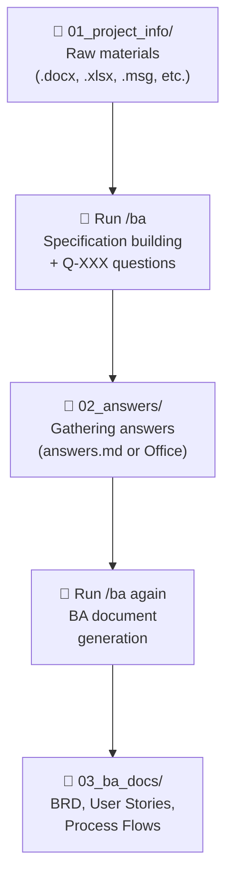
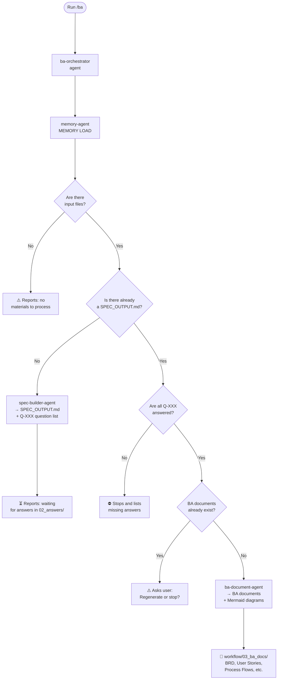

# BA Team – Be the Boss of a 5-member AI Team!

[Magyar változat](README.md)

> **Don't just use AI – lead it!** 🚀
> 
> With this workflow, you don't just get a simple chatbot, but a complete, specialized Business Analyst team with you as the lead. While you focus on strategic decisions and client relationships, your AI colleagues do the heavy lifting:
>
> 1. 📋 **Orchestrator**: Your project manager who keeps track of everything and knows where you are.
> 2. 🏗️ **Spec Builder**: Your precise analyst who carves a pinpoint specification out of raw notes.
> 3. ✍️ **BA Document Agent**: Your technical writer who produces BRDs, User Stories, and process flows.
> 4. 📂 **File Converter**: Your data specialist who converts any Office file into AI-ready format in seconds.
> 5. 🧠 **Memory Agent**: Your strategic advisor who never forgets a single decision or stakeholder detail.
>
> **Take your efficiency to the next level: delegate to the BA Team and focus on real value creation!**

---

This repository contains Claude AI skills and agents designed to **support Business Analyst colleagues** throughout the entire requirements engineering process of IT projects.

---

## Key Capabilities

The system features several built-in intelligent functions that distinguish it from a simple chatbot:

### 🧠 Intelligent Memory Management
All important information learned during the project (decisions, stakeholders, risks, terminology) persists between sessions. The `memory-agent` ensures you don't have to repeat yourself, and the AI is always aware of the current project context.

### ⚡ Incremental Specification Building
You don't need to rebuild the entire documentation from scratch for every minor change. The system detects when you've added a new file or modified an existing one and processes only the changes. This drastically reduces wait times and token usage for large projects.

### 🔄 Automatic File Conversion
Feel free to copy your Word minutes, Excel spreadsheets, or Outlook emails (`.msg`, `.eml`). The system automatically detects them and converts them to Markdown in the background for immediate processing. It only reconverts changed files, keeping everything up to date.

### 🇭🇺 Full Hungarian Language Support
The system natively supports Hungarian business communication. It not only understands Hungarian input materials but also produces the entire BA documentation (BRD, User Stories, etc.) and all status reports strictly in Hungarian.

### 📊 Visual Process Modeling (Mermaid)
Alongside text descriptions, the system automatically generates Mermaid process flows for every business process and logic branch. These diagrams can be viewed and edited directly within VS Code.

### 🔗 Source-level Traceability
Every generated requirement and specification point can be traced back to the original source material. The automatic traceability matrix helps you always know which client request led to which development task.

---

## Daily Usage

### Starting a New Project

1. Copy client meeting materials (minutes, emails, notes, Word/Excel/Outlook files, etc.) into the `workflow/01_project_info/` folder.
2. If your answers are also in Office files, copy them to the `workflow/02_answers/` folder.
3. In the Claude panel, type: `/ba`
4. Claude will automatically convert non-markdown files (if Python and dependencies are installed) and perform the next step.

### Ongoing Work

At the start of every session, type: `/session-loader`

This shows where the project stands and what the next step is — no need to remember where you left off.

### The Full Workflow



> `/ba` automatically converts Office/Outlook files on every run.
> `/convert` can be run independently to check conversion only.

---

`/ba` is a single command that starts a **ba-orchestrator** agent. This agent automatically assesses the current project state and then calls the appropriate specialist agent to perform the work.

### Key Performance Optimizations:

-   **Incremental Specification**: Only processes the content of new or modified files when updating the spec.
-   **Smart File Conversion**: Skips already converted files based on SHA-256 fingerprints and file stats (size, date).
-   **Batch Memory Protocol**: Performs memory operations in groups, minimizing AI agent spawn times.
-   **Targeted Memory Query**: Loads only the memory files needed for the task, significantly reducing token usage.



---

## Available Commands

| Command | Purpose | Detailed Description |
|---|---|---|
| `/ba` | Perform automatic next step | [→ Description](.claude/skills/ba/README.md) |
| `/spec-builder` | Only build spec (advanced use) | [→ Description](.claude/skills/spec-builder/README.md) |
| `/business-analyst` | Only generate BA docs (advanced use) | [→ Description](.claude/skills/business-analyst/README.md) |
| `/session-loader` | Load session – shows project status | [→ Description](.claude/skills/session-loader/README.md) |
| `/convert` | Convert Office/Outlook files to Markdown | [→ Description](.claude/skills/convert/README.md) |
| `/mermaid-diagrams` | Create standalone diagram | [→ Description](.claude/skills/mermaid-diagrams/README.md) |
| `/memory-handler` | Manage project memory | [→ Description](.claude/skills/memory-handler/README.md) |

---

## Background Agents

Commands are executed by specialized agents. They are not called directly by the user — they activate automatically at the right moment.

| Agent | Task | Detailed Description |
|---|---|---|
| `ba-orchestrator` | State detection and coordination | [→ Description](.claude/agents/README.md#ba-orchestrator) |
| `spec-builder-agent` | Specification generation | [→ Description](.claude/agents/README.md#spec-builder-agent) |
| `ba-document-agent` | BA document generation | [→ Description](.claude/agents/README.md#ba-document-agent) |
| `file-converter-agent` | Office/Outlook to Markdown conversion | [→ Description](.claude/agents/README.md#file-converter-agent) |
| `memory-agent` | Project memory management | [→ Description](.claude/agents/README.md#memory-agent) |

> Detailed technical description of all agents: [.claude/agents/README.md](.claude/agents/README.md)

---

## Automatic Notifications

The system automatically checks the workflow state after every Claude response and reminds you if action is required:

| State | Notification |
|---|---|
| Unprocessed input files | `📋 N input files waiting for processing. Run: /ba` |
| Spec ready, answers missing | `❓ Spec completed. Waiting for answers in 02_answers/ folder.` |
| Answers ready, documents missing | `✅ Answers found. To generate BA documents, run: /ba` |

---

## Generated BA Documents

The `/ba` command (or the `/business-analyst` skill) produces the following professional document package in the `workflow/03_ba_docs/` folder:

| File | Name | Content |
|---|---|---|
| `BRD.md` | Business Requirements Document | Business requirements, objectives, and high-level needs. |
| `User_Stories.md` | User Story List | User stories with detailed Gherkin format acceptance criteria. |
| `Process_Flows.md` | Business Processes | Text descriptions and **mandatory visual Mermaid flowcharts**. |
| `Traceability_Matrix.md` | Traceability Matrix | A table describing the relationship between source materials and requirements. |
| `RAID_Log.md` | RAID Log | Risks, Assumptions, Issues, and Dependencies. |
| `Glossary.md` | Glossary | A collection of domain-specific technical terms identified during the project. |

---

## Folder Structure

```
project-name/
├── workflow/
│   ├── 01_project_info/     ← Copy client materials HERE
│   ├── 02_answers/          ← Answers to questions (Q-XXX format) go HERE
│   └── 03_ba_docs/          ← Finished BA documents go HERE
├── .claude/
│   ├── agents/              ← Specialized agents (do not edit)
│   │   ├── README.md        ← Agent descriptions
│   │   ├── ba-orchestrator.md
│   │   ├── spec-builder-agent.md
│   │   ├── ba-document-agent.md
│   │   └── memory-agent.md
│   ├── skills/              ← Commands (slash commands)
│   │   ├── convert/         ← /convert – Office file converter
│   ├── memory/              ← Project memory (automatically managed)
│   ├── rules/               ← Behavior rules
│   └── scripts/             ← Session loader scripts
├── CLAUDE.md                ← Internal instructions (do not edit)
├── AGENTS.md                ← Technical reference (do not edit)
└── README.md                ← This file
```

---

## Answer Format (`workflow/02_answers/answers.md`)

Create an `answers.md` file in the `workflow/02_answers/` folder and fill in the answers to the questions generated by Claude:

```
Q-001: The system logs every failed login attempt; account lockout after 5 tries.
Q-002: The data retention period is 7 years based on GDPR.
Q-003: Payments are handled by Stripe API, billing must be integrated into the existing ERP.
```

---

## FAQ

**Where can I find the finished BA documents?**
In the `workflow/03_ba_docs/` folder, in the VS Code file explorer.

**How can I read the documents nicely?**
Double-click the `.md` file, then press `Ctrl+Shift+V` (Windows) / `Cmd+Shift+V` (Mac) to open the formatted preview.

**What is Q-XXX?**
Numbered questions generated by Claude about information missing from the client. Every question must be answered before BA documents can be generated.

**Something broke, what should I do?**
Type: `/session-loader` — it shows the current state and the next step.

**Can I run `/ba` again if something changed?**
Yes, it can be run at any time. The system always starts from the current state.

---

## Installation Guide

> This guide does not require programming knowledge.

---

### A) Automatic Installation – One Command

The easiest method: run the installer script, which automatically installs and configures everything.

**Windows – PowerShell:**
```powershell
.\install.ps1
```

**Mac – Terminal:**
```bash
bash install.sh
```

**What the script installs:**

| Tool | Purpose |
|---|---|
| Git | Version control, downloading the project |
| Visual Studio Code | Text editor, Claude plugin |
| Python | Required for file conversions |
| markitdown[docx] | Word (.docx) → Markdown |
| openpyxl | Excel (.xlsx) → Markdown |
| extract-msg | Outlook (.msg) → Markdown |
| Claude Code (VS Code ext.) | The AI plugin |
| Markdown Preview Mermaid Support | For displaying process flows |
| Markdown All in One | For Markdown editing |

> The script is idempotent — it can be rerun and only installs what is missing.

---

### B) Manual Installation – Step by Step

If you prefer to perform the installation manually instead of using the script, follow these steps in order.

#### What You'll Need

| Tool | Purpose | Price |
|---|---|---|
| GitHub account | Project storage and download | Free |
| Visual Studio Code | Text editor with Claude integration | Free |
| Claude account | The AI engine that does the work | Free / Pro |

---

#### Step 1 – Create a GitHub Account

1. Open your browser and go to **[github.com](https://github.com)**
2. Click the **Sign up** button at the top right
3. Enter your email, choose a password and a username
4. Follow the email confirmation steps
5. Once done, you are logged in to GitHub

---

#### Step 2 – Create Your Own Project from the Template

This repository is a **template**, so you can create your own independent copy with a single click.

1. Go to the template repository page on GitHub *(your team lead will send the link)*
2. Click the green **Use this template** button *(top right corner)*
3. Select the **Create a new repository** option
4. Fill in the details:
   - **Repository name**: give your project a name, e.g., `project-insurance-system`
   - **Visibility**: select **Private** *(it stays private)*
5. Click the **Create repository** button
6. Your new, own repository page will open

> Every BA colleague creates their own copy for their project. No one modifies the original template.

---

#### Step 3 – Install Visual Studio Code

1. Open the **[code.visualstudio.com](https://code.visualstudio.com)** page
2. Click the large blue **Download** button
   - Windows: downloads `.exe` installer
   - Mac: downloads `.dmg` file
3. Open the downloaded file and follow the installation instructions
   - On Windows: leave "Add to PATH" and "Open with Code" options checked
4. Start VS Code — a welcome screen appears

---

#### Step 4 – Install Claude Code Extension

Claude Code is the extension that builds AI into VS Code.

1. In VS Code, click the square **Extensions** icon in the left sidebar (or press `Ctrl+Shift+X` / `Cmd+Shift+X` on Mac)
2. In the search box, type: `Claude Code`
3. Find the **Claude Code** extension *(publisher: Anthropic)*
4. Click the **Install** button
5. After installation, click the **Claude** icon that appears in the left sidebar
6. Click the **Sign in** button and log in with your Claude account *(if you don't have one, create it at **[claude.ai](https://claude.ai)**)*

---

#### Step 5 – Install Markdown Preview Extensions

BA documents are created in Markdown format and include Mermaid process flows. Two extensions are needed for a nice display.

**5a. Markdown Preview Mermaid Support** *(for displaying process flows)*

1. In the Extensions panel (`Ctrl+Shift+X`), find: `Markdown Preview Mermaid Support`
2. Publisher: **Matt Bierner**
3. Click the **Install** button

**5b. Markdown All in One** *(for comfortable Markdown editing)*

1. In the Extensions panel, find: `Markdown All in One`
2. Publisher: **Yu Zhang**
3. Click the **Install** button

> **How can you view the documents?** Open an `.md` file, then press `Ctrl+Shift+V` (Windows) / `Cmd+Shift+V` (Mac) — the nicely formatted preview with process flows will open.

---

#### Step 6 – Download the Project to VS Code

1. In VS Code, press `Ctrl+Shift+P` (Windows) / `Cmd+Shift+P` (Mac)
2. Type: `Git: Clone` and press Enter
3. Click the **Clone from GitHub** option
4. If it's your first time: VS Code will ask you to log in to GitHub — click **Allow** and follow the steps in the browser
5. In the search box, find your repository name *(the one you created in Step 2)*
6. Select it, then choose **where** to save it on your computer *(e.g., Documents folder)*
7. Click the **Open** button — the project opens in VS Code

---

#### Step 7 – Install Python and Conversion Libraries (Optional)

> This step is **not mandatory**. If you only use `.md`, `.txt`, or `.pdf` files, you can skip it.
> If you want to submit Word, Excel, or Outlook files to the system, this is required.

**Supported File Formats:**

| File Type | Required Tool |
|---|---|
| Word (.docx) | Python + markitdown[docx] |
| Excel (.xlsx) | Python + openpyxl |
| Outlook (.msg) | Python + extract-msg |
| Email (.eml) | Python stdlib (no extra package needed) |
| PDF | Nothing needed – Claude reads natively |

**7a. Install Python**

*Windows:*
1. Download from **[python.org/downloads](https://www.python.org/downloads/)**
2. **Important:** check the **"Add Python to PATH"** checkbox before installing

*Mac:*
```bash
brew install python
```

**7b. Install Python Libraries**

```
pip install "markitdown[docx]" openpyxl extract-msg
```

**Verification:**
```
pip show markitdown openpyxl extract-msg
```

---

#### How File Conversion Works

After copying files into the `workflow/01_project_info/` or `workflow/02_answers/` folder:

1. In the Claude panel, type: `/convert`
2. The system automatically:
   - **Loads the conversion log** — immediately skips already processed, unchanged files (based on size and date).
   - **Verifies SHA-256 fingerprints** — if the file content matches the previous one, it doesn't reconvert.
   - **Converts only new or modified files** to Markdown format.
   - **Updates the log in batch mode** — saves all changes in a single step, minimizing wait time.
3. Then run the `/ba` command — the AI will process the converted contents.

> The `/ba` command also automatically starts conversion if it finds Office files, using the same optimizations.

---

#### Step 8 – Verify First Run

1. In VS Code, open the Claude panel *(left sidebar, Claude icon)*
2. In the bottom input field, type: `/session-loader`
3. Press Enter
4. Claude shows the current state of the project:
   ```
   ============================================================
     BA WORKFLOW – SESSION LOADER
   ============================================================
     PROJECT
     Name:    –
     ...
     SUGGESTED NEXT STEP
     ⚠️  No input materials.
        → Copy files to workflow/01_project_info/ folder
   ============================================================
   ```
5. If you see this, the basic installation is successful.

> **Verifying Python:** If you installed Python (Step 7), type `/convert` in the Claude panel — if the system reports no files to convert, both Python and the libraries are working.
