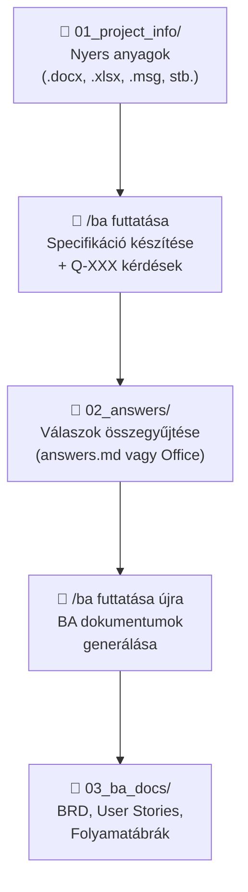
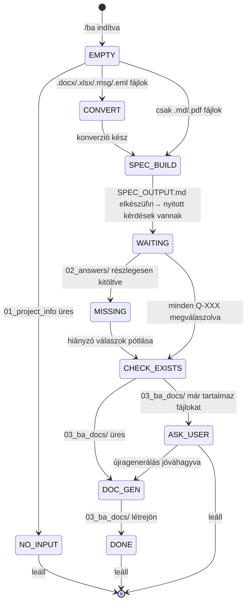
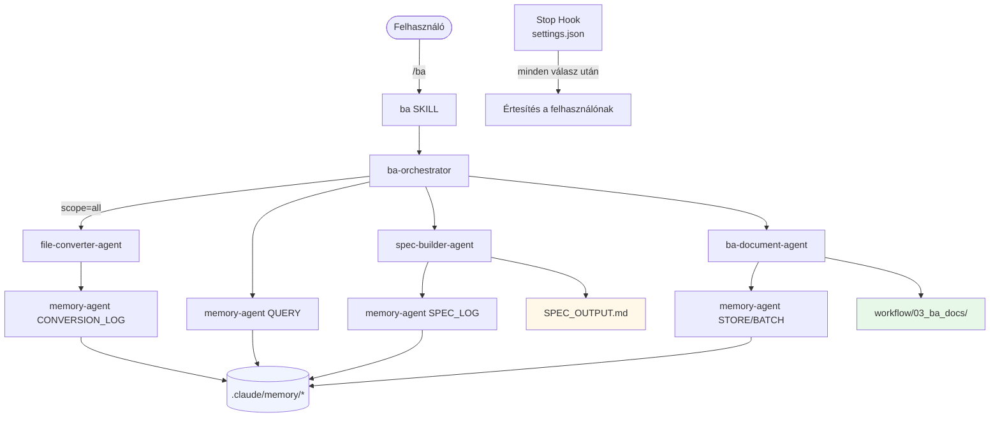

# BA Team – Legyél Te a főnök egy 5 fős AI csapat felett!

[English version](README.en.md)
[Kézikönyv](Handbook.md)


> **Ne csak használd az AI-t – irányítsd!** 🚀
>
> Ezzel a workflow-val nem egy egyszerű chat-botot kapsz, hanem egy komplett, specializált Business Analyst csapatot, akiknek Te vagy a vezetője. Miközben Te a stratégiai döntésekre és az ügyfélkapcsolatokra fókuszálsz, az AI kollégáid elvégzik a munka nehezét:
>
> 1. 📋 **Orchestrator**: A projektmenedzsered, aki összefogja a szálakat és tudja, hol tartotok.
> 2. 🏗️ **Spec Builder**: A precíz elemződ, aki a nyers jegyzetekből tűpontos specifikációt farag.
> 3. ✍️ **BA Document Agent**: A technikai íród, aki BRD-ket, User Story-kat és folyamatábrákat gyárt.
> 4. 📂 **File Converter**: Az adat-specialistád, aki bármilyen Office fájlt másodpercek alatt AI-kész formátumra hoz.
> 5. 🧠 **Memory Agent**: A stratégiai tanácsadód, aki egyetlen döntést vagy stakeholder adatot sem felejt el.
>
> **Emeld a hatékonyságodat a következő szintre: delegálj a BA Team-nek, és koncentrálj a valódi értékteremtésre!**

---

Ez a repository Claude AI-hoz készített skilleket és ügynököket tartalmaz, amelyek célja a **Business Analyst kollégák munkájának támogatása** az IT projektek teljes requirements engineering folyamatán át.

---

## Kiemelt Képességek

A rendszer számos olyan beépített intelligens funkcióval rendelkezik, amelyek megkülönböztetik egy egyszerű chat-botól:

### 🧠 Intelligens Memória Kezelés
A projekt során megtanult minden fontos információ (döntések, érintettek, kockázatok, szakkifejezések) a munkamenetek között is megmarad. A `memory-agent` gondoskodik róla, hogy ne kelljen kétszer elmondanod ugyanazt, és az AI mindig képben legyen a projekt aktuális kontextusával.

### ⚡ Inkrementális Specifikáció Készítés
Nem kell minden apró változtatásnál a nulláról újraépíteni a dokumentációt. A rendszer felismeri, ha csak egy új fájlt adtál hozzá vagy egy meglévőt módosítottál, és csak a változásokat dolgozza fel. Ez drasztikusan csökkenti a várakozási időt és a tokenhasználatot nagy projektek esetén.

### 🔄 Automatikus Fájl Konverzió
Másold be bátran a Word jegyzőkönyveidet, Excel táblázataidat vagy Outlook e-mailjeidet (`.msg`, `.eml`). A rendszer automatikusan észleli őket, és a háttérben Markdown formátumba alakítja, hogy azonnal feldolgozhatóvá váljanak. Csak a megváltozott fájlokat konvertálja újra, így mindig naprakész marad.

### 🇭🇺 Teljes Magyar Nyelvű Támogatás
A rendszer natívan támogatja a magyar nyelvű üzleti kommunikációt. Nemcsak a bemeneti anyagokat értelmezi, hanem a teljes BA dokumentációt (BRD, User Story-k, stb.) és az összes státuszjelentést is szigorúan magyar nyelven készíti el.

### 📊 Vizuális Folyamatmodellezés (Mermaid)
A szöveges leírások mellett a rendszer automatikusan generál Mermaid folyamatábrákat minden üzleti folyamathoz és logikai elágazáshoz. Ezek a diagramok azonnal megtekinthetők és szerkeszthetők a VS Code felületén.

### 🔗 Forrás-szintű Követhetőség (Traceability)
Minden generált követelmény és specifikációs pont visszavezethető az eredeti forrásanyagra. Az automatikus követhetőségi mátrix segít abban, hogy mindig tudd: melyik ügyfélkérésből melyik fejlesztési feladat született.

---

## Napi használat

### Új projekt indítása

1. Másold be az ügyféllel folytatott megbeszélések anyagait:
    - meetingjegyzetek,
    - emailek,
    - egyeztetések,
    - Word/Excel/Outlook fájlok
    - félkész vagy kész dokumentumok
   a `workflow/01_project_info/` mappába
2. Ha a válaszaid is Office fájlban vannak, azokat a `workflow/02_answers/` mappába másold
3. A Claude panelen írd be: `/ba`
4. A Claude automatikusan konvertálja (ha a python és függőségek telepítve vannak, lásd a [7. lépés](#7-lépés--python-telepítése-opcionális--csak-ha-officoutlook-fájlokat-is-szeretnél-feldolgozni)) a nem-markdown fájlokat, majd elvégzi a következő lépést

### Folyamatos munka

Minden munkaülés elején írd be: `/session-loader`

Ez megmutatja, hol tart a projekt és mi a következő teendő — nem kell emlékezned, hol hagytad abba.

### A teljes workflow



> A `/ba` minden futtatáskor automatikusan konvertálja az Office/Outlook fájlokat.
> A `/convert` önállóan is futtatható, ha csak a konverziót szeretnéd ellenőrizni.

---

A `/ba` egyetlen parancs, amely elindít egy **ba-orchestrator** ügynököt. Ez az ügynök automatikusan felméri a projekt aktuális állapotát, majd a megfelelő specialist ügynököt hívja meg a munka elvégzéséhez.

### Főbb teljesítménybeli optimalizálások:

-   **Inkrementális Specifikáció**: Csak az új vagy módosult fájlok tartalmát dolgozza fel a specifikáció frissítésekor.
-   **Smart File Conversion**: SHA-256 ujjlenyomat és fájl-statisztikák (méret, dátum) alapján kihagyja a már konvertált fájlokat.
-   **Batch Memory Protocol**: A memóriaműveleteket csoportosítva végzi, minimalizálva az AI ügynökök indítási idejét.
-   **Targeted Memory Query**: Csak a munkához szükséges memóriafájlokat tölti be, jelentősen csökkentve a tokenhasználatot.




---

## Elérhető parancsok

| Parancs | Mire való | Részletes leírás |
|---|---|---|
| `/ba` | Automatikus következő lépés végrehajtása | [→ Leírás](.claude/skills/ba/README.md) |
| `/spec-builder` | Csak a spec készítése (haladó használat) | [→ Leírás](.claude/skills/spec-builder/README.md) |
| `/business-analyst` | Csak a BA dokumentumok generálása (haladó használat) | [→ Leírás](.claude/skills/business-analyst/README.md) |
| `/session-loader` | Munkamenet betöltése – megmutatja hol tart a projekt | [→ Leírás](.claude/skills/session-loader/README.md) |
| `/convert` | Office/Outlook fájlok konvertálása Markdown-ra | [→ Leírás](.claude/skills/convert/README.md) |
| `/mermaid-diagrams` | Önálló diagram készítése | [→ Leírás](.claude/skills/mermaid-diagrams/README.md) |
| `/memory-handler` | Projekt memória kezelése | [→ Leírás](.claude/skills/memory-handler/README.md) |

---

## Háttérben futó ügynökök

A parancsok végrehajtását specializált ügynökök végzik. Ezeket nem a felhasználó hívja közvetlenül — automatikusan aktiválódnak a megfelelő pillanatban.

| Ügynök | Feladata | Részletes leírás |
|---|---|---|
| `ba-orchestrator` | Állapot felismerés és koordináció | [→ Leírás](.claude/agents/README.md#ba-orchestrator) |
| `spec-builder-agent` | Specifikáció előállítása | [→ Leírás](.claude/agents/README.md#spec-builder-agent) |
| `ba-document-agent` | BA dokumentumok generálása | [→ Leírás](.claude/agents/README.md#ba-document-agent) |
| `file-converter-agent` | Office/Outlook fájlok konvertálása Markdown-ra | [→ Leírás](.claude/agents/README.md#file-converter-agent) |
| `memory-agent` | Projekt memória kezelése | [→ Leírás](.claude/agents/README.md#memory-agent) |

> Részletes technikai leírás az összes ügynökről: [.claude/agents/README.md](.claude/agents/README.md)

---

## Automatikus értesítések

A rendszer minden Claude válasz után automatikusan ellenőrzi a workflow állapotát és emlékeztet, ha teendő van:

| Állapot | Értesítés |
|---|---|
| Feldolgozatlan bemeneti fájlok | `📋 N bemeneti fájl feldolgozásra vár. Futtasd: /ba` |
| Spec kész, válaszok hiányoznak | `❓ Spec elkészült. Válaszokat várok a 02_answers/ mappában.` |
| Válaszok megvannak, dokumentum nincs | `✅ Válaszok megtalálhatók. BA dokumentumok generálásához futtasd: /ba` |

---

## Generált BA dokumentumok

A `/ba` parancs (vagy a `/business-analyst` skill) az alábbi professzionális dokumentum-csomagot állítja elő a `workflow/03_ba_docs/` mappába:

| Fájl | Megnevezés | Tartalom |
|---|---|---|
| `BRD.md` | Business Requirements Document | Üzleti követelmények, célkitűzések és magas szintű igények. |
| `User_Stories.md` | User Story lista | Felhasználói történetek részletes Gherkin formátumú elfogadási kritériumokkal. |
| `Process_Flows.md` | Üzleti folyamatok | Szöveges leírások és **kötelező vizuális Mermaid folyamatábrák**. |
| `Traceability_Matrix.md` | Követhetőségi mátrix | A forrásanyagok és a követelmények közötti kapcsolatot leíró táblázat. |
| `RAID_Log.md` | RAID Log | Kockázatok (Risks), Feltételezések (Assumptions), Problémák (Issues) és Függőségek (Dependencies). |
| `Glossary.md` | Szójegyzék | A projekt során azonosított domain-specifikus szakkifejezések gyűjteménye. |

---

## Mappa struktúra

```
projekt-neve/
├── workflow/
│   ├── 01_project_info/     ← IDE másold be az ügyfél anyagait
│   ├── 02_answers/          ← IDE kerülnek a kérdésekre adott válaszok
│   └── 03_ba_docs/          ← IDE kerülnek a kész BA dokumentumok
├── .claude/
│   ├── agents/              ← Specializált ügynökök (nem kell szerkeszteni)
│   │   ├── README.md        ← Ügynökök leírása
│   │   ├── ba-orchestrator.md
│   │   ├── spec-builder-agent.md
│   │   ├── ba-document-agent.md
│   │   └── memory-agent.md
│   ├── skills/              ← Parancsok (slash commands)
│   │   ├── convert/         ← /convert – Office fájl konverter
│   ├── memory/              ← Projekt memória (automatikusan kezelt)
│   ├── rules/               ← Viselkedési szabályok
│   └── scripts/             ← Session loader szkriptek
├── CLAUDE.md                ← Belső instrukciók (nem kell szerkeszteni)
├── AGENTS.md                ← Technikai referencia (nem kell szerkeszteni)
└── README.md                ← Ez a fájl
```

---

## Architektúra áttekintése



---

## Válaszok formátuma (`workflow/02_answers/answers.md`)

Hozz létre egy `answers.md` fájlt a `workflow/02_answers/` mappában, és töltsd ki a Claude által generált kérdésekre a válaszokat:

```
Q-001: A rendszer minden sikertelen belépési kísérletet naplóz; 5 próba után zárolja a fiókot.
Q-002: Az adatmegőrzési időszak GDPR alapján 7 év.
Q-003: A fizetéseket a Stripe API kezeli, a számlázást a meglévő ERP-be kell integrálni.
```

---

## Gyakori kérdések

**Hol találom a kész BA dokumentumokat?**
A `workflow/03_ba_docs/` mappában, VS Code-ban a bal oldali fájlböngészőben.

**Hogyan olvasom el szépen a dokumentumokat?**
Kattints duplán a `.md` fájlra, majd nyomj `Ctrl+Shift+V` (Windows) / `Cmd+Shift+V` (Mac) billentyűt az előnézet megnyitásához.

**Mi az a Q-XXX?**
A Claude által generált, sorszámozott kérdések az ügyféltől hiányzó információkról. Minden kérdést meg kell válaszolni mielőtt a BA dokumentumok elkészülnek.

**Elromlott valami, mit tegyek?**
Írd be: `/session-loader` — megmutatja az aktuális állapotot és a következő lépést.

**Újra lehet futtatni a `/ba`-t ha változott valami?**
Igen, bármikor futtatható. A rendszer mindig az aktuális állapotból indul ki.


## Telepítési útmutató

> Ez az útmutató nem igényel programozói ismereteket.

---

### A) Automatikus telepítés – egy paranccsal

A legegyszerűbb módszer: futtasd a telepítő szkriptet, amely mindent automatikusan feltelepít és konfigurál.

**Windows – PowerShell:**
```powershell
.\install.ps1
```

**Mac – Terminal:**
```bash
bash install.sh
```

**Mit telepít a szkript:**

| Eszköz | Mire való |
|---|---|
| Git | Verziókezelés, projekt letöltése |
| Visual Studio Code | Szövegszerkesztő, Claude beépülő |
| Python | Fájlkonverziókhoz szükséges |
| markitdown[docx] | Word (.docx) → Markdown |
| openpyxl | Excel (.xlsx) → Markdown |
| extract-msg | Outlook (.msg) → Markdown |
| Claude Code (VS Code ext.) | Az AI beépülő |
| Markdown Preview Mermaid Support | Folyamatábrák megjelenítéséhez |
| Markdown All in One | Markdown szerkesztéshez |

> A szkript idempotens — újrafuttatható, csak azt telepíti, ami még hiányzik.

---

### B) Manuális telepítés – lépésről lépésre

Ha a szkript helyett kézzel szeretnéd elvégezni a telepítést, kövesd az alábbi lépéseket sorban.

#### Amire szükséged lesz

| Eszköz | Mire való | Ár |
|---|---|---|
| GitHub fiók | A projekt tárolása és letöltése | Ingyenes |
| Visual Studio Code | Szövegszerkesztő, amelybe a Claude beépül | Ingyenes |
| Claude fiók | Az AI motor, amely a munkát végzi | Ingyenes / Pro |

---

#### 1. lépés – GitHub fiók létrehozása

1. Nyisd meg a böngészőt és menj a **[github.com](https://github.com)** oldalra
2. Kattints a **Sign up** gombra jobb felül
3. Add meg az e-mail címedet, válassz egy jelszót és egy felhasználónevet
4. Kövesd az e-mailes megerősítési lépéseket
5. Ha kész, be vagy jelentkezve a GitHubra

---

#### 2. lépés – Saját projekt létrehozása a sablonból

Ez a repository **sablon (template)**, tehát egyetlen kattintással létrehozhatsz belőle egy saját, független másolatot.

1. Menj a sablon repository oldalára GitHubon *(a csapatvezetőd elküldi a linket)*
2. Kattints a zöld **Use this template** gombra *(jobb felső sarok)*
3. Válaszd a **Create a new repository** lehetőséget
4. Töltsd ki az adatokat:
   - **Repository name**: adj egy nevet a projektednek, pl. `projekt-biztosito-rendszer`
   - **Visibility**: válaszd a **Private** lehetőséget *(privát marad)*
5. Kattints a **Create repository** gombra
6. Megnyílik az új, saját repository oldalad

> Minden BA kolléga a saját projektjéhez létrehoz egy ilyen saját másolatot. Az eredeti sablont nem módosítja senki.

---

#### 3. lépés – Visual Studio Code telepítése

1. Nyisd meg a **[code.visualstudio.com](https://code.visualstudio.com)** oldalt
2. Kattints a nagy kék **Download** gombra
   - Windows: `.exe` telepítőt tölt le
   - Mac: `.dmg` fájlt tölt le
3. Nyisd meg a letöltött fájlt és kövesd a telepítő utasításait
   - Windowson: hagyd bejelölve a *„Add to PATH"* és *„Open with Code"* opciókat
4. Indítsd el a VS Code-ot — megjelenik egy üdvözlő képernyő

---

#### 4. lépés – Claude Code bővítmény telepítése

A Claude Code az a bővítmény, amely az AI-t beépíti a VS Code-ba.

1. VS Code-ban kattints a bal oldali sávban a négyzetes **Extensions** ikonra (vagy nyomj `Ctrl+Shift+X` / `Cmd+Shift+X` Mac-en)
2. A keresőmezőbe írd be: `Claude Code`
3. Keresd meg a **Claude Code** bővítményt *(kiadó: Anthropic)*
4. Kattints az **Install** gombra
5. Telepítés után kattints a bal oldali sávban megjelenő **Claude** ikonra
6. Kattints a **Sign in** gombra és jelentkezz be a Claude fiókoddal *(ha nincs fiókod, a **[claude.ai](https://claude.ai)** oldalon tudod létrehozni)*

---

#### 5. lépés – Markdown előnézeti bővítmények telepítése

A BA dokumentumok Markdown formátumban készülnek, és tartalmaznak Mermaid folyamatábrákat. Két bővítményre van szükség a szép megjelenítéshez.

**5a. Markdown Preview Mermaid Support** *(folyamatábrák megjelenítéséhez)*

1. Extensions panelen (`Ctrl+Shift+X`) keresd meg: `Markdown Preview Mermaid Support`
2. Kiadó: **Matt Bierner**
3. Kattints az **Install** gombra

**5b. Markdown All in One** *(kényelmes markdown szerkesztéshez)*

1. Extensions panelen keresd meg: `Markdown All in One`
2. Kiadó: **Yu Zhang**
3. Kattints az **Install** gombra

> **Hogyan nézheted meg a dokumentumokat?** Nyiss meg egy `.md` fájlt, majd nyomj `Ctrl+Shift+V` (Windows) / `Cmd+Shift+V` (Mac) billentyűt — megnyílik a szép formázott előnézet, benne a folyamatábrákkal.

---

#### 6. lépés – A projekt letöltése VS Code-ba

1. VS Code-ban nyomj `Ctrl+Shift+P` (Windows) / `Cmd+Shift+P` (Mac) billentyűt
2. Írd be: `Git: Clone` és nyomj Entert
3. Kattints a **Clone from GitHub** lehetőségre
4. Ha először csinálod: VS Code megkér, hogy jelentkezz be GitHubra — kattints az **Allow** gombra és kövesd a böngészőben megjelenő lépéseket
5. A keresőmezőben keresd meg a saját repository nevedet *(amit a 2. lépésben hoztál létre)*
6. Válaszd ki, majd válaszd ki, **hová** mentse a számítógépeden *(pl. Dokumentumok mappa)*
7. Kattints az **Open** gombra — megnyílik a projekt VS Code-ban

---

#### 7. lépés – Python és konverziós könyvtárak telepítése *(opcionális)*

> Ez a lépés **nem kötelező**. Ha csak `.md`, `.txt` vagy `.pdf` fájlokat használsz, kihagyhatod.
> Ha Word, Excel vagy Outlook fájlokat is be szeretnél adni a rendszernek, ez szükséges.

**Támogatott fájlformátumok:**

| Fájltípus | Szükséges eszköz |
|---|---|
| Word (.docx) | Python + markitdown[docx] |
| Excel (.xlsx) | Python + openpyxl |
| Outlook (.msg) | Python + extract-msg |
| E-mail (.eml) | Python stdlib (külön csomag nem kell) |
| PDF | Nem kell semmi – Claude natívan olvassa |

**7a. Python telepítése**

*Windows:*
1. Töltsd le a **[python.org/downloads](https://www.python.org/downloads/)** oldalról
2. **Fontos:** jelöld be az **„Add Python to PATH"** jelölőnégyzetet telepítés előtt

*Mac:*
```bash
brew install python
```

**7b. Python könyvtárak telepítése**

```
pip install "markitdown[docx]" openpyxl extract-msg
```

**Ellenőrzés:**
```
pip show markitdown openpyxl extract-msg
```

---

#### Hogyan működik a fájl konverzió?

Miután bemásoltad a fájlokat a `workflow/01_project_info/` vagy `workflow/02_answers/` mappába:

1. A Claude panelen írd be: `/convert`
2. A rendszer automatikusan:
   - **Betölti a konverziós naplót** — a már feldolgozott, változatlan fájlokat (méret és dátum alapján) azonnal kihagyja.
   - **SHA-256 ujjlenyomatot ellenőriz** — ha a fájl tartalma megegyezik a korábbival, nem végzi el újra a konverziót.
   - **Csak az új vagy megváltozott fájlokat konvertálja** Markdown formátumba.
   - **Batch módban frissíti a naplót** — egyetlen lépésben menti az összes változást, minimalizálva a várakozási időt.
3. Ezután futtasd a `/ba` parancsot — az AI már a konvertált tartalmakat dolgozza fel.

> A `/ba` parancs is automatikusan elindítja a konverziót, ha Office fájlokat talál, és ugyanezeket az optimalizálásokat használja.

---

### 8. lépés – Első indítás ellenőrzése

1. VS Code-ban nyisd meg a Claude panelt *(bal oldali sáv, Claude ikon)*
2. Az alsó beviteli mezőbe írd be: `/session-loader`
3. Nyomj Entert
4. A Claude megmutatja a projekt aktuális állapotát:
   ```
   ============================================================
     BA WORKFLOW – SESSION LOADER
   ============================================================
     PROJEKT
     Név:    –
     ...
     JAVASOLT KÖVETKEZŐ LÉPÉS
     ⚠️  Nincs bemeneti anyag.
        → Másolj fájlokat a workflow/01_project_info/ mappába
   ============================================================
   ```
5. Ha ezt látod, az alap telepítés sikeres.

> **Python ellenőrzése:** Ha telepítetted a Pythont (7. lépés), a Claude panelen írd be: `/convert` — ha a rendszer jelzi, hogy nincs konvertálandó fájl, a Python és a könyvtárak is működnek.

---
