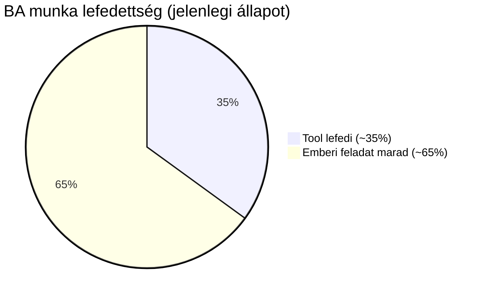
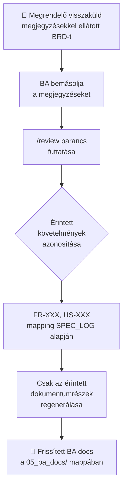
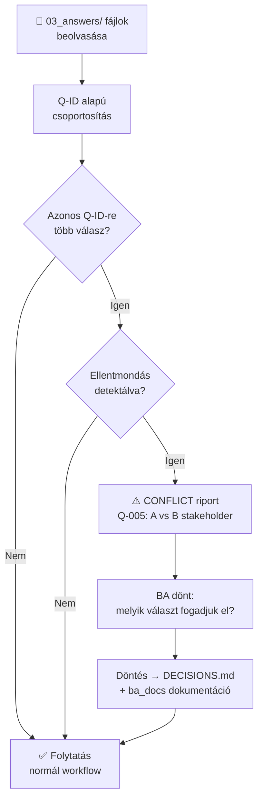
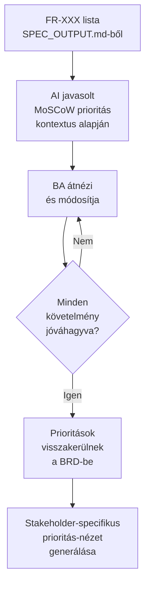
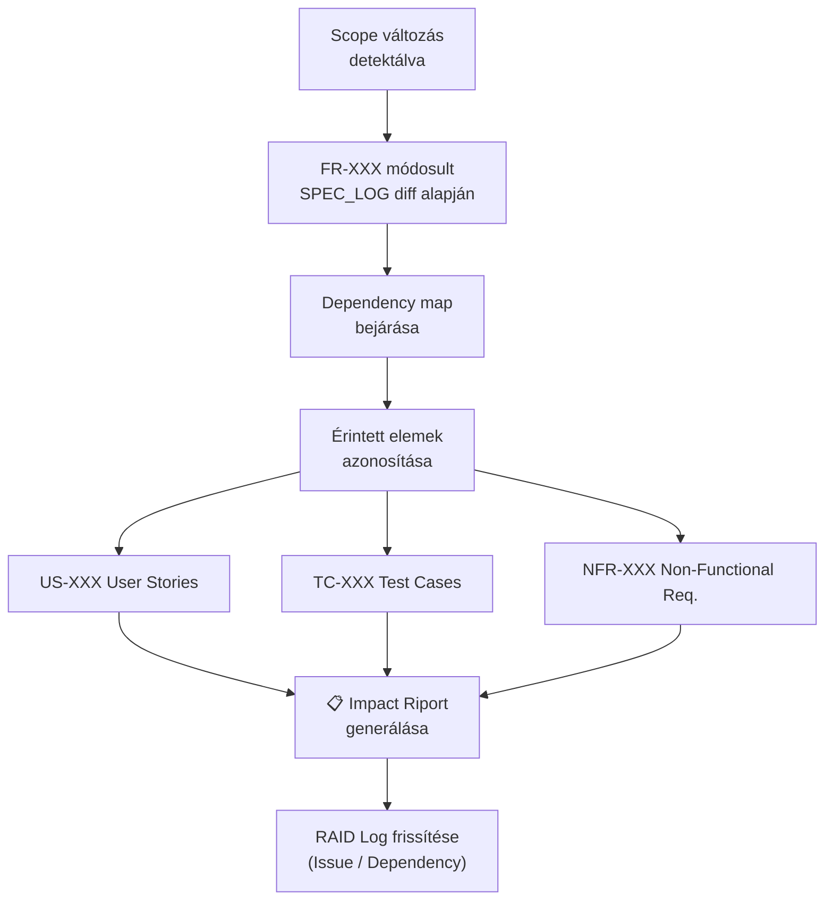
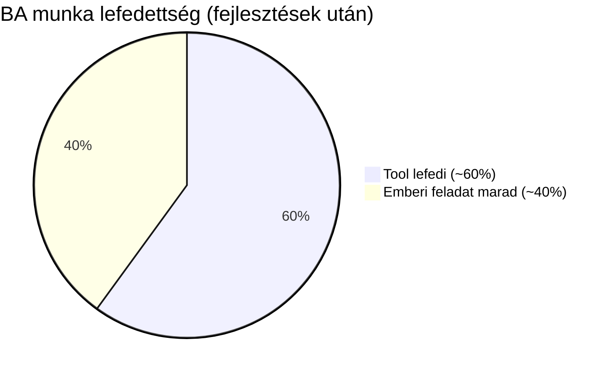

# BA Team – Fejlesztési Javaslatok

## Jelenlegi lefedettség

A tool jelenlegi állapotban a BA munka ~35%-át fedi le:
a dokumentálás és strukturálás mechanikus, ismétlődő részét.

### Amit jól végez:

A Q-XXX kérdés-válasz ciklus reális. A BA munkájának nagy része pontosan ez: nyers anyagból kiszűrni a hiányokat, kérdéseket feltenni a stakeholdereknek, majd a válaszokból dokumentumokat gyártani. A kimenet (BRD, User Stories, RAID Log, Glossary, Traceability Matrix) is standard BA deliverable-készlet.

A memória-persistencia szintén praktikus — egy 3 hónapos projekt esetén a BA-nak nem kellene minden munkamenetben újra kontextust adni, a döntések, stakeholder adatok, kockázatok megmaradnak.

### Ahol sántít:

A valódi BA munka nem lineáris. Ez a tool azt feltételezi: anyag bekerül → spec → válaszok → dokumentumok → kész. A valóságban a requirements evolválódnak, stakeholderek visszamondanak döntéseket, scope változik iteráción belül. Az inkrementális spec-build segít, de az igazi iteratív visszacsatolás (pl. "a BRD-t visszakapta a megrendelő megjegyzésekkel") nincs lemodellezve.

A facilitáció teljesen hiányzik. A BA munkaidejének nagy részét workshop-ok, interjúk, konfliktuskezelés teszi ki. Ez a tool a dokumentálás fázisát gyorsítja, de az elicitáció (követelmények kinyerése stakeholderekből) az emberé marad.

Prioritizálás is emberi feladat marad — a tool MoSCoW-t generálhat, de a stakeholderekkel való egyeztetés, a kompromisszumok kezelése nem modellezhető.

Összesítve: Ez egy erős dokumentációs és strukturálási asszisztens, nem egy teljes BA workflow-tool. Egy BA-nak kb. 30-40%-át veszi le a munkájának — a mechanikus, ismétlődő részét. A stratégiai, kommunikációs, facilitációs részt nem érinti.

---

## Implementálható fejlesztések

### 1. Iteratív visszacsatolás (`/review` parancs)

**Megjegyzés:** A jelenlegi rendszer már most is képes kezelni a visszacsatolást: ha a BA bemásolja a megrendelő megjegyzéseit új fájlként a `01_project_info/` vagy `03_answers/` mappába, majd futtat `/ba`-t, a spec-builder felismeri az új fájlt, frissíti a `SPEC_OUTPUT.md`-t, és a `ba-document-agent` legenerálja a frissített dokumentumokat. Tehát funkcionálisan a `/review` nem új képesség — **teljesítményoptimalizálás**.

**Probléma:** A `ba-document-agent` jelenleg az összes engedélyezett dokumentumot újragenerálja (BRD, User Stories, Process Flows, RAID Log, Glossary, Traceability Matrix), még akkor is, ha a változás csak egy-két FR-XXX-et érint. Nagy projektnél (20+ követelmény) ez jelentős idő- és token-pazarlás.

**Megoldás:**
- Új `/review` parancs: a BA beilleszti a megrendelő megjegyzéseit
- A tool azonosítja az érintett követelményeket (FR-XXX, US-XXX) a SPEC_LOG diff alapján
- Csak az érintett dokumentumrészeket regenerálja — a többi érintetlen marad
- A SPEC_LOG SHA-256 logika már megvan — ki kell terjeszteni a BA docs szintjére

**Becsült lefedettség-növekmény:** +8% (elsősorban nagyobb projekteken realizálódik)

---

### 2. Konfliktusdetekció (`/conflicts` riport)

**Probléma:** Ha két stakeholder ugyanarra a Q-XXX-re ellentmondó választ ad, a tool ezt jelenleg csendben átenged.

**Megoldás:**
- Az answer fájlok beolvasásakor összehasonlítani az azonos Q-ID-re adott válaszokat
- Ellentmondás esetén külön flagelni: `Q-005: CONFLICT — A stakeholder: X, B stakeholder: Y`
- A `/ba` megáll és felkér döntésre, mielőtt dokumentumot generál
- Az elfogadott döntés bekerül a `DECISIONS.md` memóriába
- A döntés ténye, ideje és felelőse is dokumentálva lesz a ba_docs mappában

**Becsült lefedettség-növekmény:** +5%

---

### 3. Prioritizálási flow (`/prioritize` parancs)

**Probléma:** A MoSCoW prioritások jelenleg automatikusan generálódnak kontextus alapján, stakeholder-egyeztetés nélkül.

**Megoldás:**
- Struktúrált kérdéssor a BA számára minden funkcióhoz (Must/Should/Could/Won't)
- A tool javaslatot tesz a kontextus alapján, a BA jóváhagyja vagy felülírja
- Az eredmény visszakerül a BRD-be és a Traceability Matrixba
- Opcionálisan: stakeholder-specifikus prioritás-nézetek generálása

**Becsült lefedettség-növekmény:** +7%

---

### 4. Változáskövetés és impact analízis

**Probléma:** Ha a scope közben változik, nem látszik, melyik downstream dokumentumot érinti.

**Megoldás:**
- Requirement-szintű dependency map (FR → US → TC összefüggések)
- Scope változáskor automatikus impact riport: "FR-005 módosítása érinti: US-012, US-013, TC-007"
- A változásnapló bekerül a RAID Log-ba (Issue-ként vagy Dependency-ként)

**Becsült lefedettség-növekmény:** +5%

---

## Összesítés

| # | Fejlesztés | Becsült növekmény | Komplexitás |
|---|---|---|---|
| 1 | Iteratív visszacsatolás (`/review`) | +8% | Közepes |
| 2 | Konfliktusdetekció (`/conflicts`) | +5% | Alacsony |
| 3 | Prioritizálási flow (`/prioritize`) | +7% | Közepes |
| 4 | Változáskövetés + impact analízis | +5% | Magas |
| | **Összesen** | **~+25%** | |

---

## Ami emberi készség marad

A maradék ~40% nem automatizálható — és nem is érdemes:

- **Live facilitáció**: valós idejű moderálás, hatalmi dinamikák kezelése, kompromisszumközvetítés
- **Elicitáció**: "nem tudja, mit akar" típusú ügyfélnél a rávezetés emberi kontextust igényel
- **Bizalomépítés**: stakeholder-kapcsolatok, politikai érzék, nem-verbális kommunikáció
- **Döntési felelősség**: végső jóváhagyás, etikai ítélet, üzleti prioritások mérlegelése

Ezek az értékes részek — a tool célja, hogy a BA ezekre tudjon koncentrálni.

# Javítandó működés

## Memory-agent: Törlés tilalma és következményei

A források alapján a memory-agent működésének egyik alapkövetelménye, hogy a memóriafájlok kizárólag bővülhetnek, és a meglévő tartalom soha nem törlődik. Bár a dokumentáció ezt nem nevezi explicit módon „bajnak”, a rendszer felépítéséből és az optimalizálási törekvésekből következtetni lehet a technikai nehézségekre:

1. Tokenhasználat és költségek növekedése
A legfontosabb korlát a token-takarékosság. Mivel a memória csak hízik, minden egyes alkalommal, amikor egy agent betölti a memóriát, több adatot kell feldolgoznia. A rendszer ezt olyan megoldásokkal próbálja ellensúlyozni, mint a Targeted Memory Query (csak a szükséges fájlok lekérése) és a Batch Memory Protocol (műveletek csoportosítása), hogy minimalizálják a növekvő adatmennyiség miatti tokenfelhasználást és futási időt.

2. Manuális karbantartás igénye
Mivel az agent nem törölhet, ha egy adat (például egy döntés vagy egy stakeholder információja) elavulttá válik vagy hibásan került be, az benne marad a rendszerben, hacsak a felhasználó manuálisan be nem avatkozik. A dokumentáció megjegyzi, hogy a memória fájljai egyszerű Markdown táblázatok, amelyeket bármilyen szövegszerkesztővel kézzel kell módosítani, ha törölni szeretnél belőlük.

3. Redundancia és ellentmondások veszélye
Bár a STORE művelet mindig új bejegyzést fűz a fájlhoz, a törlés hiánya miatt fennáll a veszélye, hogy korábbi, már nem érvényes információk (például egy régi kockázat vagy döntés) összezavarják az AI-t. A rendszer ezt azzal próbálja kezelni, hogy:
A session-loader minden indításkor összegzi a memória tartalmát, hogy a felhasználó lássa, mi gyűlt össze.
Bizonyos esetekben (például fájlok törlésekor) a spec-builder inkább teljes újragenerálást végez, hogy elkerülje az „árván maradt” vagy érvénytelen követelményeket.
Miért választották mégis ezt a megoldást?
A törlés tilalma nem véletlen hiba, hanem egy tudatos tervezési döntés eredménye:
Audit-kész dokumentáció: A BA Team célja az audit-kész anyagok előállítása. Ehhez elengedhetetlen a forrás-szintű követhetőség és a döntések naplózása, amit a törölhetetlen memória biztosít.
Perzisztencia: Biztosítja, hogy a különböző projektfázisokon és munkameneteken át semmi ne vesszen el véletlenül.
Összefoglalva: A törlés hiánya hosszú távon adat-túlterheléshez és magasabb tokenköltségekhez vezethet, amit jelenleg a célzott lekérdezésekkel és a felhasználó manuális „takarító” szerepével (a .claude/memory/ mappában) próbálnak egyensúlyozni.

## Plitikai döntések és emberi tényezők

A források nem említenek külön kategóriát a „politikai” vagy „diplomáciai” döntésekre, azonban a workflow felépítése pontosan az ilyen érzékeny, emberi mérlegelést igénylő helyzetek kezelésére szolgál az alábbi mechanizmusokon keresztül:

1. Az ellentmondások felszínre hozása (nem feloldása)
A rendszer alapelve, hogy a /extractor soha nem oldja fel csendben az ellentmondásokat. Ha a politikai érdekek mentén különböző érintettek (stakeholderek) mást mondanak, az AI ezt konfliktusként jelzi a specifikációban, és nem próbál meg „okosabb” lenni az embernél.

2. Q-XXX kérdések és emberi döntéshozatal
Minden olyan pontot, ahol diplomáciai egyeztetésre van szükség, a rendszer nyitott kérdésként (Q-XXX) jelöl meg.
Az AI megáll a folyamatban, és nem generál dokumentumokat, amíg ezeket a kérdéseket meg nem válaszolod.
Ez biztosítja, hogy a stratégiai vagy politikai döntések ne az algoritmus véletlenszerű választásán alapuljanak, hanem a te, mint emberi vezető döntésén.

3. A döntések naplózása (DECISIONS.md)
Miután diplomáciai úton megszületett a döntés, a rendszer azt a hosszú távú memóriába menti:
A döntések a .claude/memory/DECISIONS.md fájlba kerülnek egyedi DEC-XXX azonosítóval és indoklással.
Ez biztosítja, hogy a döntés „politikai háttere” vagy indoka később is auditálható és visszakereshető legyen.

4. Audit-kész dokumentáció és felelősség
A workflow célja, hogy te legyél a „főnök”, aki az AI csapatot irányítja. Az AI elvégzi a nyers adatok rendszerezését, de a stratégiai fókusz az emberi elemzőnél marad.
A Traceability Matrix (Követhetőségi mátrix) segítségével pontosan dokumentálható, hogy egy-egy vitatott követelmény melyik ügyfélkéréstől vagy döntéstől származik.
A rendszer így nemcsak a technikai, hanem a projektpolitikai döntéseknek is keretet ad a RAID Log-on keresztül, ahol a kockázatok és függőségek rögzítésre kerülnek.
Összegezve: A politikai és diplomáciai döntéseket a rendszer nem „megoldja”, hanem dokumentált döntési kényszerhelyzetbe hozza a felhasználót, majd a meghozott döntést tartósan megőrzi és beépíti a dokumentációba.

## Emberi metakommunikáció és facilitáció

A file-converter-agent feladata tisztán technikai: az ő dolga mindössze annyi, hogy az Outlook (.msg, .eml) vagy Word fájlokat AI-számára olvasható Markdown formátumba alakítsa. Nem elemez stílust, és nem detektál érzelmeket, csak a nyers szöveget menti át.

Azonban a rendszer egésze – különösen a spec-builder-agent – éppen azért lett így kialakítva, hogy az ilyen „emberi” helyzeteket kezelni tudja, de ne helyetted, hanem a te kezed alá dolgozva:

- Az ellentmondás felszínre hozása: Ha a vezérigazgató hajnali kettőkor beírja, hogy „NEM!!!”, az valószínűleg ellentmond egy korábbi követelménynek. A /extractor egyik legfontosabb szabálya, hogy soha nem oldja fel csendben az ellentmondásokat. Ehelyett a SPEC_OUTPUT.md fájlban jelzi a konfliktust, és megmutatja, hol ütköznek az információk.

- A „NEM!!!” mint Explicit adat: A rendszer megkülönbözteti az [EXPLICIT] (szó szerint elhangzott) és az [INFERRED] (következtetett) információkat. Egy ilyen határozott elutasítás explicit tiltásként vagy kockázatként bekerül a rendszerbe, és azonnal megállítja a folyamatot.

- Q-XXX kérdések: A rendszer nem fogja kitalálni, hogy a vezérigazgató miért volt dühös, vagy mi a pontos diplomáciai megoldás. Ehelyett generál egy Q-XXX azonosítóval ellátott kérdést (pl. a BUSINESS LOGIC vagy PRIORITY kategóriában), amivel jelzi neked, hogy itt egy tisztázatlan pont van, amit neked, mint emberi vezetőnek kell tisztáznod.

- Te vagy a főnök: A BA Team mottója: „Ne csak használd az AI-t – irányítsd!”. A rendszer pont azért nem próbálja meg „finomhangolni” a kommunikációt, mert az AI nem képes a diplomáciára. A te feladatod a stratégiai döntéshozatal és az ügyfélkapcsolatok kezelése, az AI pedig gondoskodik róla, hogy a vezérigazgató „NEM!!!”-je ne sikkadjon el, hanem bekerüljön a döntési naplóba (DECISIONS.md) és a kockázatok közé (RISKS.md)

## Ha nincs mindenre válasz, megakad a folyamat

A rendszerben alkalmazott szigorú szabály, miszerint nem generálhatók BA dokumentumok, amíg akár egyetlen Q-XXX kérdés is megválaszolatlan marad, nem hiba, hanem egy tudatos minőségbiztosítási gát. Ennek több oka is van a források alapján:
1. Az "audit-kész" dokumentáció garantálása
A BA Team workflow célja nem csupán vázlatok készítése, hanem audit-kész, professzionális dokumentációs csomagok (BRD, User Story-k, RAID Log) előállítása. Ha a rendszer megengedné a generálást hiányzó adatokkal, a dokumentumok tele lennének tisztázatlan pontokkal, ami alkalmatlanná tenné őket a fejlesztői átadásra vagy egy hivatalos auditra.
2. A "csendes döntéshozatal" elkerülése
A /extractor alapelve, hogy soha nem talál ki követelményt, amit az ügyfél nem mondott ki, és soha nem oldja fel csendben az ellentmondásokat. Ha a rendszer továbblépne válaszok nélkül, az AI-nak "halucinálnia" vagy feltételeznie kellene az üzleti logikát, ami súlyos hibákhoz vezethetne a szoftverfejlesztés során.
3. Forrás-szintű követhetőség (Traceability)
A rendszer egyik legfontosabb képessége a Traceability Matrix, amely minden követelményt visszavezet az eredeti forrásra (pl. egy emailre vagy egy megválaszolt kérdésre). Ha hiányoznak a válaszok, ez a láncolat megszakad, és nem lehetne pontosan dokumentálni, miért úgy működik a rendszer, ahogy.
4. Technikai kényszer: a TBD nem válasz
A /ba skill gépi úton ellenőrizik a válaszokat. A rendszer kifejezetten figyeli, hogy a válaszfájlban a kérdés után van-e érdemi szöveg; a "TBD" (később meghatározandó) vagy "N/A" (nem értelmezhető) kifejezéseket nem fogadja el válaszként. Ez kényszeríti ki a precizitást a Business Analystból.
5. Az emberi vezető (Te) szerepének védelme
A workflow mottója: "Ne csak használd az AI-t – irányítsd!". Azzal, hogy a rendszer megáll a kérdéseknél, biztosítja, hogy a stratégiai döntések és az üzleti logika finomhangolása az emberi szakértő kezében maradjon, ne pedig egy algoritmus véletlenszerű választásán múljon.

Összegezve: Ez a korlát akadályozza meg, hogy a projekt egy "félkész" állapotban csússzon tovább a következő fázisba, megspórolva ezzel a későbbi újratervezés és a félreértések költségeit

## Workaround: Ha nincs válasz, hogyan tovább?

Ha egy kérdésre (Q-XXX) még nincs válaszod, a rendszer nem fogja engedni a BA dokumentumok generálását, mivel a workflow egyik alapelve a hiánytalan, audit-kész dokumentáció előállítása.

Az alábbi lehetőségeid vannak a helyzet kezelésére:
1. Fogalmazz meg egy Feltételezést (Assumption)
- Ha a pontos válasz még nem ismert, de a munka folytatásához szükséges egy irány, válaszolj a kérdésre egy feltételezéssel.
- A /extractor külön kategóriaként kezeli a feltételezéseket (A-XXX), amelyekre a specifikáció építhet, amíg a tények be nem igazolódnak.
- Ezzel a rendszer túllép a kérdésen, de a későbbi dokumentációban (például a RAID Log-ban) jól láthatóan megmarad, hogy ez egy bizonytalan pont.

2. Jelöld meg Kockázatként
- Ha a válasz hiánya akadályozza a projektet, a választ tartalmazó fájlban rögzítheted, hogy az információ beszerzése folyamatban van, és ez kritikus kockázatot jelent.
- A BA Team egyik ügynöke a RAID_Log.md fájlba gyűjti a kockázatokat (Risks), így a válasz hiánya transzparens marad minden érintett számára.

3. Amit NE tegyél: Ne írj "TBD"-t vagy "N/A"-t
- A /ba skill gépileg ellenőrzik a válaszokat. A rendszer kifejezetten tiltja a "TBD" (később meghatározandó) vagy "N/A" (nem értelmezhető) jellegű rövidítéseket; ezeket nem tekinti érdemi válasznak, és továbbra is megállítja a folyamatot.
4. Te vagy a "főnök" – Diplomáciai út
- Mivel a BA Team workflow lényege, hogy te irányítod az AI csapatot, a stratégiai döntések és az ügyfélkapcsolatok kezelése a te feladatod.
- Ha nincs válasz, az AI „megállítja a gépsort”, hogy kényszerítsen téged a hiányzó információ beszerzésére az ügyféltől vagy a stakeholderektől.
- Csak akkor futtasd újra a /ba parancsot, ha a workflow/03_answers/ mappába legalább egy ideiglenes (feltételezésen alapuló) választ beírtál.

Összegezve: Ha nem tudsz érdemi választ adni, a legjobb módszer egy logikus feltételezés rögzítése, amely lehetővé teszi az AI számára a dokumentumok (BRD, User Story-k) legenerálását, miközben a Traceability Matrix és a RAID Log dokumentálja a döntés hátterét