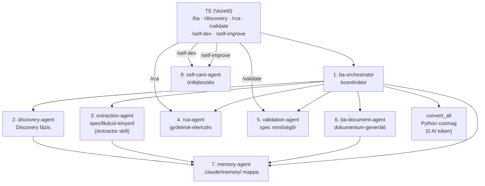

# 2. Az AI csapat bemutatása

A BA Team nyolc specializált AI ügynökből és egy Python konverziós csomagból áll. Az ügynököket nem közvetlenül te hívod – automatikusan aktiválódnak a megfelelő pillanatban.

| # | Komponens | Típus | Szerepe |
|---|---|---|---|
| 1 | **ba-orchestrator** | AI ügynök | Koordinátor: felméri az állapotot, eldönti mi a következő lépés |
| 2 | **discovery-agent** | AI ügynök | Discovery specialista: korai anyagokból BC.md + kérdéslista, soha nem blokkolja a generálást |
| 3 | **extraction-agent** | AI ügynök | Specifikáció-kinyerő: nyers anyagokból strukturált spec-et farag — kizárólag kinyerés, minőségellenőrzés nélkül (a `/extractor` skill hívja) |
| 4 | **rca-agent** | AI ügynök | Gyökérok-elemzés: oksági láncok, önfenntartó hurkok, driver/tünet besorolás — automatikusan fut ha elegendő RISK/INFERRED:HIGH elem van |
| 5 | **validation-agent** | AI ügynök | Spec minőségőr: ellenőrzi a SPEC_OUTPUT.md-t 8 dimenzión (PASS / WARN / BLOCK) — dokumentumot nem generál |
| 6 | **ba-document-agent** | AI ügynök | Dokumentum-generáló: BRD, User Story-k, folyamatábrák |
| – | **convert_all** | Python csomag | Fájlkonverzió: Office/Outlook fájlok → Markdown (0 AI token) |
| 7 | **memory-agent** | AI ügynök | Memóriakezelő: döntések, stakeholderek, szakkifejezések tárolása |
