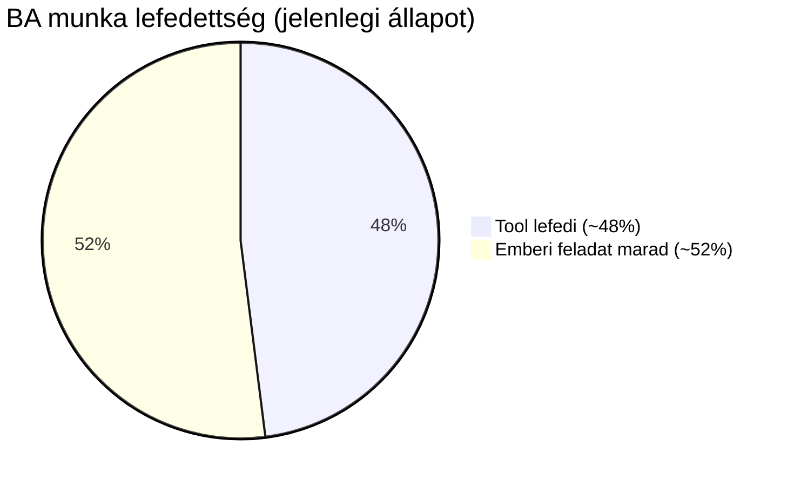
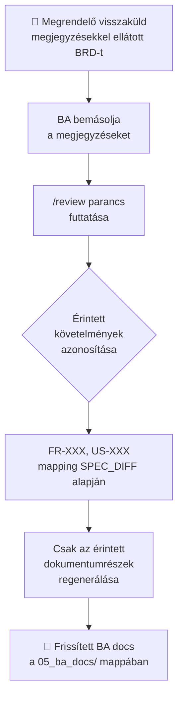
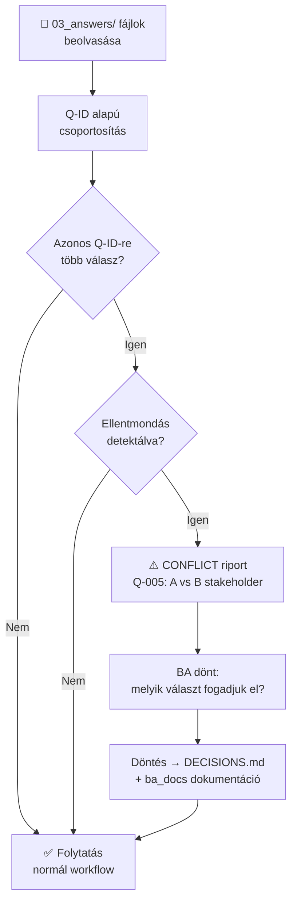
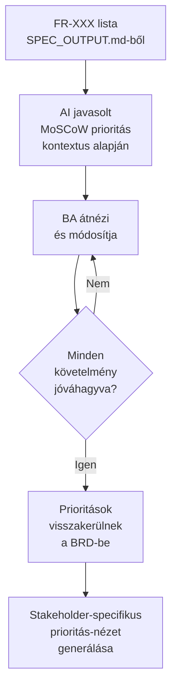
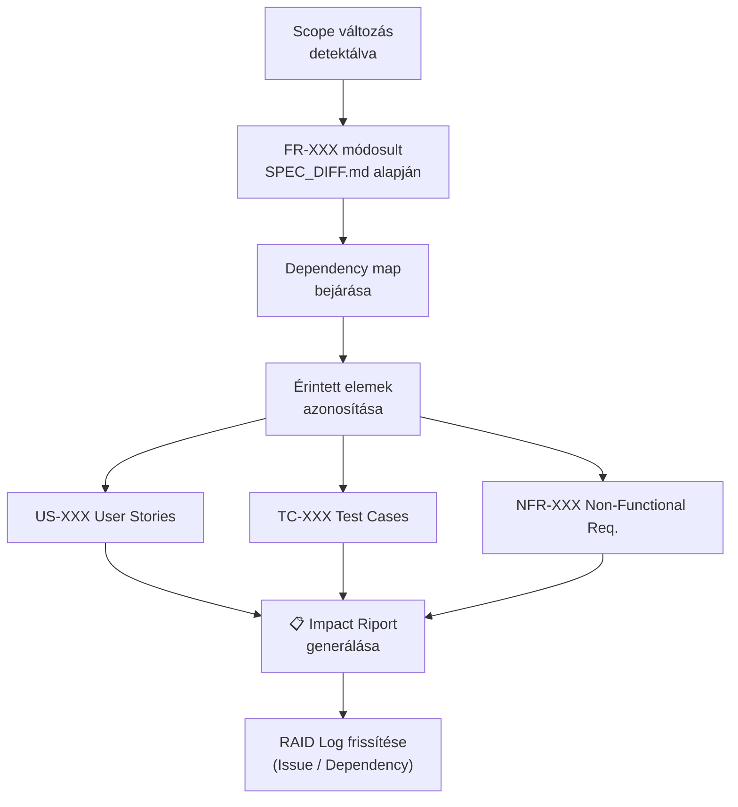
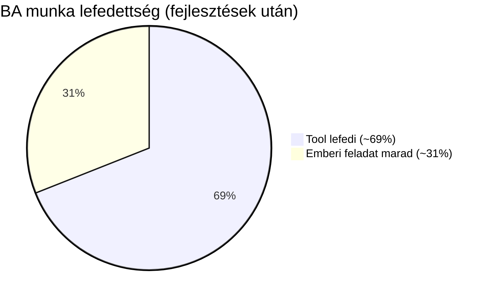

# BA Team – Fejlesztési Javaslatok

## Jelenlegi lefedettség

A tool jelenlegi állapotban a BA munka ~48%-át fedi le.
Az eredeti becslés (35%) a discovery-agent, validation-agent, rca-agent és SPEC_DIFF.md
bevezetése előtt készült.

### Amit jól végez:

**Dokumentáció és strukturálás:**
A Q-XXX kérdés-válasz ciklus reális. A BA munkájának nagy része pontosan ez: nyers anyagból kiszűrni a hiányokat, kérdéseket feltenni a stakeholdereknek, majd a válaszokból dokumentumokat gyártani. A kimenet (BRD, User Stories, RAID Log, Glossary, Traceability Matrix) standard BA deliverable-készlet.

**Elicitáció-támogatás (discovery-agent):**
A `/discovery` parancs Üzleti Eset (BC.md), Discovery RAID és Discovery Questions dokumentumokat állít elő a korai fázisban — még mielőtt teljes specifikáció létezne. A discovery-agent nem blokkolódik megválaszolatlan kérdéseknél, és a kimenetét a következő stakeholder-tárgyalás alapjaként lehet használni.

**Root Cause Analysis (rca-agent):**
A `/rca` parancs Chain Analysis és Interrelationship Matrix (IR mátrix) módszertannal végez gyökérok-elemzést. A driver/symptom osztályozás és a kauzális láncok önálló BA deliverable-t adnak (RCA_Analysis.md), ami a projekt kockázatkezelési döntéseit megalapozza.

**Minőségi gate (validation-agent):**
A `/validate` parancs 8 minőségi dimenzión ellenőrzi a SPEC_OUTPUT.md-t (PASS/WARN/BLOCK státusszal) mielőtt a ba-document-agent dokumentumokat generálna.

**Változáskövetés (SPEC_DIFF.md):**
Minden spec-újrageneráláskor a rendszer előállít egy SPEC_DIFF.md-t, ami ID-szinten felsorolja az Új/Módosított/Törölt elemeket (FR-XXX, NFR-XXX, Q-XXX, stb.) forrás SHA-256 alapján.

**Konfliktusdetekció (extraction-agent OB-20):**
Ha ugyanaz a scope-elem egyik forrásban IN SCOPE, másikban OUT OF SCOPE, a rendszer explicit SCOPE CONFLICT bejegyzést generál, és Q-XXX kérdéssel megállítja a folyamatot.

**Memória-perzisztencia:**
Egy 3 hónapos projekt esetén a BA-nak nem kell minden munkamenetben újra kontextust adni — a döntések, stakeholder-adatok, kockázatok megmaradnak.

### Ahol sántít:

A valódi BA munka nem lineáris. A tool azt feltételezi: anyag bekerül → spec → válaszok → dokumentumok → kész. A valóságban a requirements evolválódnak, stakeholderek visszamondanak döntéseket, scope változik iteráción belül. Az inkrementális spec-build és a SPEC_DIFF.md segítenek, de az igazi iteratív visszacsatolás (pl. "a BRD-t visszakapta a megrendelő megjegyzésekkel, pontosan ez a két fejezet változott") nincs lemodellezve.

A facilitáció részben megmaradt emberi feladatnak. A discovery-agent egy stakeholder-tárgyaláshoz előkészíti az anyagot (kérdések, üzleti eset, RAID), de a live workshop-moderálás, hatalmi dinamikák és kompromisszumközvetítés az emberé.

Prioritizálás emberi feladat marad — a tool MoSCoW-t generálhat kontextus alapján (OB-25 figyelmeztetéssel), de a stakeholderekkel való egyeztetés, kompromisszumok kezelése nem modellezhető.

Összesítve: Ez egy erős dokumentációs, strukturálási és elemzési asszisztens. Egy BA-nak kb. 45-50%-át veszi le a munkájának — a mechanikus, ismétlődő és módszertanos részét. A stratégiai, élő kommunikációs, facilitációs részt nem érinti.

---

## Implementálható fejlesztések

### 1. Iteratív visszacsatolás (`/review` parancs)

**Státusz:** Nem megvalósítva.

**Megjegyzés:** A jelenlegi rendszer már most is képes kezelni a visszacsatolást: ha a BA bemásolja a megrendelő megjegyzéseit új fájlként a `01_project_info/` vagy `03_answers/` mappába, majd futtat `/ba`-t, a spec-builder felismeri az új fájlt, frissíti a `SPEC_OUTPUT.md`-t, és a `ba-document-agent` legenerálja a frissített dokumentumokat. A SPEC_DIFF.md megmutatja, pontosan mi változott. Tehát funkcionálisan a `/review` nem új képesség — **teljesítményoptimalizálás**.

**Probléma:** A `ba-document-agent` jelenleg az összes engedélyezett dokumentumot újragenerálja (BRD, User Stories, Process Flows, RAID Log, Glossary, Traceability Matrix), még akkor is, ha a változás csak egy-két FR-XXX-et érint. Nagy projektnél (20+ követelmény) ez jelentős idő- és token-pazarlás.

**Megoldás:**
- Új `/review` parancs: a BA beilleszti a megrendelő megjegyzéseit
- A tool a SPEC_DIFF.md alapján azonosítja az érintett követelményeket (FR-XXX, US-XXX)
- Csak az érintett dokumentumrészeket regenerálja — a többi érintetlen marad
- A SPEC_LOG SHA-256 logika már megvan — ki kell terjeszteni a BA docs szintjére

**Becsült lefedettség-növekmény:** +8% (elsősorban nagyobb projekteken realizálódik)

---

### 2. Stakeholder konfliktusdetekció (`/conflicts` riport)

**Státusz:** Részben megvalósítva — scope-szintű konfliktusdetekció az extraction-agent-ben (OB-20) már működik. A `/conflicts` mint önálló parancs és a stakeholder-szintű (azonos Q-ID-re adott ellentmondó válaszok) detekció nincs.

**Probléma:** Ha két stakeholder ugyanarra a Q-XXX-re ellentmondó választ ad (nem scope-konfliktus, hanem értelmezési ellentét), a tool ezt jelenleg csendben átenged.

**Megoldás:**
- A `03_answers/` beolvasásakor összehasonlítani az azonos Q-ID-re adott válaszokat
- Ellentmondás esetén külön flagelni: `Q-005: CONFLICT — A stakeholder: X, B stakeholder: Y`
- A `/ba` megáll és felkér döntésre, mielőtt dokumentumot generál
- Az elfogadott döntés bekerül a `DECISIONS.md` memóriába

**Becsült lefedettség-növekmény:** +3% (a scope-szintű detekció már megvan)

---

### 3. Prioritizálási flow (`/prioritize` parancs)

**Státusz:** Nem megvalósítva. A BRD tartalmaz automatikusan generált MoSCoW prioritást OB-25 figyelmeztetéssel (felülvizsgálat ajánlott Product Ownerrel), de interaktív prioritizálás nincs.

**Probléma:** A MoSCoW prioritások jelenleg automatikusan generálódnak kontextus alapján, stakeholder-egyeztetés nélkül.

**Megoldás:**
- Struktúrált kérdéssor a BA számára minden funkcióhoz (Must/Should/Could/Won't)
- A tool javaslatot tesz a kontextus alapján, a BA jóváhagyja vagy felülírja
- Az eredmény visszakerül a BRD-be és a Traceability Matrixba
- Opcionálisan: stakeholder-specifikus prioritás-nézetek generálása

**Becsült lefedettség-növekmény:** +7%

---

### 4. Változáskövetés és impact analízis (FR→US→TC szint)

**Státusz:** Részben megvalósítva — a SPEC_DIFF.md már tartalmaz ID-szintű változásnaplót (Új/Módosított/Törölt FR-XXX, NFR-XXX, Q-XXX elemek forrás SHA alapján). Hiányzik: requirement-szintű dependency map és automatikus impact riport (melyik US-XXX, TC-XXX érinti az FR-változás).

**Megoldás:**
- Requirement-szintű dependency map (FR → US → TC összefüggések)
- Scope változáskor automatikus impact riport: "FR-005 módosítása érinti: US-012, US-013, TC-007"
- A változásnapló bekerül a RAID Log-ba (Issue-ként vagy Dependency-ként)

**Becsült lefedettség-növekmény:** +3% (a spec-szintű változáskövetés már megvan)

---

## Összesítés

| # | Fejlesztés | Státusz | Becsült növekmény | Komplexitás |
|---|---|---|---|---|
| 1 | Iteratív visszacsatolás (`/review`) | Nem megvalósítva | +8% | Közepes |
| 2 | Stakeholder konfliktusdetekció | Részben (scope-szint kész) | +3% | Alacsony |
| 3 | Prioritizálási flow (`/prioritize`) | Nem megvalósítva | +7% | Közepes |
| 4 | Változáskövetés + impact analízis | Részben (SPEC_DIFF kész) | +3% | Magas |
| | **Összesen** | | **~+21%** | |

---

## Ami emberi készség marad

A maradék ~30-35% nem automatizálható — és nem is érdemes:

- **Live facilitáció**: valós idejű moderálás, hatalmi dinamikák kezelése, kompromisszumközvetítés
- **Elicitáció (deep)**: a discovery-agent előkészíti a kérdéseket és struktúrát, de a "nem tudja, mit akar" típusú ügyféllel a személyes rávezetés emberi kontextust igényel
- **Bizalomépítés**: stakeholder-kapcsolatok, politikai érzék, nem-verbális kommunikáció
- **Döntési felelősség**: végső jóváhagyás, etikai ítélet, üzleti prioritások mérlegelése

Ezek az értékes részek — a tool célja, hogy a BA ezekre tudjon koncentrálni.

---

## Ismert design korlátok (nem bugok)

### Memory-agent: Törlés tilalma

A memóriafájlok kizárólag bővülhetnek — a meglévő tartalom soha nem törlődik automatikusan. Ez tudatos tervezési döntés:

- **Audit-kész dokumentáció:** A BA Team célja audit-kész anyagok előállítása. Ehhez elengedhetetlen a döntések naplózása és a forrás-szintű követhetőség.
- **Perzisztencia:** Biztosítja, hogy projektfázisokon és munkameneteken át semmi ne vesszen el véletlenül.

**Ára:** Hosszú távon adat-túlterhelés és magasabb tokenköltség. A rendszer ezt Targeted Memory Query-vel (csak szükséges fájlok) és Batch Memory Protocol-lal ellensúlyozza. Elavult adatot manuálisan kell törölni a `.claude/memory/` mappában.

### Megválaszolatlan kérdések: folyamat megáll

A `/ba` nem generál BA dokumentumokat egyetlen megválaszolatlan Q-XXX esetén sem. Ez szándékos minőségi gát:

- Megelőzi az "audit-ready" kimenetben a tisztázatlan pontokat
- Megakadályozza, hogy az AI csendben feltételezzen üzleti logikát
- Biztosítja a Traceability Matrix forrás-láncolatát

**Workaround ha nincs még válasz:**
1. **Draft mód:** `/ba --draft` — VÁZLAT fejléccel generál, Q-XXX-ek nyitva maradnak. Tárgyaláshoz, belső áttekintéshez alkalmas.
2. **Feltételezés rögzítése:** Válaszolj a kérdésre egy `A-XXX` feltételezéssel. A rendszer továbblép, de a RAID Log dokumentálja a bizonytalanságot.
3. **Amit ne tegyél:** "TBD" vagy "N/A" — ezeket a `/ba` skill nem fogadja el érdemi válaszként.
